```

```


# 相关项目


> aisegmentcn/matting_human_datasets: 人像matting数据集，包含34427张图像和对应的matting结果图。
> https://github.com/aisegmentcn/matting_human_datasets
>
> Pytorch 抠图算法 Deep Image Matting 模型实现 - 简书
> https://www.jianshu.com/p/91fc778cf4ed
>
> 
>
> 
>


## 推理时间测试


# 分割

综述


# 相关网络


## Unet


> Unet 论文解读 代码解读 - 简书
> https://www.jianshu.com/p/f9b0c2c74488


## SINet


# 手机端测试


## MNN 

工程地址：

alibaba/MNN: MNN is a blazing fast, lightweight deep learning framework, battle-tested by business-critical use cases in Alibaba
https://github.com/alibaba/MNN

建立工程

其中，建立build 文件后，使用  `cmake-gui`  工具进行配置

```
1.1 Linux / Mac 
使用根目录的CMakeLists.txt ，打开 MNN_BUILD_DEMO 开关
cd path/to/MNN
cd schema && ./generate.sh
mkdir build && cd build
cmake -DMNN_BUILD_DEMO=ON ..
make -j8
```


cmake-gui 配置

```bash
pv@pv:~/Desktop/py/localProject/MNN/build$ cmake-gui ..
```


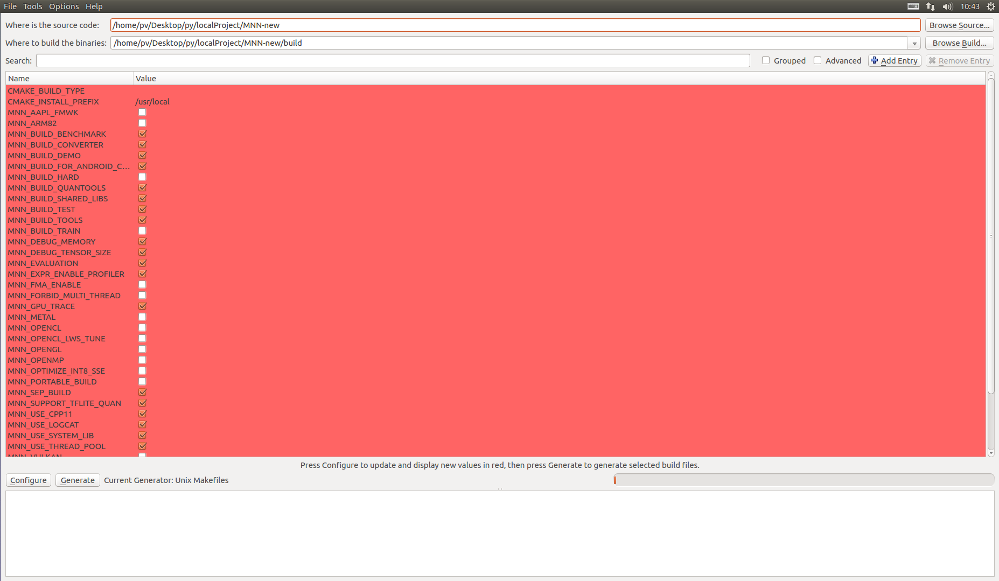


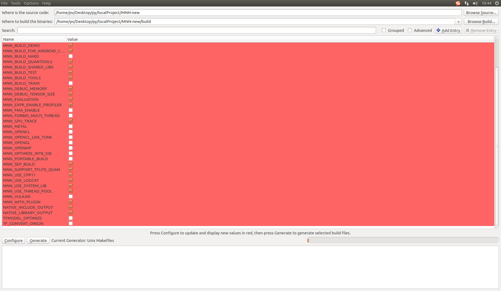


## 配置转化工具


### protobuf

```
$ sudo apt-get install autoconf automake libtool curl make g++ unzip
$ git clone https://github.com/google/protobuf.git
$ cd protobuf
$ git submodule update --init --recursive
$ ./autogen.sh
$ ./configure
$ make
$ make check
$ sudo make install
$ sudo ldconfig # refresh shared library cache.

```


protobuf简单介绍和ubuntu 16.04环境下安装_宛十八的专栏-CSDN博客
https://blog.csdn.net/kdchxue/article/details/81046192


Ubuntu下protobuf及其python runtime的安装_饺子醋的博客-CSDN博客
https://blog.csdn.net/codertc/article/details/52022646


- 写入环境变量


Ubuntu 16.04 安装 protobuf 以及测试/使用_漫长IT路-CSDN博客（）
https://blog.csdn.net/qq_16775293/article/details/81119375


### 如何安装zlib

```
wget http://prdownloads.sourceforge.net/libpng/zlib-1.2.11.tar.gz
tar -zxf zlib-1.2.11.tar.gz
sudo ./configure
sudo make && make install # 等待 zlib 安装完

```

如何安装zlib_止水聊技术-CSDN博客
https://blog.csdn.net/qq_32281471/article/details/91487679


之后进行 make 的时候，出现以下错误

### Unrecognized syntax identifier "proto3".  This parser only recognizes "proto2".

- 问题

```
onnx-operators.proto:9:10: Unrecognized syntax identifier "proto3".  This parser only recognizes "proto2".
tools/converter/CMakeFiles/MNNConverterONNX.dir/build.make:70: recipe for target 'tools/converter/onnx-operators.pb.cc' failed
make[2]: *** [tools/converter/onnx-operators.pb.cc] Error 1
CMakeFiles/Makefile2:1593: recipe for target 'tools/converter/CMakeFiles/MNNConverterONNX.dir/all' failed
make[1]: *** [tools/converter/CMakeFiles/MNNConverterONNX.dir/all] Error 2
Makefile:127: recipe for target 'all' failed
make: *** [all] Error 2

```

- 分析

编译cartographer时遇到Unrecognized syntax identifier “proto3”.  This parser only recognizes “proto2”.
 排查：
 使用 protoc --version 指令查看protobuf的版本，若版本为3.0.0以下，则需要到git上下载最新版protobuf，编译安装就好。
 若显示protobuf版本为3.0.0以上，仍然报这个错误，则可能是同时安装了proto2，编译器优先找了/usr/bin/protoc的版本,  新安装的proto3是放在/usr/local/bin/protoc下的，可以删除/usr/bin/protoc，然后把/usr/local/bin/protoc放入/usr/bin目录下，或者建立软连接：

- 解决方案

```bash
 sudo mv /usr/bin/protoc  /usr/bin/protoc.bk
 sudo ln -s /usr/local/bin/protoc /usr/bin/protoc


```

“ Unrecognized syntax identifier proto3. This parser only recognizes proto2. ”问题解决方法_weixin_43707303的博客-CSDN博客
https://blog.csdn.net/weixin_43707303/article/details/89015920


### 配置问题

- 问题

```
CMake Error: The source "/home/pv/Desktop/py/localProject/MNN/CMakeLists.txt" does not match the source "/home/pv/Desktop/py/localProject/MNN/benchmark/CMakeLists.txt" used to generate cache.  Re-run cmake with a different source directory.
```


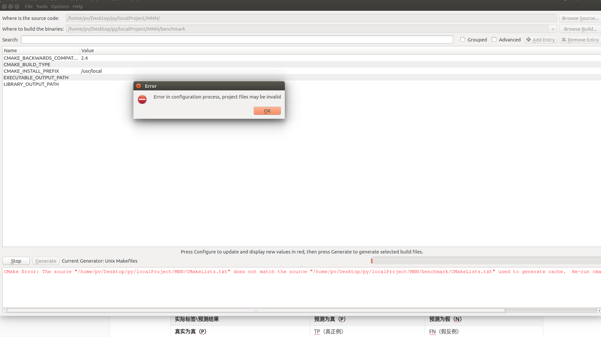


- 解决

关闭`cmake-gui`，删除所在目录的文件 `CMakeCache.txt` 文件，重新再运行 `cmake-gui` ，再重新点击左下角的 `Configure` ==>> `Generate`


## 手机端编译


1. 在 `https://developer.android.com/ndk/downloads/`下载安装NDK，建议使用最新稳定版本

2. 在 .bashrc 或者 .bash_profile 中设置 NDK 环境变量，例如：`export ANDROID_NDK=/Users/username/path/to/android-ndk-r14b`

3. `cd /path/to/MNN`

4. `./schema/generate.sh`

5. `cd project/android`

6. 编译armv7动态库：`mkdir build_32 && cd build_32 && ../build_32.sh` 详细步骤如下

7. 

   6.1	`mkdir build_32 && cd build_32`

   6.2  配置编译信息

   ```
   pv@pv:~/Desktop/py/localProject/MNN-new/project/android/build_32$ cmake-gui ../../../
   ```

   点击下图 `Finish`

   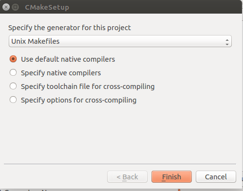

   之后，点击左下角`Configure` ==>> `Generate`

   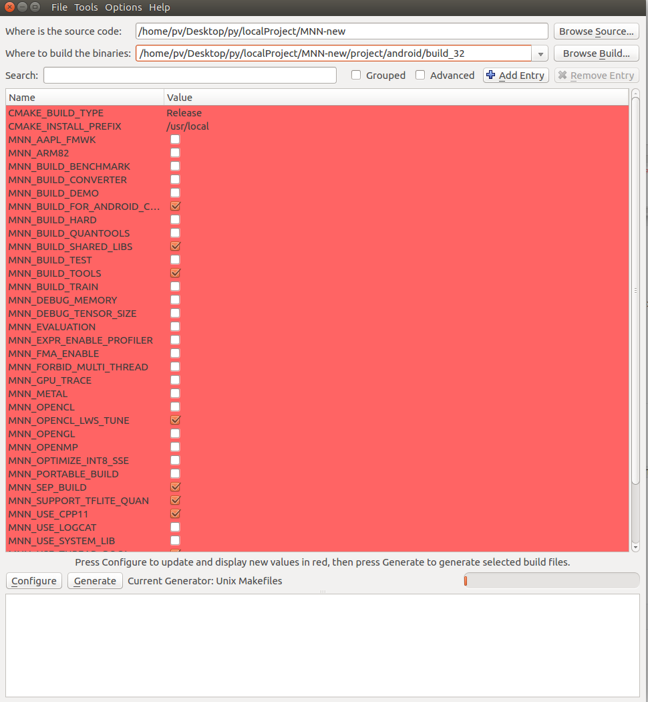
   
   
   
   
   
   
   
   
   
   
   
   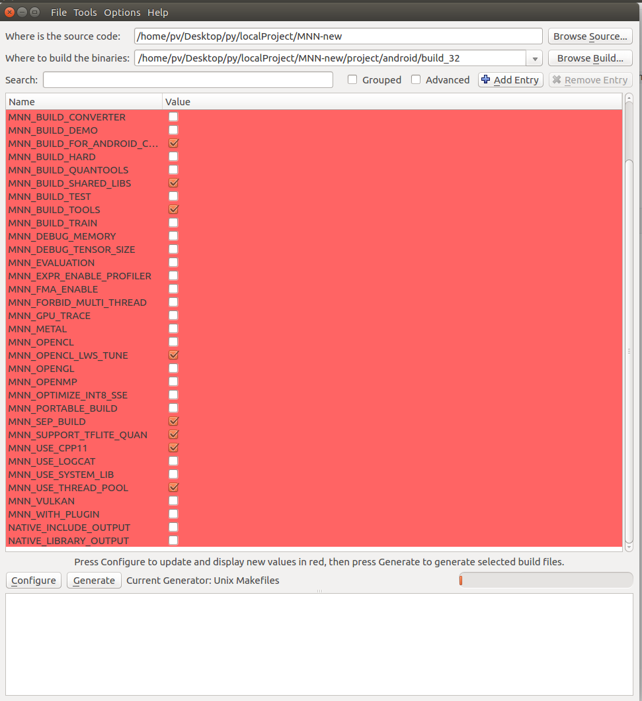
   
   6.3 编译

```bash
pv@pv:~/Desktop/py/localProject/MNN-new/project/android/build_32$ ../build_32.sh
```


​		6.4 编译成功


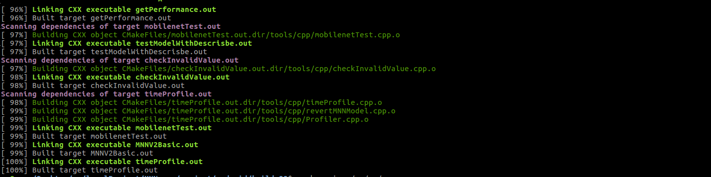


7. 编译armv8动态库：`mkdir build_64 && cd build_64 && ../build_64.sh`


cmake 3.6.3，升级

```
cd ~/Download
wget https://cmake.org/files/v3.6/cmake-3.6.0-Linux-x86_64.tar.gz
tar -xzvf cmake-3.6.0-Linux-x86_64.tar.gz

# 解压出来的包，将其放在 /opt 目录下，其他目录也可以，主要别以后不小心删了
sudo mv cmake-3.6.0-Linux-x86_64.tar.gz /opt/cmake-3.6.0

# 建立软链接
# 建立之前，先备份，
sudo cp  /usr/bin/cmake-gui /usr/bin/cmake-gui_backup3.5.1
sudo cp  /usr/bin/cmake /usr/bin/cmake_backup3.5.1

## 方式一
# sudo ln -sf /opt/cmake-3.13.0/bin/*  /usr/bin/
## 方式二
sudo ln /opt/cmake-3.6.0/bin/cmake-gui /usr/bin/cmake-gui
sudo ln /opt/cmake-3.6.0/bin/cmake /usr/bin/cmake

# 查看 cmake 版本
cmake --version
```


**错误：CMake Error: Could not find CMAKE_ROOT !!!**


```
CMake Error: Could not find CMAKE_ROOT !!!
CMake has most likely not been installed correctly.
Modules directory not found in
/usr/share/cmake-3.6
CMake Error: Could not find cmake module file: CMakeSystemSpecificInitialize.cmake
CMake Error: Could not find cmake module file: CMakeDetermineCCompiler.cmake
CMake Error: Error required internal CMake variable not set, cmake may be not be built correctly.
Missing variable is:
CMAKE_C_COMPILER_ENV_VAR
CMake Error: Error required internal CMake variable not set, cmake may be not be built correctly.
Missing variable is:
CMAKE_C_COMPILER
CMake Error: Could not find cmake module file: /home/pv/Desktop/py/localProject/MNN/build/CMakeFiles/3.6.0/CMakeCCompiler.cmake
CMake Error: Could not find cmake module file: CMakeDetermineCXXCompiler.cmake
CMake Error: Error required internal CMake variable not set, cmake may be not be built correctly.
Missing variable is:
CMAKE_CXX_COMPILER_ENV_VAR
CMake Error: Error required internal CMake variable not set, cmake may be not be built correctly.
Missing variable is:
CMAKE_CXX_COMPILER
CMake Error: Could not find cmake module file: /home/pv/Desktop/py/localProject/MNN/build/CMakeFiles/3.6.0/CMakeCXXCompiler.cmake
CMake Error: Could not find cmake module file: CMakeDetermineASMCompiler.cmake
CMake Error: Error required internal CMake variable not set, cmake may be not be built correctly.
Missing variable is:
CMAKE_ASM_COMPILER_ENV_VAR
CMake Error: Error required internal CMake variable not set, cmake may be not be built correctly.
Missing variable is:
CMAKE_ASM_COMPILER
CMake Error: Could not find cmake module file: /home/pv/Desktop/py/localProject/MNN/build/CMakeFiles/3.6.0/CMakeASMCompiler.cmake
CMake Error: Could not find cmake module file: CMakeSystemSpecificInformation.cmake
CMake Error at CMakeLists.txt:30 (project):
  No CMAKE_C_COMPILER could be found.

  Tell CMake where to find the compiler by setting the CMake cache entry
  CMAKE_C_COMPILER to the full path to the compiler, or to the compiler name
  if it is in the PATH.


CMake Error: Could not find cmake module file: CMakeCInformation.cmake
CMake Error at CMakeLists.txt:30 (project):
  No CMAKE_CXX_COMPILER could be found.

  Tell CMake where to find the compiler by setting the CMake cache entry
  CMAKE_CXX_COMPILER to the full path to the compiler, or to the compiler
  name if it is in the PATH.


CMake Error: Could not find cmake module file: CMakeCXXInformation.cmake
CMake Error at CMakeLists.txt:30 (project):
  No CMAKE_ASM_COMPILER could be found.

  Tell CMake where to find the compiler by setting the CMake cache entry
  CMAKE_ASM_COMPILER to the full path to the compiler, or to the compiler
  name if it is in the PATH.


CMake Error: Could not find cmake module file: CMakeASMInformation.cmake
CMake Error: CMAKE_C_COMPILER not set, after EnableLanguage
CMake Error: CMAKE_CXX_COMPILER not set, after EnableLanguage
CMake Error: CMAKE_ASM_COMPILER not set, after EnableLanguage
Configuring incomplete, errors occurred!
See also "/home/pv/Desktop/py/localProject/MNN/build/CMakeFiles/CMakeOutput.log".
See also "/home/pv/Desktop/py/localProject/MNN/build/CMakeFiles/CMakeError.log".
```

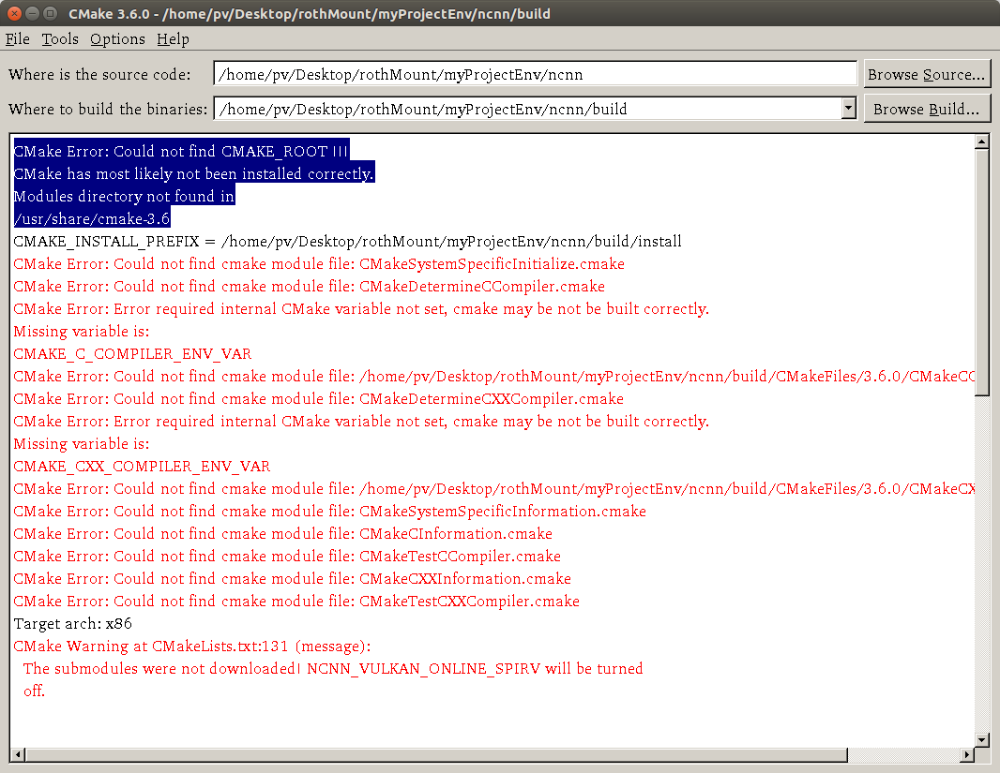


- 分析

**原因1：安装包问题**

升级不完全导致如下错误

因为在官网中下载的文件是编译好的

```
[ ]	cmake-3.6.0-Linux-x86_64.tar.gz	2016-07-07 13:05 	27M	 
```

之后，安装的时候按照未编译好的文件进行使用，因此才产生错误


（如下图），cmake-3.6.3-Linux-x86_64.tar.gz，这个是已经编译好的版本。还是使用[cmake-3.6.3.tar.gz](https://cmake.org/files/v3.6/cmake-3.6.3.tar.gz)比较好，下载下来之后再make编译，安装后与本机的兼容性更好。

 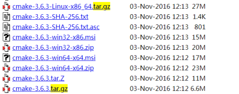

 

**原因2：没有找到相关的组件包信息**

检索提示的目录，可以发现有系统自带的 `cmake-3.5` ，内容如下：

```
pv@pv:/opt/cmake-3.6.3$ ll /usr/share/ | grep cmake
drwxr-xr-x    8 root root  4096 8月  12 11:04 cmake-3.5/
pv@pv:/opt/cmake-3.6.3$ ll /usr/share/cmake-3.5/
total 60
drwxr-xr-x   8 root root  4096 8月  12 11:04 ./
drwxr-xr-x 359 root root 12288 9月   7 14:30 ../
drwxr-xr-x   2 root root  4096 8月  12 11:04 completions/
drwxr-xr-x   4 root root  4096 8月  12 11:04 editors/
drwxr-xr-x  17 root root  4096 8月  12 11:04 Help/
drwxr-xr-x   2 root root  4096 8月  12 11:04 include/
drwxr-xr-x  10 root root 24576 8月  12 11:04 Modules/
drwxr-xr-x   3 root root  4096 8月  12 11:04 Templates/
```


- 解决方式

不行

```
$ hash -r
```


下载 [cmake-3.6.3.tar.gz](https://cmake.org/files/v3.6/cmake-3.6.3.tar.gz)

再进行安装。

具体如下

```
1.官网下载cmake-3.6.3.tar.gz  https://cmake.org/files/v3.6/cmake-3.6.3.tar.gz
2.解压文件tar -xvf cmake-3.6.3.tar.gz，并修改文件权限chmod -R 777 cmake-3.6.3
3.检测gcc和g++是否安装，如果没有则需安装gcc-g++：sudo apt-get install build-essential
（或者直接执行这两条命令sudo apt-get install gcc,sudo apt-get install g++）
4.进入cmake-3.6.3 进入命令 cd cmake-3.6.3
5.执行sudo ./bootstrap   或者执行  sudo ./configure
6.执行sudo make
7.执行 sudo make install
8.执行 cmake –-version，返回cmake版本信息，则说明安装成功
```


上述安装之后，如果出现以下错误

```
CMake Error: Could not find CMAKE_ROOT !!!
CMake has most likely not been installed correctly.
Modules directory not found in
/usr/share/cmake-3.6
```


将安装的位置的文件拷贝到 `/usr/share/` 目录

```
pv@pv:/opt/cmake-3.6.3$ cp -r /usr/local/share/cmake-3.6/ /usr/share/
cp: cannot create directory '/usr/share/cmake-3.6': Permission denied
pv@pv:/opt/cmake-3.6.3$ sudo cp -r /usr/local/share/cmake-3.6/ /usr/share/
pv@pv:/opt/cmake-3.6.3$ 
```


这样就不会错误了。


安装完后，执行cmake --version会报如下错误-奇搜博客
https://www.keysou.com/?id=365


编译安装cmake3 - ZealouSnesS - 博客园
https://www.cnblogs.com/zealousness/p/8748311.html


源码安装cmake(或者叫升级cmake) - 浮云-Mignet - 博客园
https://www.cnblogs.com/mignet/p/5404357.html


- 以下的安装方式也不行

  Linux之cmake3.6安装_逝者如斯夫-CSDN博客
  https://blog.csdn.net/fujian9544/article/details/104049491


### ./bench_android.sh: line 64: adb: command not found

```
pv@pv:~/Desktop/py/localProject/MNN-new/benchmark$ ./bench_android.sh
./bench_android.sh: line 64: adb: command not found

```


- 解决

```


sudo apt-get install android-tools-adb


```


之后进行相关的配置

首先通过  `lsusb` 命令查看Android设备的ID:


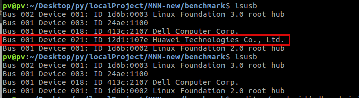

通过拔插手机设备，以及手机本身的识别码，可以发现，华为手机的相关的设备信息如下：

ID： 12d1


之后，进行如下配置

```

 # 终端
mkdir -p ~/.android
vi ~/.android/adb_usb.ini
# vi编辑器中加入
# add the following line:
12d1
 
# vi编辑器中输入 :wq
# 保存退出
 
 # 终端中
sudo vi /etc/udev/rules.d/70-android.rules
# vi编辑器中加入
# add the following line：
SUBSYSTEM=="usb", ATTR{idVendor}=="12d1", MODE="0666"
 
 # vi编辑器中输入 :wq
# 保存退出


 # 终端中
sudo udevadm control --reload-rules
sudo udevadm trigger
 
 
sudo adb kill-server
adb start-server
 
 
adb devices
adb shell
```


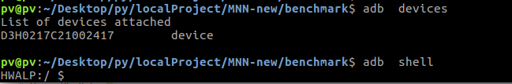


【MNN学习五】在Android上部署MobileNetSSD之一_My Blogs-CSDN博客
https://blog.csdn.net/qq_37643960/article/details/97814466


### Benchmark工具将模型推到手机测试推理时间


首先完成编译：

```
# 在MNN根目录下
mkdir build
cd build
cmake .. -DMNN_BUILD_BENCHMARK=true && make -j4
```


然后执行如下命令:

```
./benchmark.out models_folder loop_count forwardtype
```

选项如下:

- models_folder: benchmark models文件夹，benchmark models[在此](https://github.com/alibaba/MNN/tree/master/benchmark/models)。
- loop_count: 可选，默认是10
- forwardtype: 可选，默认是0，即CPU，forwardtype有0->CPU，1->Metal，3->OpenCL，6->OpenGL，7->Vulkan


#### Android

在[benchmark目录](https://github.com/alibaba/MNN/tree/master/benchmark)下直接执行脚本`bench_android.sh`，默认编译armv7，加参数-64编译armv8，参数-p将[benchmarkModels](https://github.com/alibaba/MNN/tree/master/benchmark/models) push到机器上。

脚本执行完成在[benchmark目录](https://github.com/alibaba/MNN/tree/master/benchmark)下得到测试结果`benchmark.txt`


具体如下

```
pv@pv:~/Desktop/py/localProject/MNN-new/benchmark$ ./bench_android.sh -p

```


终端输出

```
5303 KB/s (231000 bytes in 0.042s)
push: /home/pv/Desktop/py/localProject/MNN-new/benchmark/models_default/MobileNetV2_224.mnn -> /data/local/tmp/benchmark_models/MobileNetV2_224.mnn
push: /home/pv/Desktop/py/localProject/MNN-new/benchmark/models_default/mobilenet-v1-1.0.mnn -> /data/local/tmp/benchmark_models/mobilenet-v1-1.0.mnn
push: /home/pv/Desktop/py/localProject/MNN-new/benchmark/models_default/SqueezeNetV1.0.mnn -> /data/local/tmp/benchmark_models/SqueezeNetV1.0.mnn
push: /home/pv/Desktop/py/localProject/MNN-new/benchmark/models_default/inception-v3.mnn -> /data/local/tmp/benchmark_models/inception-v3.mnn
push: /home/pv/Desktop/py/localProject/MNN-new/benchmark/models_default/resnet-v2-50.mnn -> /data/local/tmp/benchmark_models/resnet-v2-50.mnn

```


测试结果在 `benchmark.txt`

- 自带模型测试结果

```
--------> Benchmarking... loop = 10, warmup = 5
[ - ] MobileNetV2_224.mnn         max =   43.952ms  min =   40.742ms  avg =   41.345ms
[ - ] mobilenet-v1-1.0.mnn        max =   67.484ms  min =   66.408ms  avg =   66.725ms
[ - ] SqueezeNetV1.0.mnn          max =   78.617ms  min =   74.100ms  avg =   75.462ms
[ - ] inception-v3.mnn            max =  573.716ms  min =  523.064ms  avg =  529.705ms
[ - ] resnet-v2-50.mnn            max =  350.961ms  min =  346.842ms  avg =  348.103ms
MNN benchmark
Forward type: **Vulkan** thread=4** precision=2
--------> Benchmarking... loop = 10, warmup = 5
[ - ] MobileNetV2_224.mnn         max =   41.613ms  min =   40.428ms  avg =   41.198ms
[ - ] mobilenet-v1-1.0.mnn        max =   68.386ms  min =   66.477ms  avg =   67.252ms
[ - ] SqueezeNetV1.0.mnn          max =   76.951ms  min =   73.999ms  avg =   76.018ms
[ - ] inception-v3.mnn            max =  527.038ms  min =  523.782ms  avg =  525.170ms
[ - ] resnet-v2-50.mnn            max =  348.808ms  min =  347.593ms  avg =  347.952ms
```


- Dnc_SINet

```
Forward type: **CPU** thread=4** precision=2
--------> Benchmarking... loop = 10, warmup = 5
[ - ] Dnc_SINet_bi_192_128.mnn    max =    6.224ms  min =    5.716ms  avg =    5.886ms
[ - ] Dnc_SINet_bi_256_160.mnn    max =   10.065ms  min =    9.418ms  avg =    9.610ms
[ - ] Dnc_SINet_bi_320_256.mnn    max =   22.692ms  min =   18.679ms  avg =   19.502ms
MNN benchmark
Forward type: **Vulkan** thread=4** precision=2
--------> Benchmarking... loop = 10, warmup = 5
[ - ] Dnc_SINet_bi_192_128.mnn    max =    6.115ms  min =    5.727ms  avg =    5.862ms
[ - ] Dnc_SINet_bi_256_160.mnn    max =    9.993ms  min =    8.572ms  avg =    9.167ms
[ - ] Dnc_SINet_bi_320_256.mnn    max =   30.365ms  min =   18.795ms  avg =   21.392ms
```


### ndk 配置

【Linux】Ubuntu下安装并配置Android-NDK（附详细过程）_Yngz_Miao的博客-CSDN博客
https://blog.csdn.net/qq_38410730/article/details/94151172


Android studio-第一次安装时候弹出unable to access android sdk add-on list解决方法 - 简书
https://www.jianshu.com/p/ab4a46c05f7c


## 疑问


### [benchmark目录](https://github.com/alibaba/MNN/tree/master/benchmark)下直接执行脚本`bench_android.sh`？？

这个执行之后，得到的有什么用处？


执行之后，有啥用？

```
pv@pv:~/Desktop/py/localProject/MNN-new/benchmark$ ./bench_android.sh -p
```

将模型推送到手机端进行测试，并且返回推理时间

打印的结果

```bash
push: /home/pv/Desktop/py/localProject/MNN-new/benchmark/models/MobileNetV2_224.mnn -> /data/local/tmp/benchmark_models/MobileNetV2_224.mnn
push: /home/pv/Desktop/py/localProject/MNN-new/benchmark/models/mobilenet-v1-1.0.mnn -> /data/local/tmp/benchmark_models/mobilenet-v1-1.0.mnn
push: /home/pv/Desktop/py/localProject/MNN-new/benchmark/models/SqueezeNetV1.0.mnn -> /data/local/tmp/benchmark_models/SqueezeNetV1.0.mnn
push: /home/pv/Desktop/py/localProject/MNN-new/benchmark/models/inception-v3.mnn -> /data/local/tmp/benchmark_models/inception-v3.mnn
push: /home/pv/Desktop/py/localProject/MNN-new/benchmark/models/resnet-v2-50.mnn -> /data/local/tmp/benchmark_models/resnet-v2-50.mnn

```


并没有找到

