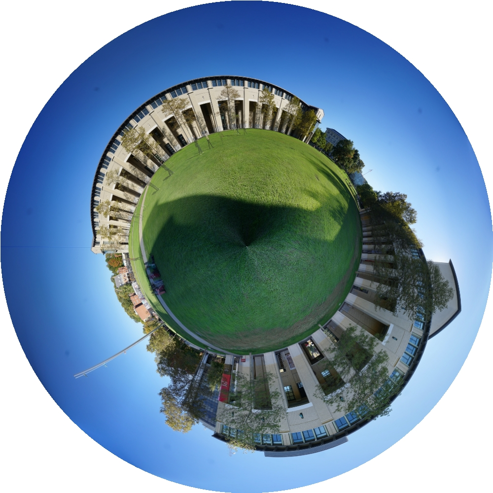

# 全景拼接

项目地址：

kushalvyas/Python-Multiple-Image-Stitching: Implementation of multiple image stitching
https://github.com/kushalvyas/Python-Multiple-Image-Stitching


目前的发展情况


难点


基本使用方法


评测指标


# 环境搭建

## pip install opencv-python 报错

**问题**

```
(Python-Multiple-Image-Stitching-py2.7) root@localhost:~/myProject/Python-Multiple-Image-Stitching/code# pip install opencv-python
DEPRECATION: Python 2.7 reached the end of its life on January 1st, 2020. Please upgrade your Python as Python 2.7 is no longer maintained. pip 21.0 will drop support for Python 2.7 in January 2021. More details about Python 2 support in pip can be found at https://pip.pypa.io/en/latest/development/release-process/#python-2-support
WARNING: The directory '/home/SSD/roth/.cache/pip' or its parent directory is not owned or is not writable by the current user. The cache has been disabled. Check the permissions and owner of that directory. If executing pip with sudo, you may want sudo's -H flag.
Looking in indexes: http://pypi.douban.com/simple
Collecting opencv-python
  Downloading http://pypi.doubanio.com/packages/a1/d6/8422797e35f8814b1d9842530566a949d9b5850a466321a6c1d5a99055ee/opencv-python-4.3.0.38.tar.gz (88.0 MB)
     |████████████████████████████████| 88.0 MB 2.6 MB/s 
  Installing build dependencies ... done
  Getting requirements to build wheel ... error
  ERROR: Command errored out with exit status 1:
   command: /home/SSD/roth/myProjectEnv/Python-Multiple-Image-Stitching-py2.7/bin/python2.7 /home/SSD/roth/myProjectEnv/Python-Multiple-Image-Stitching-py2.7/local/lib/python2.7/site-packages/pip/_vendor/pep517/_in_process.py get_requires_for_build_wheel /tmp/tmpCCylit
       cwd: /tmp/pip-install-oQXA4s/opencv-python
  Complete output (22 lines):
  Traceback (most recent call last):
    File "/home/SSD/roth/myProjectEnv/Python-Multiple-Image-Stitching-py2.7/local/lib/python2.7/site-packages/pip/_vendor/pep517/_in_process.py", line 280, in <module>
      main()
    File "/home/SSD/roth/myProjectEnv/Python-Multiple-Image-Stitching-py2.7/local/lib/python2.7/site-packages/pip/_vendor/pep517/_in_process.py", line 263, in main
      json_out['return_val'] = hook(**hook_input['kwargs'])
    File "/home/SSD/roth/myProjectEnv/Python-Multiple-Image-Stitching-py2.7/local/lib/python2.7/site-packages/pip/_vendor/pep517/_in_process.py", line 114, in get_requires_for_build_wheel
      return hook(config_settings)
    File "/home/SSD/roth/myProjectEnv/Python-Multiple-Image-Stitching-py2.7/local/lib/python2.7/site-packages/setuptools/build_meta.py", line 146, in get_requires_for_build_wheel
      return self._get_build_requires(config_settings, requirements=['wheel'])
    File "/home/SSD/roth/myProjectEnv/Python-Multiple-Image-Stitching-py2.7/local/lib/python2.7/site-packages/setuptools/build_meta.py", line 127, in _get_build_requires
      self.run_setup()
    File "/home/SSD/roth/myProjectEnv/Python-Multiple-Image-Stitching-py2.7/local/lib/python2.7/site-packages/setuptools/build_meta.py", line 243, in run_setup
      self).run_setup(setup_script=setup_script)
    File "/home/SSD/roth/myProjectEnv/Python-Multiple-Image-Stitching-py2.7/local/lib/python2.7/site-packages/setuptools/build_meta.py", line 142, in run_setup
      exec(compile(code, __file__, 'exec'), locals())
    File "setup.py", line 448, in <module>
      main()
    File "setup.py", line 99, in main
      % {"ext": re.escape(sysconfig.get_config_var("EXT_SUFFIX"))}
    File "/home/SSD/roth/myProjectEnv/Python-Multiple-Image-Stitching-py2.7/lib/python2.7/re.py", line 210, in escape
      s = list(pattern)
  TypeError: 'NoneType' object is not iterable
  ----------------------------------------
ERROR: Command errored out with exit status 1: /home/SSD/roth/myProjectEnv/Python-Multiple-Image-Stitching-py2.7/bin/python2.7 /home/SSD/roth/myProjectEnv/Python-Multiple-Image-Stitching-py2.7/local/lib/python2.7/site-packages/pip/_vendor/pep517/_in_process.py get_requires_for_build_wheel /tmp/tmpCCylit Check the logs for full command output.
(Python-Multiple-Image-Stitching-py2.7) root@localhost:~/myProject/Python-Multiple-Image-Stitching/code# apt-get install libxrender1^C
(Python-Multiple-Image-Stitching-py2.7) root@localhost:~/myProject/Python-Multiple-Image-Stitching/code# ^C
(Python-Multiple-Image-Stitching-py2.7) root@localhost:~/myProject/Python-Multiple-Image-Stitching/code# python pano.py ./
matchers.py  pano.py      txtlists/    
(Python-Multiple-Image-Stitching-py2.7) root@localhost:~/myProject/Python-Multiple-Image-Stitching/code# python pano.py ./txtlists/files1.txt 
Traceback (most recent call last):
  File "pano.py", line 2, in <module>
    import cv2
ImportError: No module named cv2
(Python-Multiple-Image-Stitching-py2.7) root@localhost:~/myProject/Python-Multiple-Image-Stitching/code# 
(Python-Multiple-Image-Stitching-py2.7) root@localhost:~/myProject/Python-Multiple-Image-Stitching/code# 

```


分析与解决

numpy 版本不对

解决

```
(Python-Multiple-Image-Stitching-py2.7) root@localhost:~/myProject/Python-Multiple-Image-Stitching/code# pip install --target='./' opencv-python==3.1.0.0
DEPRECATION: Python 2.7 reached the end of its life on January 1st, 2020. Please upgrade your Python as Python 2.7 is no longer maintained. pip 21.0 will drop support for Python 2.7 in January 2021. More details about Python 2 support in pip can be found at https://pip.pypa.io/en/latest/development/release-process/#python-2-support
WARNING: The directory '/home/SSD/roth/.cache/pip' or its parent directory is not owned or is not writable by the current user. The cache has been disabled. Check the permissions and owner of that directory. If executing pip with sudo, you may want sudo's -H flag.
Looking in indexes: http://pypi.douban.com/simple
Collecting opencv-python==3.1.0.0
  Downloading http://pypi.doubanio.com/packages/9b/08/6faed2c71086dbbeb25e89cff0b4f19cfa6bcd0699ca1ba3aed4bb8255a2/opencv_python-3.1.0.0-cp27-cp27mu-manylinux1_x86_64.whl (6.2 MB)
     |████████████████████████████████| 6.2 MB 1.1 MB/s 
Collecting numpy==1.11.1
  Downloading http://pypi.doubanio.com/packages/18/eb/707897ab7c8ad15d0f3c53e971ed8dfb64897ece8d19c64c388f44895572/numpy-1.11.1-cp27-cp27mu-manylinux1_x86_64.whl (15.3 MB)
     |████████████████████████████████| 15.3 MB 1.6 MB/s 
Installing collected packages: numpy, opencv-python
Successfully installed numpy-1.11.1 opencv-python-3.1.0.0

```


## cv2 导致错误 AttributeError: 'module' object has no attribute 'xfeatures2d'

**问题**

```
(Python-Multiple-Image-Stitching-py2.7) root@localhost:~/myProject/Python-Multiple-Image-Stitching/code# 
(Python-Multiple-Image-Stitching-py2.7) root@localhost:~/myProject/Python-Multiple-Image-Stitching/code# python pano.py ./txtlists/files1.txt 
Parameters :  ./txtlists/files1.txt
['../images/S1.jpg', '../images/S2.jpg', '../images/S3.jpg', '../images/S5.jpg', '../images/S6.jpg']
Traceback (most recent call last):
  File "pano.py", line 138, in <module>
    s = Stitch(args)
  File "pano.py", line 16, in __init__
    self.matcher_obj = matchers()
  File "/home/SSD/roth/myProject/Python-Multiple-Image-Stitching/code/matchers.py", line 6, in __init__
    self.surf = cv2.xfeatures2d.SURF_create()
AttributeError: 'module' object has no attribute 'xfeatures2d'
(Python-Multiple-Image-Stitching-py2.7) root@localhost:~/myProject/Python-Multiple-Image-Stitching/code# 
(Python-Multiple-Image-Stitching-py2.7) root@localhost:~/myProject/Python-Multiple-Image-Stitching/code# 

```


**分析与解决**


opencv 版本问题

```bash
pip install opencv-python==3.4.2.16
pip install opencv-contrib-python==3.4.2.16
```


> pip install opencv-contrib-python==3.4.2.16
> https://blog.csdn.net/weixin_43167047/article/details/82841750


# 工程 OpenPano

## 项目地址

ppwwyyxx/OpenPano: Automatic Panorama Stitching From Scratch
https://github.com/ppwwyyxx/OpenPano


## 环境配置

- ### Compile Dependencies:

  - gcc >= 4.7 (Or VS2015)
  - [Eigen](http://eigen.tuxfamily.org/index.php?title=Main_Page)
  - [FLANN](http://www.cs.ubc.ca/research/flann/) (already included in the repository, slightly modified)
  - [CImg](http://cimg.eu/) (optional. already included in the repository)
  - libjpeg (optional if you only work with png files)
  - cmake or make

  Eigen, CImg and FLANN are header-only, to simplify the compilation on different platforms. CImg and libjpeg are only used to read and write images, so you can easily get rid of them.

  On ArchLinux, install dependencies by: `sudo pacman -S gcc sed cmake make libjpeg eigen`

  On Ubuntu, install dependencies by: `sudo apt install build-essential sed cmake libjpeg-dev libeigen3-dev`


详情见官网文档

ppwwyyxx/OpenPano: Automatic Panorama Stitching From Scratch
https://github.com/ppwwyyxx/OpenPano


```
$ mkdir build && cd build && cmake .. && make
```


## 运行


进行图像拼接

```
pv@pv:~/Desktop/rothMount/myProject/OpenPano2020/build/src$ ./image-stitching ../../example-data/CMU0/medium*
```

完成之后，会在该路径下，保存图像 `out.jpg`，效果如下


## 生成特效图

其他的特效图具体见工程主函数

```
$ vi /home/pv/Desktop/rothMount/myProject/OpenPano2020/src/main.cc
```

相关参数如下

```
		if (command == "raw_extrema")
			test_extrema(argv[2], 0);
		else if (command == "keypoint")
			test_extrema(argv[2], 1);
		else if (command == "orientation")
			test_orientation(argv[2]);
		else if (command == "match")
			test_match(argv[2], argv[3]);
		else if (command == "inlier")
			test_inlier(argv[2], argv[3]);
		else if (command == "warp")
			test_warp(argc, argv);
		else if (command == "planet")
			planet(argv[2]);
		else
			{
			// the real routine
			work(argc, argv);
			}

```


生成星球图

```
 pv@pv:~/Desktop/rothMount/myProject/OpenPano2020/build/src$ ./image-stitching planet  ./out.jpg
```


完成之后，会在该路径下，保存图像 `planet.jpg`，效果如下





## 推理时间测试


打开工程主函数`main.cc`

```
$ vi /home/pv/Desktop/rothMount/myProject/OpenPano2020/src/main.cc
```


将main 函数中的 342 行中的时间测试开关打开，

```
bool testTimeFlag = true;
```


回到 OpenPano2020 工程目录，重新生成编译

```
$ mkdir build && cd build && cmake .. && make
```


之后，重新运行，相关图片，获取测试时间

时间效果如下：

| 说明： 1、测试时间测量10次求平均值 2、测试环境 Intel® Core™ i7-6700 CPU @ 3.40GHz × 8 |                |           |           |           |            |
| ------------------------------------------------------------ | -------------- | --------- | --------- | --------- | ---------- |
| 分辨率                                                       | 平均耗时（ms） | 图片数量2 | 图片数量3 | 图片数量4 | 图片数量38 |
| **320x240**                                                  | 638.6000       | yes       |           |           |            |
|                                                              | 696.9000       |           | yes       |           |            |
|                                                              | 732.1000       |           |           | yes       |            |
|                                                              | 5849.1001      |           |           |           | yes        |
| **640x480**                                                  | 857.2000       | yes       |           |           |            |
|                                                              | 903.0000       |           | yes       |           |            |
|                                                              | 1006.8000      |           |           | yes       |            |
|                                                              | 11000.9004     |           |           |           | yes        |
| **1280x720**                                                 | 1159.7000      | yes       |           |           |            |
|                                                              | 1159.7000      |           | yes       |           |            |
|                                                              | 1304.3000      |           |           | yes       |            |
|                                                              | 12248.0996     |           |           |           | yes        |
| **1300x867**                                                 | 1201.3000      | yes       |           |           |            |
|                                                              | 1268.0000      |           | yes       |           |            |
|                                                              | 1408.3000      |           |           | yes       |            |
|                                                              | 13808.2998     |           |           |           | yes        |
| **1920x1080**                                                | 1574.6000      | yes       |           |           |            |
|                                                              | 1609.8000      |           | yes       |           |            |
|                                                              | 1784.4000      |           |           | yes       |            |
|                                                              | 15941.0000     |           |           |           | yes        |


## 生成不同的分辨率特征图


见脚本

```
$   /home/pv/Desktop/rothMount/myProject/OpenPano2020/example-data/changePicFebBianLv.py
```


# 其他


基于深度学习Superpoint 的Python图像全景拼接_qq_33591712的博客-CSDN博客_基于深度学习的superpoint 图像拼接
https://blog.csdn.net/qq_33591712/article/details/84947829


amusi/awesome-image-stitching: 详尽地介绍关于图像拼接的知识点
https://github.com/amusi/awesome-image-stitching


tzxiang/awesome-image-alignment-and-stitching: A curated list of awesome resources for image alignment and stitching ...
https://github.com/tzxiang/awesome-image-alignment-and-stitching