# ~~MobileNetV2-YOLOv3-SPP 实验~~

xuarehere/MobileNetv2-YOLOV3: MobileNetV2-YoloV3-Nano: 0.5BFlops 3MB HUAWEI P40: 6ms/img, YoloFace-500k:0.1Bflops500KB
https://github.com/xuarehere/MobileNetv2-YOLOV3


[MobileNetV2-YOLOv3-SPP](https://github.com/dog-qiuqiu/MobileNetv2-YOLOV3/tree/master/MobileNetV2-YOLOv3-SPP)

使用从 darknet 官网下载的框架，进行训练，不对框架的源码进行修改。

以下是 github 用了开预训练权重的结果 


- github 性能


| Network                                                      | COCO mAP(0.5) | Resolution | FLOPS     | Weight size |
| ------------------------------------------------------------ | ------------- | ---------- | --------- | ----------- |
| [MobileNetV2-YOLOv3-SPP](https://github.com/dog-qiuqiu/MobileNetv2-YOLOV3/tree/master/MobileNetV2-YOLOv3-SPP) | 42.6          | 416        | 6.1BFlops | 17.6MB      |


- 实验复现结果

| Network                                         | COCO mAP(0.5) | Resolution | FLOPS     | Weight size |
| ----------------------------------------------- | ------------- | ---------- | --------- | ----------- |
| MobileNetV2-YOLOv3-SPP(github版本）             | 42.6          | 416        | 6.1BFlops | 17.6MB      |
| MobileNetV2-YOLOv3-SPP(零开始训练）             | 26.62         | 416        | 6.1BFlops | 17.6MB      |
| MobileNetV2-YOLOv3-SPP(预训练权重训练）         | 37.36         | 416        | 6.1BFlops | 17.6MB      |
| **MobileNetV2-YOLOv3-SPP(调整正负anchor权重）** | **43.51**     | 416        | 6.1BFlops | 17.6MB      |


## 从零开始训练，不使用任何的预训练权重


- 训练脚本

```bash
cd /home/SSD/roth/myProject/darknet/ \

./darknet detector train \
/home/SSD/roth/myProject/localProject/caffeProject/MobileNetv2-YOLOV3/MobileNetV2-YOLOv3-SPP/1_zeroTrain/coco.data \
/home/SSD/roth/myProject/localProject/caffeProject/MobileNetv2-YOLOV3/MobileNetV2-YOLOv3-SPP/1_zeroTrain/MobileNetV2-YOLOv3-SPP.cfg \
-gpus 4,5 -dont_show  -map -mjpeg_port 8050 \
-clear \
2>&1 | tee -a /home/SSD/roth/myProject/localProject/caffeProject/MobileNetv2-YOLOV3/MobileNetV2-YOLOv3-SPP/1_zeroTrain/result1/train1_log.txt

```


- 超参数

```cfg
[net]
batch=8
subdivisions=1
width=416
height=416
channels=3
momentum=0.9
decay=0.0005
angle=0
saturation=1.5
exposure=1.5
hue=.1

learning_rate=0.0000125
burn_in=8000
max_batches=800020
policy=steps
steps=400000,650000
scales=.1,.1

```


- 训练情况


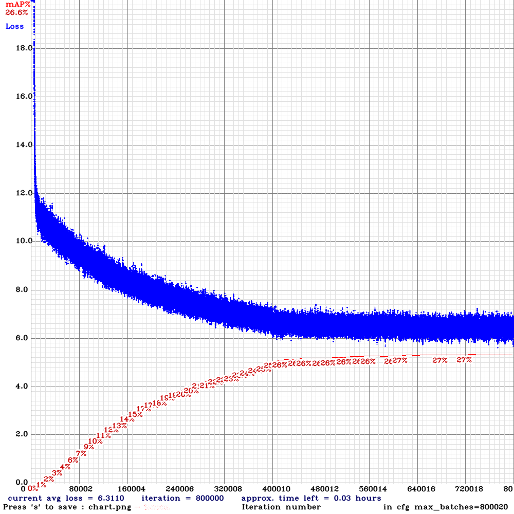


## 使用预训练权重进行训练

### 使用预训练权重进行训练

- 训练脚本


```bash
cd /home/SSD/roth/myProject/darknet/ \

./darknet detector train \
/home/SSD/roth/myProject/localProject/caffeProject/MobileNetv2-YOLOV3/MobileNetV2-YOLOv3-SPP/2_weightTrain/coco.data \
/home/SSD/roth/myProject/localProject/caffeProject/MobileNetv2-YOLOV3/MobileNetV2-YOLOv3-SPP/2_weightTrain/MobileNetV2-YOLOv3-SPP.cfg \
/home/SSD/roth/myProject/localProject/caffeProject/MobileNetv2-YOLOV3/MobileNetV2-YOLOv3-SPP/MobileNetV2-YOLOv3-SPP.conv.57 \
-gpus 0,1 -dont_show  -map -mjpeg_port 8050 \
-clear \
2>&1 | tee -a /home/SSD/roth/myProject/localProject/caffeProject/MobileNetv2-YOLOV3/MobileNetV2-YOLOv3-SPP/2_weightTrain/result1/train1_log.txt

```


- 超参数

```cfg
[net]
batch=8
subdivisions=1
width=416
height=416
channels=3
momentum=0.9
decay=0.0005
angle=0
saturation=1.5
exposure=1.5
hue=.1

learning_rate=0.0000125
burn_in=8000
max_batches=800020
policy=steps
steps=400000,650000
scales=.1,.1

```


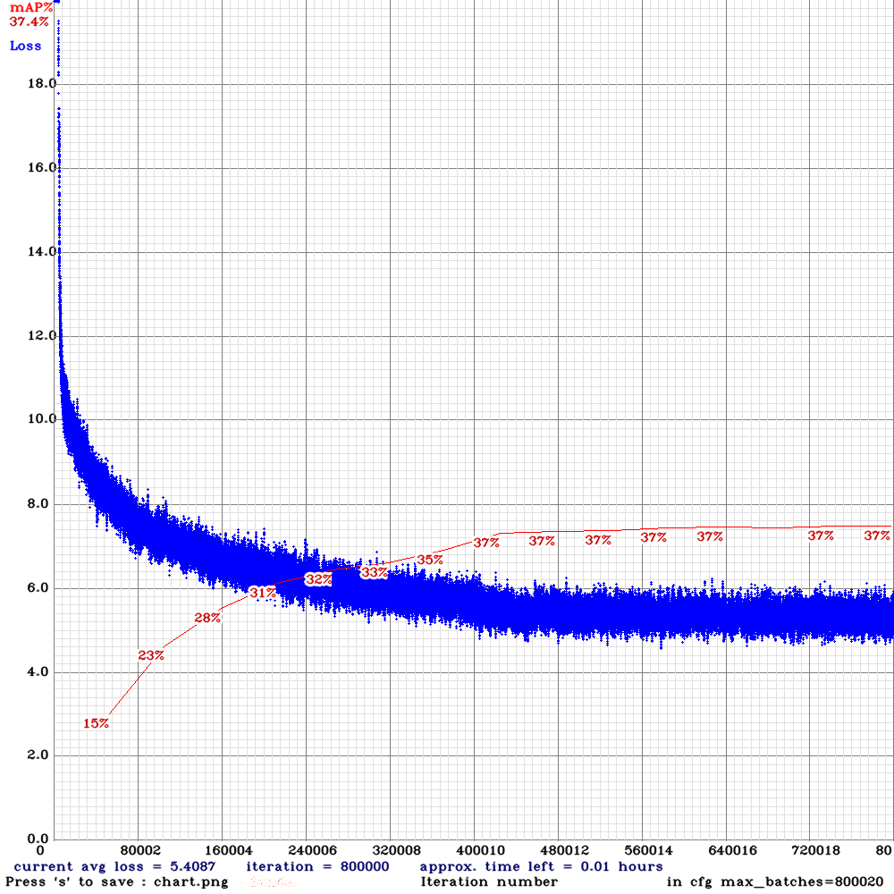


- 结果分析

通过实验对比，可以发现，同样的实验条件下，使用了预训练权重的模型比不使用预训练权重的**模型的性能要高上不少**，表现在 Loss 也收敛了很多，


### 模型性能超参数调整


#### 使用预训练权重进行训练，调整正负 anchor 的权重，训练


- 修改文件

```
/home/SSD/roth/myProject/darknet/src/yolo_layer.c
```


- 修改内容

原来部分，  520行左右

```c
                int obj_index = entry_index(l, b, mask_n*l.w*l.h + j*l.w + i, 4);

                //正anchor loss
                avg_obj += l.output[obj_index];
                l.delta[obj_index] = class_multiplier * l.cls_normalizer * (1 - l.output[obj_index]);

```


```c
                    avg_anyobj += l.output[obj_index];
                    l.delta[obj_index] = l.cls_normalizer * (0 - l.output[obj_index]);
```


**加权修改**

```c
                int obj_index = entry_index(l, b, mask_n*l.w*l.h + j*l.w + i, 4);

                //正anchor loss
                avg_obj += l.output[obj_index];
                l.delta[obj_index] = class_multiplier * l.cls_normalizer * 0.75* (1 - l.output[obj_index]);

```


```c
                    avg_anyobj += l.output[obj_index];
                    l.delta[obj_index] = l.cls_normalizer *0.25 *(0 - l.output[obj_index]);
```


- 训练脚本


```bash
cd /home/SSD/roth/myProject/darknet/ \

./darknet detector train \
/home/SSD/roth/myProject/localProject/caffeProject/MobileNetv2-YOLOV3/MobileNetV2-YOLOv3-SPP/2_weightTrain/coco.data \
/home/SSD/roth/myProject/localProject/caffeProject/MobileNetv2-YOLOV3/MobileNetV2-YOLOv3-SPP/2_weightTrain/MobileNetV2-YOLOv3-SPP.cfg \
/home/SSD/roth/myProject/localProject/caffeProject/MobileNetv2-YOLOV3/MobileNetV2-YOLOv3-SPP/2_weightTrain/result1/MobileNetV2-YOLOv3-SPP_best.weights \
-gpus 0,1,2,3,4,5 -dont_show  -map -mjpeg_port 8050 \
-clear \
2>&1 | tee -a /home/SSD/roth/myProject/localProject/caffeProject/MobileNetv2-YOLOV3/MobileNetV2-YOLOv3-SPP/2_weightTrain/result1_continue1/train1_log.txt

```


- 超参数

```cfg
[net]
batch=8
subdivisions=1
width=416
height=416
channels=3
momentum=0.9
decay=0.0005
angle=0
saturation=1.5
exposure=1.5
hue=.1

learning_rate=0.0000125
burn_in=8000
max_batches=1000020
policy=steps
steps=500000,850000
scales=.1,.1

```


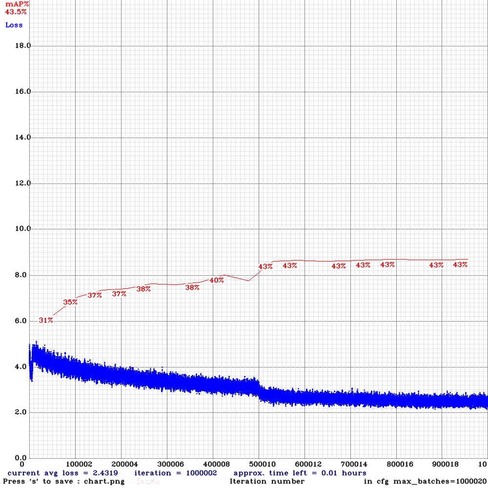


- 结果分析

通过实验对比，可以发现，同样的实验条件下，对正负 anchor 进行不同的加权，可以发现，**加权后的模型的训练的效果要远远优于**没有使用加权的模型。

Loss 上也收敛的特别多。


## 疑问

### 预训练权重是从哪里获得的？

- 问题

预训练权重，darknet官方没有找到 mobilenet-v2 的，这个是用 pytorch 官方的，之后转的 darknet 的么？


- 解答

darknet 官网没有这个预训练权重，caffe 有，用caffe的转darknet，之后就可以使用了。


# ==注意：在这之后的所有实验，正负anchor的权重被调整==

具体见前面：


```
MobileNetV2-YOLOv3-SPP 实验 下的：

#### 使用预训练权重进行训练，调整正负 anchor 的权重，训练


```


# YOLOv4-Tiny 实验


- github 性能

| Network                                                      | COCO mAP(0.5) | Resolution | FLOPS     | Weight size |
| ------------------------------------------------------------ | ------------- | ---------- | --------- | ----------- |
| [YOLOv4-Tiny](https://github.com/AlexeyAB/darknet#pre-trained-models) | 40.2          | 416        | 6.9BFlops | 23.1MB      |


- 实验复现结果

| Network                                                      | COCO mAP(0.5) | Resolution | FLOPS     | Weight size |
| ------------------------------------------------------------ | ------------- | ---------- | --------- | ----------- |
| [YOLOv4-Tiny](https://github.com/AlexeyAB/darknet#pre-trained-models) | ==29.3==      | 416        | 6.9BFlops | 23.1MB      |


## 从零开始训练，不使用任何的预训练权重


- 超参数

```cfg
;max_batches = 500200
;policy=steps
;steps=400000,450000
;scales=.1,.1


[net]
# Testing
#batch=1
#subdivisions=1
# Training
batch=8
subdivisions=1
width=416
height=416
channels=3
momentum=0.9
decay=0.0005
angle=0
saturation = 1.5
exposure = 1.5
hue=.1

learning_rate=0.00261
burn_in=1000
max_batches = 1000400
policy=steps
steps=400000,80000
scales=.1,.1
```


- 训练脚本


```bash
cd /home/SSD/roth/myProject/darknet/ \

./darknet detector train \
/home/SSD/roth/myProject/localProject/caffeProject/MobileNetv2-YOLOV3/exp_roth/YOLOv4-Tiny/1_zeroTrain/coco.data \
/home/SSD/roth/myProject/localProject/caffeProject/MobileNetv2-YOLOV3/exp_roth/YOLOv4-Tiny/yolov4-tiny.cfg \
-gpus 0,1,2,3,4,5,6 -dont_show  -map -mjpeg_port 8050 \
-clear \
2>&1 | tee -a \
/home/SSD/roth/myProject/localProject/caffeProject/MobileNetv2-YOLOV3/exp_roth/YOLOv4-Tiny/1_zeroTrain/result1/train1_log.txt

```


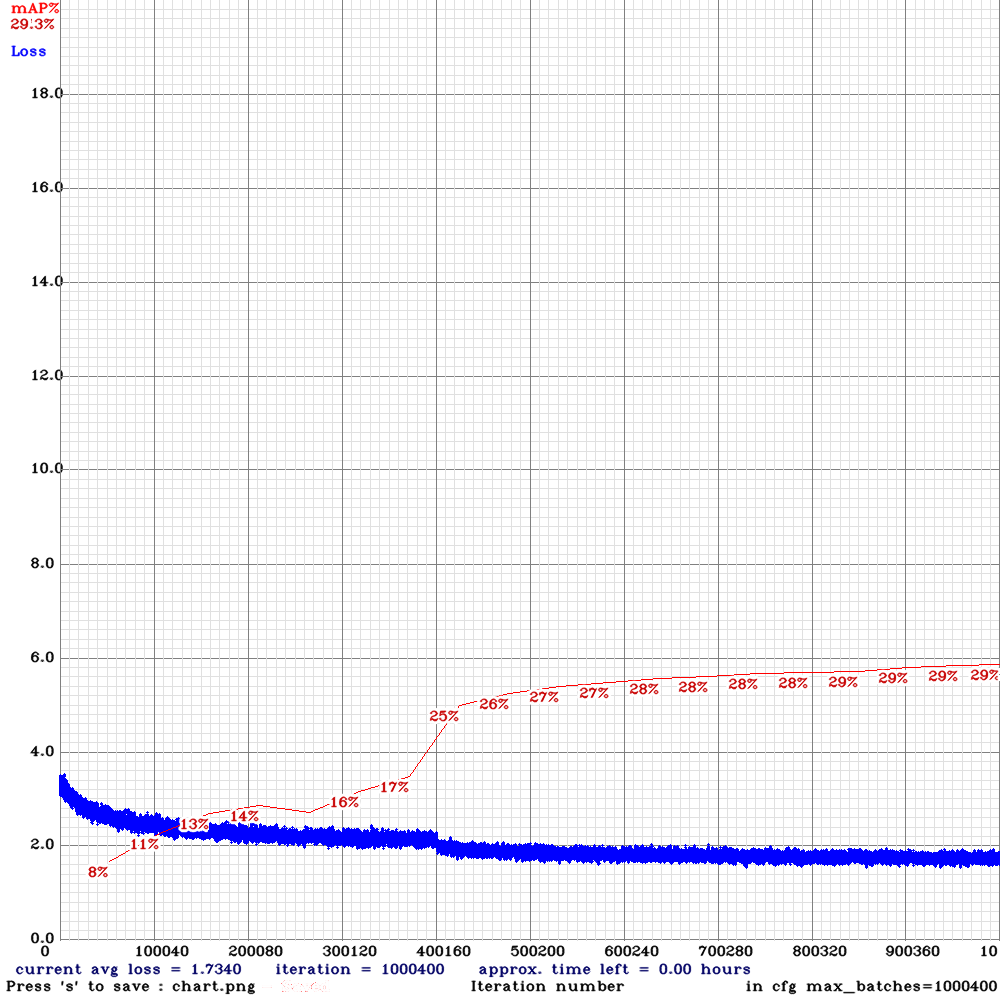


- 训练脚本

```bash
cd /home/SSD/roth/myProject/darknet/ \

./darknet detector train \
/home/SSD/roth/myProject/localProject/caffeProject/MobileNetv2-YOLOV3/exp_roth/YOLOv4-Tiny/1_zeroTrain/coco.data \
/home/SSD/roth/myProject/localProject/caffeProject/MobileNetv2-YOLOV3/exp_roth/YOLOv4-Tiny/yolov4-tiny.cfg \
/home/SSD/roth/myProject/localProject/caffeProject/MobileNetv2-YOLOV3/exp_roth/YOLOv4-Tiny/1_zeroTrain/result1/yolov4-tiny_best.weights \
-gpus 0,1,2,3,4,5,6,7 -dont_show  -map -mjpeg_port 8050 \
-clear \
2>&1 | tee -a \
/home/SSD/roth/myProject/localProject/caffeProject/MobileNetv2-YOLOV3/exp_roth/YOLOv4-Tiny/1_zeroTrain/result1_finetuning1/train1_log.txt


```


- 训练超参数

```cfg
;max_batches = 500200
;policy=steps
;steps=400000,450000
;scales=.1,.1


[net]
# Testing
#batch=1
#subdivisions=1
# Training
batch=8
subdivisions=1
width=416始的loss非常低，但
height=416
channels=3
momentum=0.9始的loss非常低，但
decay=0.0005
angle=0
saturation = 1.5
exposure = 1.5
hue=.1

learning_rate=0.00261
burn_in=1000
max_batches = 2000800
policy=steps
steps=800000,160000
scales=.1,.1

```


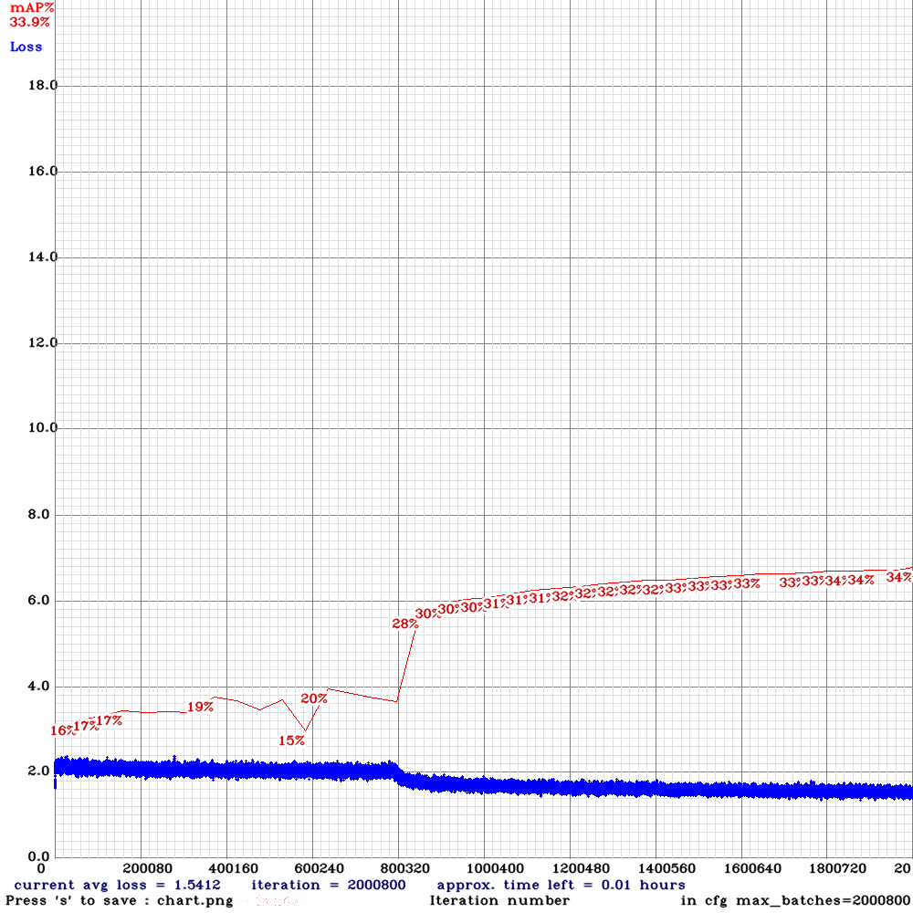

使用


```
cd /home/SSD/roth/myProject/darknet/ \

./darknet detector train \
/home/SSD/roth/myProject/localProject/caffeProject/MobileNetv2-YOLOV3/exp_roth/YOLOv4-Tiny/1_zeroTrain/coco.data \
/home/SSD/roth/myProject/localProject/caffeProject/MobileNetv2-YOLOV3/exp_roth/YOLOv4-Tiny/yolov4-tiny.cfg \
/home/SSD/roth/myProject/localProject/caffeProject/MobileNetv2-YOLOV3/exp_roth/YOLOv4-Tiny/1_zeroTrain/result1_finetuning1/yolov4-tiny_best.weights \
-gpus 0,1,2,3,4,5,6,7 -dont_show  -map -mjpeg_port 8050 \
-clear \
2>&1 | tee -a \
/home/SSD/roth/myProject/localProject/caffeProject/MobileNetv2-YOLOV3/exp_roth/YOLOv4-Tiny/1_zeroTrain/result1_finetuning2/train1_log.txt


```


```

[net]
# Testing
#batch=1
#subdivisions=1
# Training
batch=8
subdivisions=1
width=416
height=416
channels=3
momentum=0.9
decay=0.0005
angle=0
saturation = 1.5
exposure = 1.5
hue=.1

learning_rate=0.00261
burn_in=1000
max_batches = 2000800
policy=steps
steps=80000000,16000000
scales=.1,.1

```


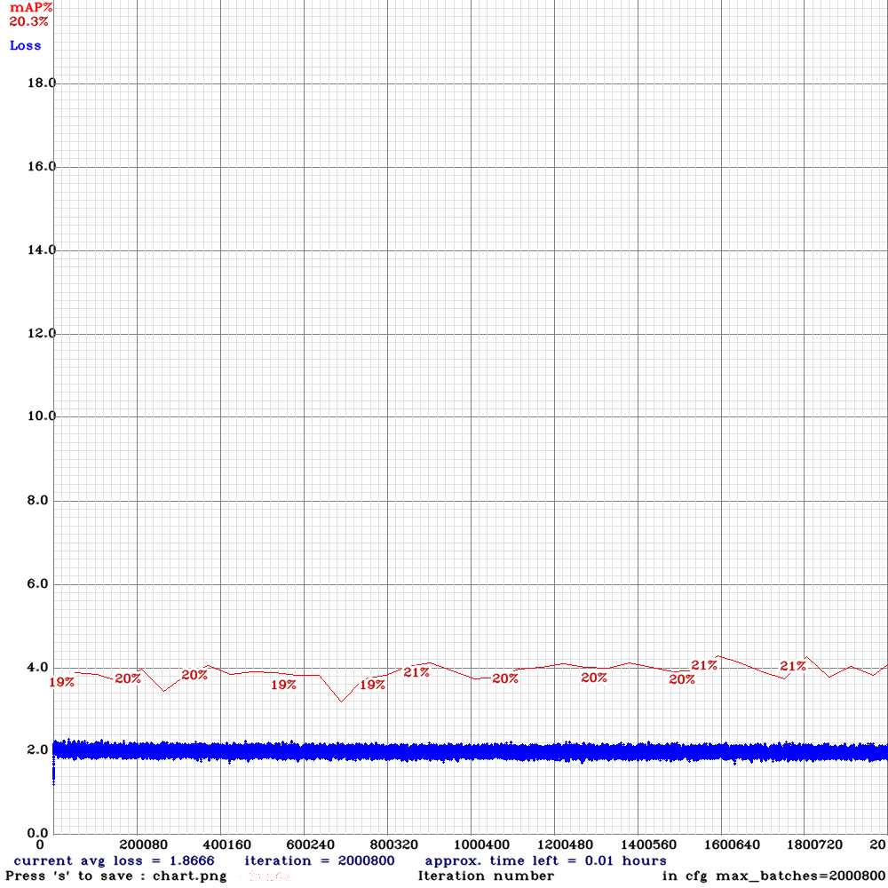


- 更改学习率

```
;learning_rate=0.00261
;learning_rate=0.000561     # 30

;max_batches = 500200
;policy=steps
;steps=400000,450000
;scales=.1,.1


[net]
# Testing
#batch=1
#subdivisions=1
# Training
batch=8
subdivisions=1
width=416
height=416
channels=3
momentum=0.9
decay=0.0005
angle=0
saturation = 1.5
exposure = 1.5
hue=.1

learning_rate=0.0000561
burn_in=1000
max_batches = 2000800
policy=steps
steps=80000000,16000000
scales=.1,.1

```


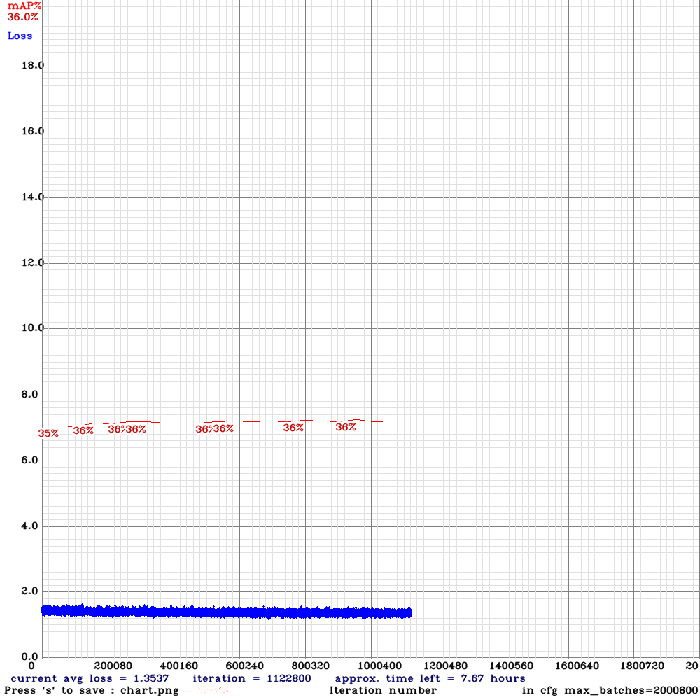


- 超参数

```cfg

[net]
# Testing
#batch=1
#subdivisions=1
# Training
batch=8
subdivisions=1
width=416
height=416
channels=3
momentum=0.9
decay=0.0005
angle=0
saturation = 1.5
exposure = 1.5
hue=.1

learning_rate=0.0000161
burn_in=1000
max_batches = 2000800
policy=steps
steps=80000000,16000000
scales=.1,.1

```


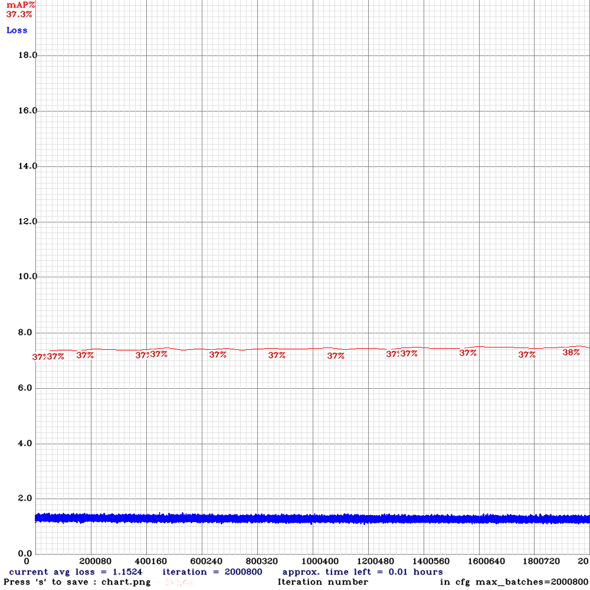


- 超参数

降低学习率

```cfg
[net]
# Testing
#batch=1
#subdivisions=1
# Training
batch=8
subdivisions=1
width=416
height=416
channels=3
momentum=0.9
decay=0.0005
angle=0
saturation = 1.5
exposure = 1.5
hue=.1

learning_rate=0.0000061
burn_in=1000
max_batches = 2000800
policy=steps
steps=80000000,16000000
scales=.1,.1
```


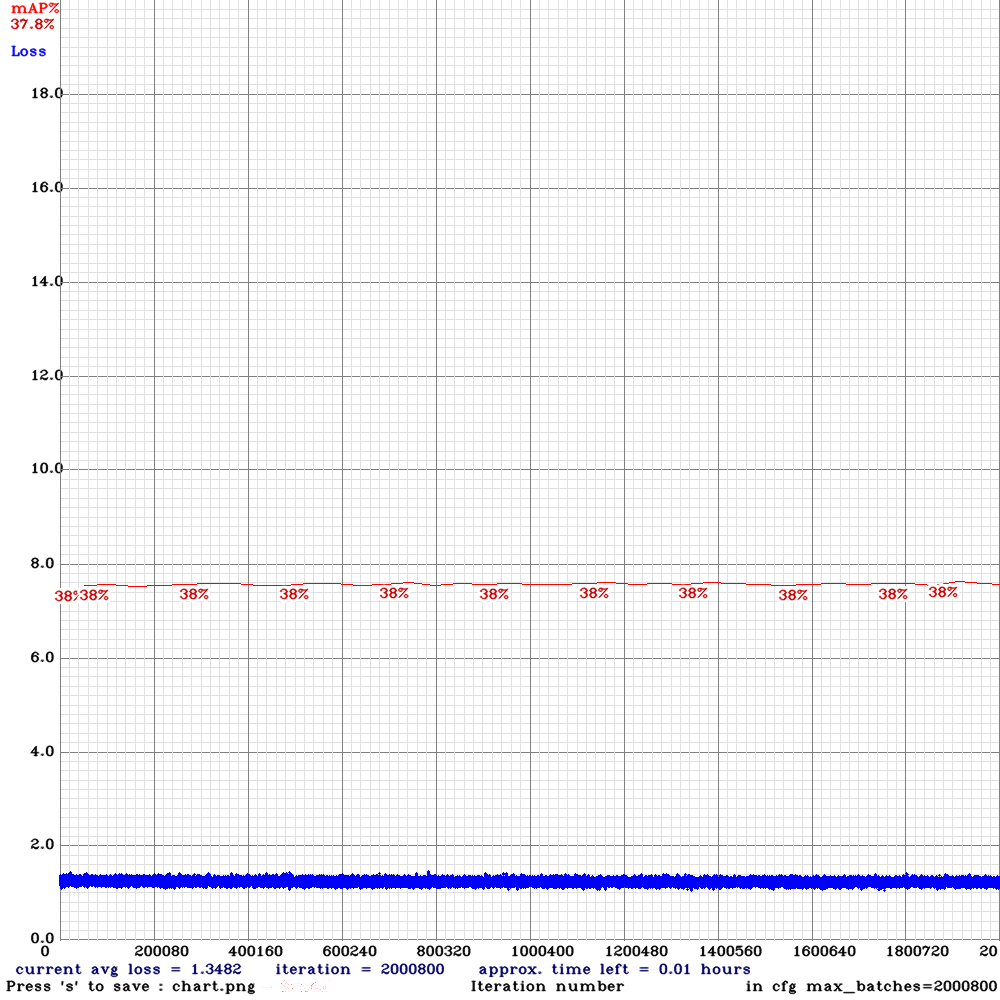


- 超参数

增大学习率

```cfg
[net]
# Testing
#batch=1
#subdivisions=1
# Training
batch=8
subdivisions=1
width=416
height=416
channels=3
momentum=0.9
decay=0.0005
angle=0
saturation = 1.5
exposure = 1.5
hue=.1

learning_rate=0.0000361
burn_in=1000
max_batches = 2000800
policy=steps
steps=80000000,16000000
scales=.1,.1

```


结果降低了几个点的map


- 超参数

减少学习率，增大 batch

```cfg
[net]
# Testing
#batch=1
#subdivisions=1
# Training
batch=16
subdivisions=1
width=416
height=416
channels=3
momentum=0.9
decay=0.0005
angle=0
saturation = 1.5
exposure = 1.5
hue=.1

learning_rate=0.0000161
burn_in=1000
max_batches = 2000800
policy=steps
steps=80000000,16000000
scales=.1,.1
```


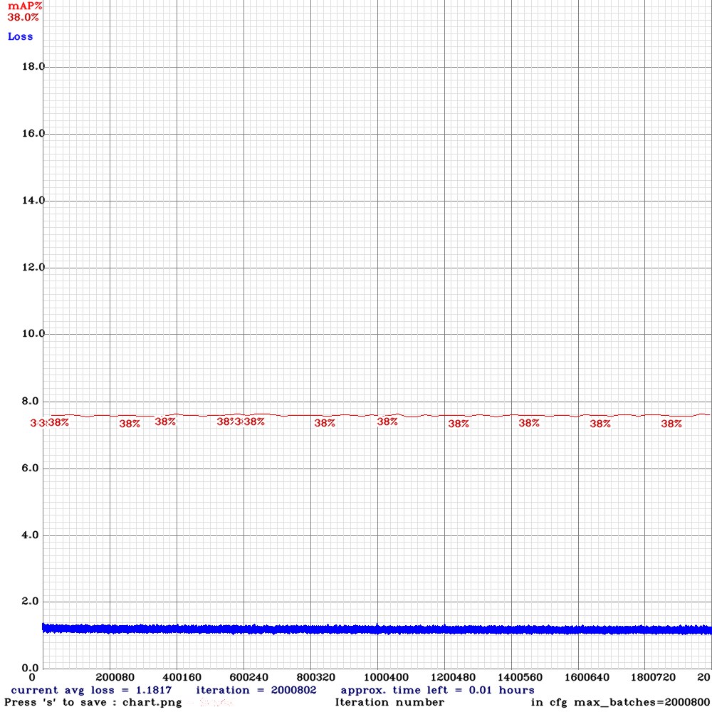


**增大学习率以及batch**

- 超参数

```
[net]
# Testing
#batch=1
#subdivisions=1
# Training
batch=32
subdivisions=1
width=416
height=416
channels=3
momentum=0.9
decay=0.0005
angle=0
saturation = 1.5
exposure = 1.5
hue=.1

learning_rate=0.0000561
burn_in=1000
max_batches = 2000800000
policy=steps
steps=80000000,16000000
scales=.1,.1
```


- 训练脚本

```
cd /home/SSD/roth/myProject/darknet/ \

./darknet detector train \
/home/SSD/roth/myProject/localProject/caffeProject/MobileNetv2-YOLOV3/exp_roth/YOLOv4-Tiny/1_zeroTrain/coco.data \
/home/SSD/roth/myProject/localProject/caffeProject/MobileNetv2-YOLOV3/exp_roth/YOLOv4-Tiny/yolov4-tiny.cfg \
/home/SSD/roth/myProject/localProject/caffeProject/MobileNetv2-YOLOV3/exp_roth/YOLOv4-Tiny/1_zeroTrain/result1_finetuning3/yolov4-tiny_best.weights \
-gpus 1,2,3,4,5,7 -dont_show  -map -mjpeg_port 8050 \
-clear \
2>&1 | tee -a \
/home/SSD/roth/myProject/localProject/caffeProject/MobileNetv2-YOLOV3/exp_roth/YOLOv4-Tiny/1_zeroTrain/result1_finetuning3/train1_log.txt

```

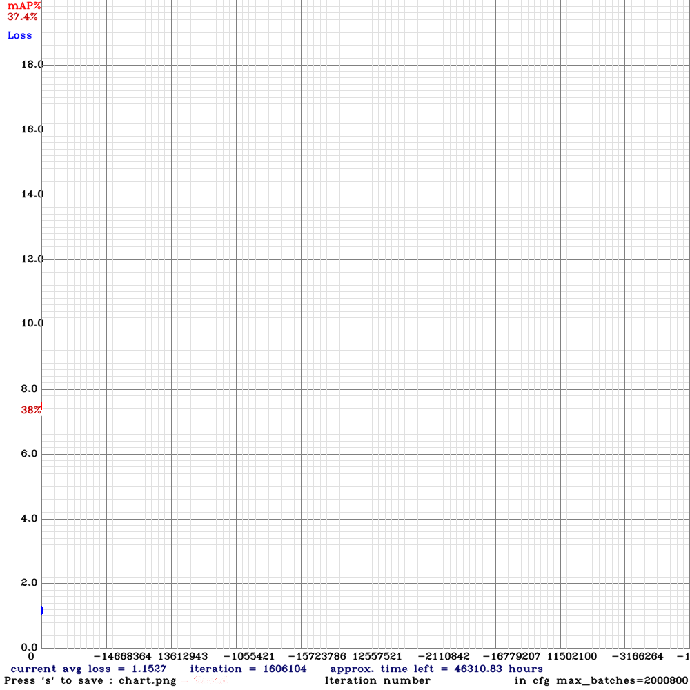


**使用voc 进行交叉训练**


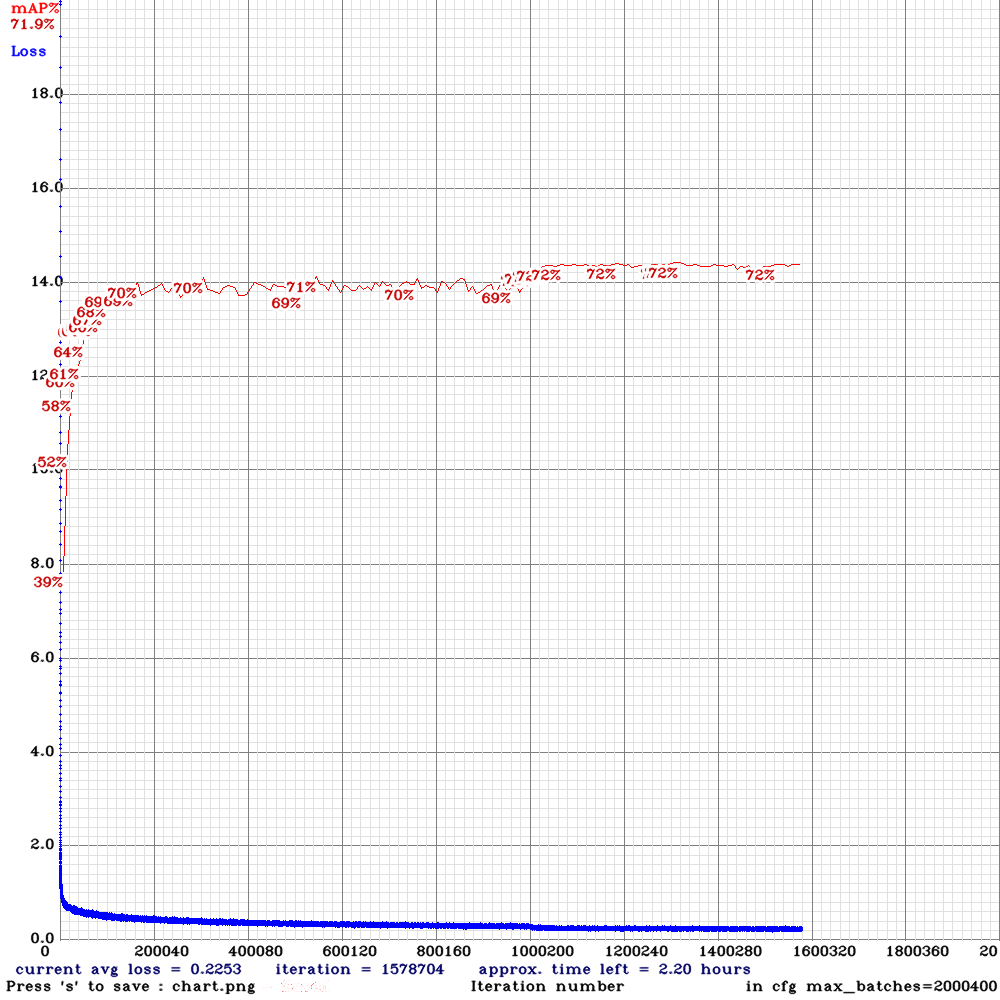


## 疑问


### 为什么每一次进行微调训练，开始的loss非常低，但是，map 性能却表现比较差？

通过上面的几次实验发现，似乎跟训练的学习率有关。

背景：

从原始开始训练到模型具有一定的推理性能（例如，loss： 8 => 2;  对应 map0.5：5% => 35%），假设中间对应参数变化如下：

阶段A：loss： 8；map0.5：5% ；	 	learning_rate = 0.00261

阶段B：loss： 5；map0.5：21% ；		learning_rate = 0.00261

阶段C：loss： 4；map0.5：30% ；		learning_rate = 0.000261

阶段D：loss： 1.8；map0.5：35% ；	learning_rate = 0.000111


微调过程E：

加载训练完成的阶段D，学习率设置为	learning_rate = 0.00261并保持不变：loss=2；map0.5 = 22%

从一开始到模型训练结束，始终有map0.5 = 22%


微调过程F：

加载训练完成的微调过程E，学习率设置为	learning_rate = 0.000111 并保持不变：loss=2 ==> loss=1.8；map0.5 = 30%  ==> map0.5 = 35%

一开始训练的时候，map 不再是22%，而是30左右。


分析：

似乎与学习率有关。

下一步，对所有的结果，直接进行map测试查看，看看是否符合

YOLOv3-Tiny-Prn	56.5


# MobileNetV2-YOLOv3-Lite&Nano Darknet


- github 性能

**Mobile inference frameworks benchmark (4*ARM_CPU)**

| Network                                                      | VOC mAP(0.5) | COCO mAP(0.5) | Resolution | Inference time (NCNN/Kirin 990) | Inference time (MNN arm82/Kirin 990) | FLOPS      | Weight size |
| ------------------------------------------------------------ | ------------ | ------------- | ---------- | ------------------------------- | ------------------------------------ | ---------- | ----------- |
| [MobileNetV2-YOLOv3-Lite](https://github.com/dog-qiuqiu/MobileNetv2-YOLOV3/tree/master/MobileNetV2-YOLOv3-Lite) | 72.61        | 36.57         | 320        | 31.58 ms                        | 18 ms                                | 1.8BFlops  | 8.0MB       |
| [MobileNetV2-YOLOv3-Nano](https://github.com/dog-qiuqiu/MobileNetv2-YOLOV3/tree/master/MobileNetV2-YOLOv3-Nano) | 65.27        | 30.13         | 320        | 13 ms                           | 5 ms                                 | 0.5BFlops  | 3.0MB       |
| [YOLOv3-Tiny-Prn](https://github.com/AlexeyAB/darknet#pre-trained-models) | &            | 33.1          | 416        | 36.6 ms                         | & ms                                 | 3.5BFlops  | 18.8MB      |
| [YOLO-Nano](https://github.com/liux0614/yolo_nano)           | 69.1         | &             | 416        | & ms                            | & ms                                 | 4.57BFlops | 4.0MB       |


- 实验复现

| Network                                                      | VOC mAP(0.5) | COCO mAP(0.5) | Resolution | Inference time (NCNN/Kirin 990) | Inference time (MNN arm82/Kirin 990) | FLOPS      | Weight size |
| ------------------------------------------------------------ | ------------ | ------------- | ---------- | ------------------------------- | ------------------------------------ | ---------- | ----------- |
| [MobileNetV2-YOLOv3-Lite](https://github.com/dog-qiuqiu/MobileNetv2-YOLOV3/tree/master/MobileNetV2-YOLOv3-Lite) | 72.4         |               | 320        |                                 |                                      | 1.8BFlops  | 8.0MB       |
| [MobileNetV2-YOLOv3-Nano](https://github.com/dog-qiuqiu/MobileNetv2-YOLOV3/tree/master/MobileNetV2-YOLOv3-Nano) | ==60.72==    | ==28.2==      | 320        |                                 |                                      | 0.5BFlops  | 3.0MB       |
| [YOLOv3-Tiny-Prn](https://github.com/AlexeyAB/darknet#pre-trained-models) | ==56.5==     |               | 416        |                                 |                                      | 3.5BFlops  | 18.8MB      |
| [YOLO-Nano](https://github.com/liux0614/yolo_nano)           | ?            | ?             | 416        |                                 |                                      | 4.57BFlops | 4.0MB       |


YOLOv3-Tiny-Prn	56.5

## MobileNetV2-YOLOv3-Lite


[MobileNetV2-YOLOv3-Lite](https://github.com/dog-qiuqiu/MobileNetv2-YOLOV3/tree/master/MobileNetV2-YOLOv3-Lite)


### 使用预训练权重进行训练


- 超参数

```cfg
[net]
batch=16
subdivisions=1
width=320
height=320
channels=3
momentum=0.9
decay=0.0005
angle=0
saturation=1.5
exposure=1.5
hue=.1

learning_rate=0.000125
burn_in=8000
max_batches=100020
policy=steps
steps=40000,65000
scales=.1,.1

```


- 训练脚本

```
cd /home/SSD/roth/myProject/darknet/ \

./darknet detector train \
/home/SSD/roth/myProject/localProject/caffeProject/MobileNetv2-YOLOV3/exp_roth/MobileNetV2-YOLOv3-Lite/voc.data \
/home/SSD/roth/myProject/localProject/caffeProject/MobileNetv2-YOLOV3/exp_roth/MobileNetV2-YOLOv3-Lite/VOC/2_weightTrain/MobileNetV2-YOLOv3-Lite-voc.cfg \
/home/SSD/roth/myProject/localProject/caffeProject/MobileNetv2-YOLOV3/exp_roth/MobileNetV2-YOLOv3-Lite/MobileNetV2--Lite.conv.57 \
-gpus 0,1,2,3,4,5,6,7 -dont_show  -map -mjpeg_port 8051 \
-clear \
2>&1 | tee -a \
/home/SSD/roth/myProject/localProject/caffeProject/MobileNetv2-YOLOV3/exp_roth/MobileNetV2-YOLOv3-Lite/VOC/2_weightTrain/result1/train1_log.txt

```


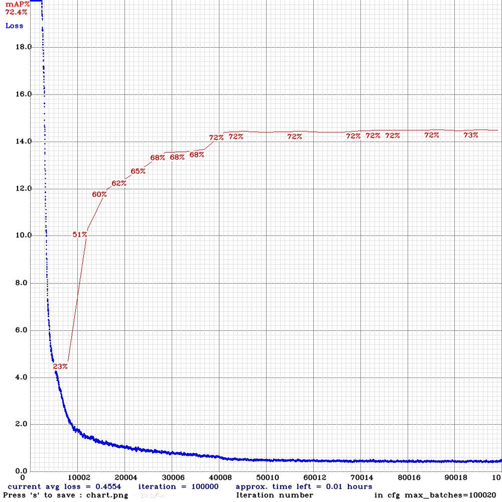


## MobileNetV2-YOLOv3-Nano

[MobileNetV2-YOLOv3-Nano

[](https://github.com/dog-qiuqiu/MobileNetv2-YOLOV3/tree/master/MobileNetV2-YOLOv3-Nano)


### 使用预训练权重进行训练-COCO


- 超参数

```cfg
[net]
batch=8
subdivisions=1
width=320
height=320
channels=3
momentum=0.949
decay=0.0005
angle=0
saturation=1.5
exposure=1.5
hue=.1


learning_rate=0.000125
burn_in=8000
;max_batches = 900500
;policy=steps
;steps=400000,450000
;scales=.1,.1
max_batches = 2000800
policy=steps
steps=600000,1020000
scales=.1,.1


```


- 训练脚本

```bash
cd /home/SSD/roth/myProject/darknet/ \

./darknet detector train \
/home/SSD/roth/myProject/localProject/caffeProject/MobileNetv2-YOLOV3/exp_roth/MobileNetV2-YOLOv3-Nano/COCO/coco.data \
/home/SSD/roth/myProject/localProject/caffeProject/MobileNetv2-YOLOV3/exp_roth/MobileNetV2-YOLOv3-Nano/COCO/MobileNetV2-YOLOv3-Nano-coco.cfg \
/home/SSD/roth/myProject/localProject/caffeProject/MobileNetv2-YOLOV3/exp_roth/MobileNetV2-YOLOv3-Nano/MobileNetV2-Nano.57 \
-gpus 0,1,2,3,4,5,6,7 -dont_show  -map -mjpeg_port 8051 \
-clear \
2>&1 | tee -a \
/home/SSD/roth/myProject/localProject/caffeProject/MobileNetv2-YOLOV3/exp_roth/MobileNetV2-YOLOv3-Nano/COCO/2_weightTrain/train1_log.txt


```


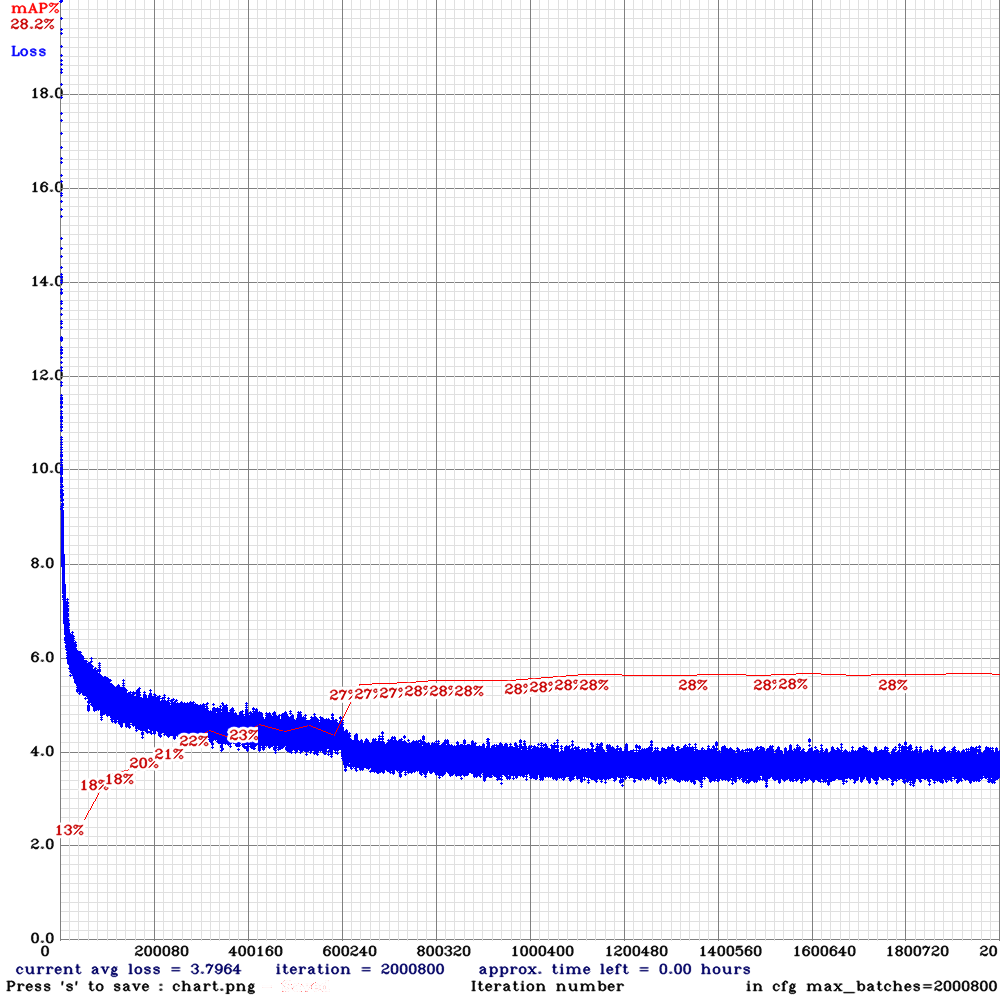


### 使用预训练权重进行训练-VOC


- 超参数

```cfg
[net]
;batch=32
;subdivisions=1
batch=8
subdivisions=1
width=320
height=320
channels=3
momentum=0.949
decay=0.0005
angle=0
saturation=1.5
exposure=1.5
hue=.1


learning_rate=0.000125
burn_in=8000
max_batches=100020
policy=steps
steps=40000,75000
scales=.1,.1

```


- 训练脚本

```bash
cd /home/SSD/roth/myProject/darknet/ \

./darknet detector train \
/home/SSD/roth/myProject/localProject/caffeProject/MobileNetv2-YOLOV3/exp_roth/MobileNetV2-YOLOv3-Nano/VOC/voc.data \
/home/SSD/roth/myProject/localProject/caffeProject/MobileNetv2-YOLOV3/exp_roth/MobileNetV2-YOLOv3-Nano/VOC/MobileNetV2-YOLOv3-Nano-voc.cfg \
/home/SSD/roth/myProject/localProject/caffeProject/MobileNetv2-YOLOV3/exp_roth/MobileNetV2-YOLOv3-Nano/MobileNetV2-Nano.57 \
-gpus 0,1,2,3,4,5,6,7 -dont_show  -map -mjpeg_port 8052 \
-clear \
2>&1 | tee -a \
/home/SSD/roth/myProject/localProject/caffeProject/MobileNetv2-YOLOV3/exp_roth/MobileNetV2-YOLOv3-Nano/VOC/2_weightTrain/train1_log.txt


```


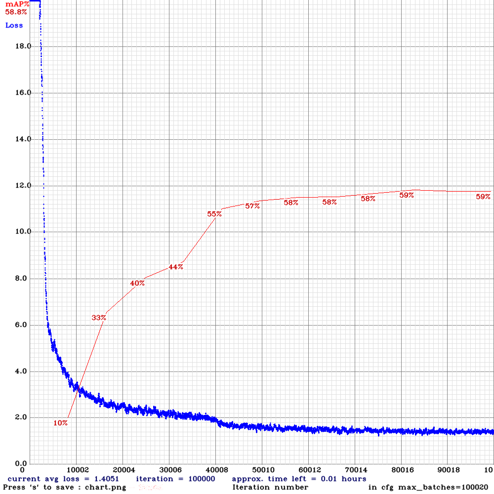


### 使用预训练权重进行训练-VOC-1

在 **使用预训练权重进行训练-VOC** 的基础上，进行微调训练，调整超参数

- 超参数

```cfg
[net]
batch=64
subdivisions=2
width=320
height=320
channels=3
momentum=0.949
decay=0.0005
angle=0
saturation=1.5
exposure=1.5
hue=.1


learning_rate=0.000125
burn_in=8000
max_batches=2000040
;max_batches=100020
policy=steps
;steps=40000,75000
steps=80000,150020
scales=.1,.1

```


- 训练脚本

```bash
cd /home/SSD/roth/myProject/darknet/ \

./darknet detector train \
/home/SSD/roth/myProject/localProject/caffeProject/MobileNetv2-YOLOV3/exp_roth/MobileNetV2-YOLOv3-Nano/VOC/voc.data \
/home/SSD/roth/myProject/localProject/caffeProject/MobileNetv2-YOLOV3/exp_roth/MobileNetV2-YOLOv3-Nano/VOC/MobileNetV2-YOLOv3-Nano-voc.cfg \
/home/SSD/roth/myProject/localProject/caffeProject/MobileNetv2-YOLOV3/exp_roth/MobileNetV2-YOLOv3-Nano/VOC/2_weightTrain/MobileNetV2-YOLOv3-Nano-voc_best.weights \
-gpus 0,1,2,3,4,5,6,7 -dont_show  -map -mjpeg_port 8052 \
-clear \
2>&1 | tee -a \
/home/SSD/roth/myProject/localProject/caffeProject/MobileNetv2-YOLOV3/exp_roth/MobileNetV2-YOLOv3-Nano/VOC/2_weightTrain1/train1_log.txt


```


60.72 %


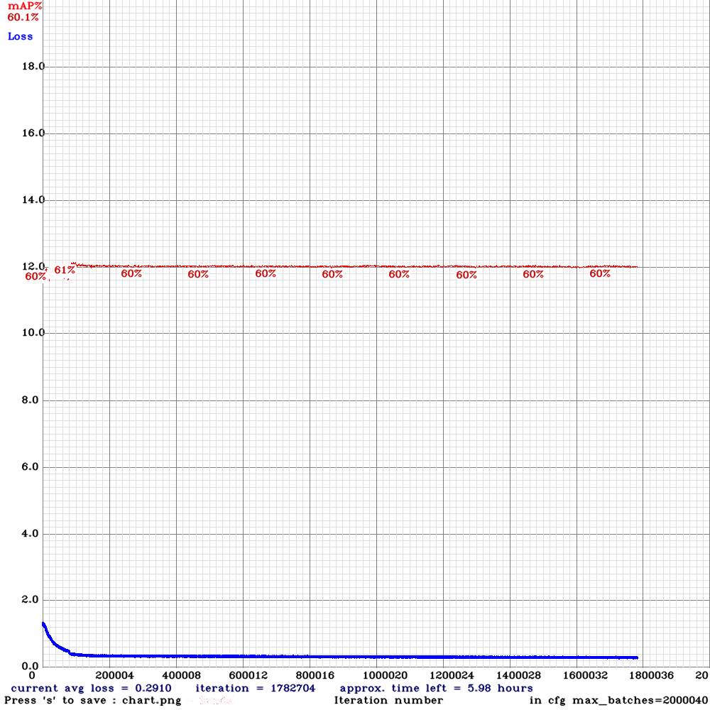


## ？YOLO-Nano？ 没有对应的cfg文件


# 其他


## 加快模型训练速度策略

- darknet

用 2 张卡，训练 coco  需要差不多一个星期（训练模型，MobileNetV2-YOLOv3-SPP）

主要参数如下

```
batch=64
subdivisions=16
```


**用 8 张卡，训练 coco  需要差不多一1星期（训练模型，MobileNetV2-YOLOv3-SPP）**

主要参数如下

```
batch=8
subdivisions=1
```


## darknet 复现疑问

- 怎么知道 darknet 支持哪些卷积层操作，哪些激活函数？


上darknet的github开源工程的 wiki上，查看说明文档与相关的支持操作


- 没有公开的cfg，怎么个复现方式

手写，堆叠一下模型


## 模型压缩那个工程，所有的那个 pytorch 都支持转darknet嘛？


源码、解析cfg  ==》 写一个层 ==》


用pytorch  转 darknet，中间某一些没有的支持操作，手工转一下


## mobilenetv2-yolov3，拉出来 yolo 层的位置，怎么寻找？

寻找语义信息丰富的地方，进行拼接输出


例如yolov3-spp从416 ==>    ....... ==>    52    ==>    26      ==> 13 

最后一个输出是13的特征图大小，截取输出一个yolo 层

之后往上面寻找13上采样的26，找最深的26的特征图那层，即语义信息最丰富

之后往上面寻找13上采样的26的上采样52，找最深的53的特征图那层，即语义信息最丰富


这样就有3个yolo 层的输出了，接下来，就是在3个yolo 层中，进行训练，训练后得到一个map，对应模型A。

接下来，测试3个yolo层对map的贡献度情况。测试方法，砍掉2个yolo层，只保留一个，然后测试输出的map = b1。

只有一个13x13的yolo层的map = a1

只有一个26x26的yolo层的map = a2

只有一个52x52的yolo层的map = a3

然后对比b1 - a? 之间的变化，就可以评测出来哪一个的贡献度最高，哪个的贡献度最低，之后决定要保留多少个yolo层。


## EfficientDet-BiFPN


## 注意力机制


注意力机制+ReLU激活函数=自适应参数化ReLU（深度学习） - davidxiong - 博客园
https://www.cnblogs.com/davidxiong2020/p/12447303.html


# 热力图 cam

- 通过热力图分析，看模型加入se等结构是否有效，**解释注意力机制**

- 以及通过这个方式，查看感受野在后面是否出现梯度弥散的问题，从而导致性能下降，**感受野弥散问题**


使用  mobilenet-v2-yolo 相关的模型，转成 pytorch 版本，之后进行热力图分析查看


argusswift/YOLOv4-pytorch: This is a pytorch repository of YOLOv4, attentive YOLOv4 and mobilenet YOLOv4 with PASCAL VOC and COCO
https://github.com/argusswift/YOLOv4-pytorch


CNN可视化之类激活热力图Grad-CAM - 知乎
https://zhuanlan.zhihu.com/p/83456743


# 从  mobilenetv2 到 MobileNetV2-YOLOv3-Lite


**思路1**

首先使用pytorch版本的mobilenetv2，转化成darknet，之后，再通过darknet进行改造升级成MobileNetV2-YOLOv3，之后再精简为MobileNetV2-YOLOv3-Lite


**具体步骤**

- [ ] 1、pytorch 版本mobilenet-v2

- [ ] 2、pytorch转darknet，生成darknet版本mobilenet-v2

- [ ] 3、darknet版本，生成mobilenetv2-yolov3

- [ ] 4、darknet版本，生成mobilenetv2-yolov3-lite


**实际上，这个转化的过程中需要伴随有 cfg 的存在，否则转化不了**


**思路2**，caffe 版本 mobilenet 转化 ==》 darknet  ==》 修改


# 其他

(1 封私信 / 29 条消息) 如何评价Google Brain团队最新检测论文SpineNet？ - 知乎
https://www.zhihu.com/question/360562458


# ghostnet--yolo

待完成

huawei-noah/ghostnet: [CVPR2020] GhostNet: More Features from Cheap Operations
https://github.com/huawei-noah/ghostnet

CVPR 2020：华为GhostNet，超越谷歌MobileNet，已开源 - 知乎
https://zhuanlan.zhihu.com/p/109325275


## Densenet--Yolo

待完成

以 DenseNet201 为主干

```
darknet partial densenet201.cfg
```

结合yolov4，进行实验


借鉴，yolov3采用的是darknet53，借鉴resnet结构，对比的是retinaNet-50 


shicai/DenseNet-Caffe: DenseNet Caffe Models, converted from https://github.com/liuzhuang13/DenseNet
https://github.com/shicai/DenseNet-Caffe


不需要预训练模型的检测算法—DSOD_AI之路-CSDN博客
https://blog.csdn.net/u014380165/article/details/77110702


# caffe 转 darknet 


# yolov3 量化记录


## V1.3


### 测试 v1.3是否有问题


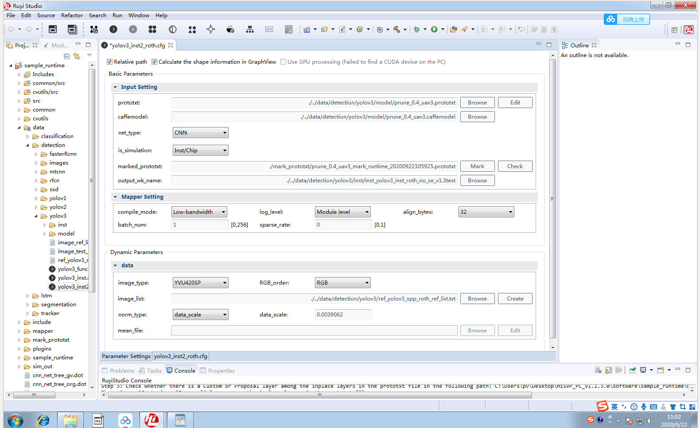


没有问题


接下来量化处理，se 模块模型