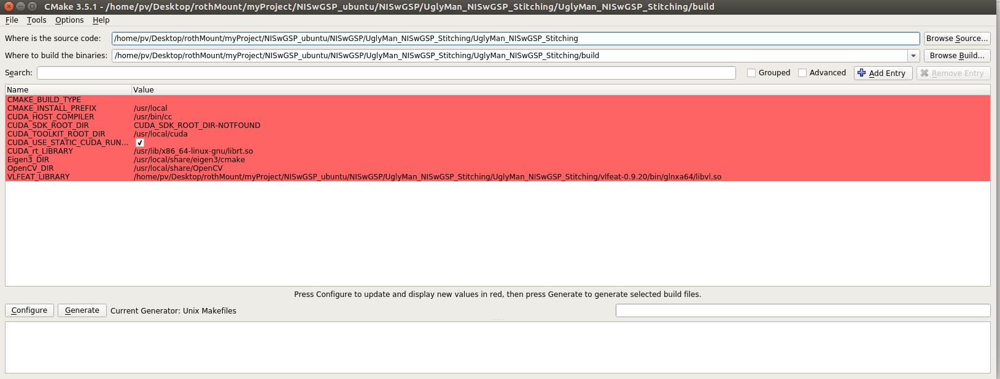

全景拼接


- 项目地址

ubuntu：

>Yannnnnnnnnnnn/NISwGSP: C++ implementation of the ECCV 2016 paper, Natural Image Stitching with the Global Similarity Prior.
https://github.com/Yannnnnnnnnnnn/NISwGSP


# 环境配置

## 安装opencv-3.0.0

### 安装教程


> Ubuntu:安装Eigen3 - 简书
> https://www.jianshu.com/p/41ff7b4502d5
>
> 
>
> Ubuntu 安装OpenCV3.0.0_Maddock的专栏-CSDN博客_ubuntu opencv 3.0.0-zip
> https://blog.csdn.net/adong76/article/details/40018407
>
> 
>
> Ubuntu16.04下安装Opencv3.2.0_蘑菇菌的博客-CSDN博客_ubuntu 安装opencv3.2
> https://blog.csdn.net/qq_40755643/article/details/96437720
>
> 


### 安装过程中可能出现的问题与解决

> Ubuntu16.04下安装Opencv3.2.0_蘑菇菌的博客-CSDN博客_ubuntu 安装opencv3.2
> https://blog.csdn.net/qq_40755643/article/details/96437720


CMake Error at 3rdparty/ippicv/downloader.cmake:71 (file): Configuring incomplete errors occurred!

```

-- ICV: Downloading ippicv_linux_20141027.tgz...
CMake Error at 3rdparty/ippicv/downloader.cmake:71 (file):
  file DOWNLOAD HASH mismatch

    for file: [/home/pv/Desktop/rothMount/myProject/NISwGSP_ubuntu/NISwGSP/UglyMan_NISwGSP_Stitching/UglyMan_NISwGSP_Stitching/opencv-3.0.0/3rdparty/ippicv/downloads/linux-8b449a536a2157bcad08a2b9f266828b/ippicv_linux_20141027.tgz]
      expected hash: [8b449a536a2157bcad08a2b9f266828b]
        actual hash: [e5a685448d47ccd1a1fe10a468639bff]
             status: [28;"Timeout was reached"]

Call Stack (most recent call first):
  3rdparty/ippicv/downloader.cmake:108 (_icv_downloader)
  cmake/OpenCVFindIPP.cmake:235 (include)
  cmake/OpenCVFindLibsPerf.cmake:12 (include)
  CMakeLists.txt:526 (include)


CMake Error at 3rdparty/ippicv/downloader.cmake:75 (message):
  ICV: Failed to download ICV package: ippicv_linux_20141027.tgz.
  Status=28;"Timeout was reached"
Call Stack (most recent call first):
  3rdparty/ippicv/downloader.cmake:108 (_icv_downloader)
  cmake/OpenCVFindIPP.cmake:235 (include)
  cmake/OpenCVFindLibsPerf.cmake:12 (include)
  CMakeLists.txt:526 (include)


-- Configuring incomplete, errors occurred!
See also "/home/pv/Desktop/rothMount/myProject/NISwGSP_ubuntu/NISwGSP/UglyMan_NISwGSP_Stitching/UglyMan_NISwGSP_Stitching/opencv-3.0.0/build/CMakeFiles/CMakeOutput.log".
See also "/home/pv/Desktop/rothMount/myProject/NISwGSP_ubuntu/NISwGSP/UglyMan_NISwGSP_Stitching/UglyMan_NISwGSP_Stitching/opencv-3.0.0/build/CMakeFiles/CMakeError.log".
(NISwGSP_ubuntu) root@pv:~/Desktop/rothMount/myProject/NISwGSP_ubuntu/NISwGSP/UglyMan_NISwGSP_Stitching/UglyMan_NISwGSP_Stitching/opencv-3.0.0/build# make clean
make: *** No rule to make target 'clean'.  Stop.

```


编译过程中，老是出现上面的问题


**分析与解决**

发现是，一个安装包下载不了，导致出了问题

安装包：**ippicv_linux_20141027.tgz;**


**1.该过程中会自动下载ippicv_linux_20141027.tgz;**

**2.将下载的包放到opencv-3.0.0/3rdparty/ippicv/downloads/linux-8b449a536a2157bcad08a2b9f266828b/下的文件中，然后重新输入命令即可;**

**希望可以给与我遇到同样情况的小伙伴们一些帮助。** 

**不知道是不是网的原因，一直不能在终端在线下载**

**链接: https://pan.baidu.com/s/1o7JGPJ0 密码: nfab**


> Cmake最怕见到的错误，Configuring incomplete errors occurred!_cxd0812的博客-CSDN博客
> https://blog.csdn.net/cxd0812/article/details/82870008
>
> 
>
> linux下报错没有头文件那个文件或目录_xiaozhu2hao的专栏-CSDN博客_没有signal.h文件或目录
> https://blog.csdn.net/xiaozhu2hao/article/details/17111991
>
> 
>
> Ubuntu14.04 安装opencv3.0中ippicv_linux_20141027.tgz终端命令窗口在线不能下载_qinguoxiaoziyangyue的博客-CSDN博客_ippicv_linux_20141027.tgz
> https://blog.csdn.net/qinguoxiaoziyangyue/article/details/78022096
>
> 


### graphcuts.cpp.o' failed


**问题**

```bash
 #define nppSafeCall(expr)  cv::cuda::checkNppError(expr, __FILE__, __LINE__, CV_Func)
                                                    ^
modules/cudalegacy/CMakeFiles/opencv_cudalegacy.dir/build.make:3014: recipe for target 'modules/cudalegacy/CMakeFiles/opencv_cudalegacy.dir/src/graphcuts.cpp.o' failed
make[2]: *** [modules/cudalegacy/CMakeFiles/opencv_cudalegacy.dir/src/graphcuts.cpp.o] Error 1
make[2]: *** Waiting for unfinished jobs....
CMakeFiles/Makefile2:9526: recipe for target 'modules/cudalegacy/CMakeFiles/opencv_cudalegacy.dir/all' failed
make[1]: *** [modules/cudalegacy/CMakeFiles/opencv_cudalegacy.dir/all] Error 2
make[1]: *** Waiting for unfinished jobs....
[ 72%] Linking CXX shared library ../../lib/libopencv_photo.so
[ 72%] Built target opencv_photo
Makefile:149: recipe for target 'all' failed
make: *** [all] Error 2

```


**解决**

1. 那是因为 `cuda-8.0`与`OpenCV 3.1.0`发生了冲突。解决方法：修改`openCV 3.1.0`源码，使其兼容`cuda-8.0`

```ruby
$ sudo vi opencv-3.1.0/modules/cudalegacy/src/graphcuts.cpp
```

将第四十五行位置的

```cpp
#if !defined (HAVE_CUDA) || defined (CUDA_DISABLER)
```

改为

```cpp
#if !defined(HAVE_CUDA)||defined(CUDA_DISABLER)||(CUDART_VERSION>=8000)
```

然后重新执行

```ruby
$ sudo make -j4             # -j4为开四个线程，加快编译速度
```


> (1条消息)make[2]: *** [modules/cudalegacy/CMakeFiles/opencv_cudalegacy.dir/src/graphcuts.cpp.o] Error 1 make[_xunan003的博客-CSDN博客_plugins/dpdk/cmakefiles/dpdk_plugin.dir/device/flo
> https://blog.csdn.net/xunan003/article/details/79484566?utm_source=blogxgwz2


## vlfeat-0.9.20


## 工程编译cmake


### VLFEAT_LIBRARY 导致 CMake Error: The following variables are used in this project, but they are set to NOTFOUND.


**问题**


```
(NISwGSP_ubuntu) root@pv:~/Desktop/rothMount/myProject/NISwGSP_ubuntu/NISwGSP/UglyMan_NISwGSP_Stitching/UglyMan_NISwGSP_Stitching/build# cmake ..
CMake Error: The following variables are used in this project, but they are set to NOTFOUND.
Please set them or make sure they are set and tested correctly in the CMake files:
VLFEAT_LIBRARY
    linked by target "NISwGSP" in directory /home/pv/Desktop/rothMount/myProject/NISwGSP_ubuntu/NISwGSP/UglyMan_NISwGSP_Stitching/UglyMan_NISwGSP_Stitching

-- Configuring incomplete, errors occurred!
See also "/home/pv/Desktop/rothMount/myProject/NISwGSP_ubuntu/NISwGSP/UglyMan_NISwGSP_Stitching/UglyMan_NISwGSP_Stitching/build/CMakeFiles/CMakeOutput.log".
See also "/home/pv/Desktop/rothMount/myProject/NISwGSP_ubuntu/NISwGSP/UglyMan_NISwGSP_Stitching/UglyMan_NISwGSP_Stitching/build/CMakeFiles/CMakeError.log".
(NISwGSP_ubuntu) root@pv:~/Desktop/rothMount/myProject/NISwGSP_ubuntu/NISwGSP/UglyMan_NISwGSP_Stitching/UglyMan_NISwGSP_Stitching/build# 
(NISwGSP_ubuntu) root@pv:~/Desktop/rothMount/myProject/NISwGSP_ubuntu/NISwGSP/UglyMan_NISwGSP_Stitching/UglyMan_NISwGSP_Stitching/build# 
(NISwGSP_ubuntu) root@pv:~/Desktop/rothMount/myProject/NISwGSP_ubuntu/NISwGSP/UglyMan_NISwGSP_Stitching/UglyMan_NISwGSP_Stitching/build# 

```


解决方式


```
cmake-gui  # 终端
```




```bash
configure ==> gernerate
```


> How to config the VLFEAT_LIBRARY · Issue #27 · nothinglo/NISwGSP
> https://github.com/nothinglo/NISwGSP/issues/27


对 VLFEAT 重新 `make`

方式

> VLFeat - Download > Compiling > Compiling on UNIX-like platforms
> https://www.vlfeat.org/compiling-unix.htm


```bash
(NISwGSP_ubuntu) root@pv:~/Desktop/rothMount/myProject/NISwGSP_ubuntu/NISwGSP/UglyMan_NISwGSP_Stitching/UglyMan_NISwGSP_Stitching/vlfeat-0.9.20# make ARCH=glnx86

```


出现

```
/usr/include/features.h:367:25: fatal error: sys/cdefs.h: No such file or directory
compilation terminated.
             CC bin/glnx86/aib.d
In file included from /usr/include/stdio.h:27:0,
                 from src/aib.c:9:
/usr/include/features.h:367:25: fatal error: sys/cdefs.h: No such file or directory
compilation terminated.
             CC bin/glnx86/test_liop.d
In file included from /usr/include/stdlib.h:24:0,
                 from ./vl/generic.h:21,
                 from ./vl/liop.h:19,
                 from src/test_liop.c:1:
/usr/include/features.h:367:25: fatal error: sys/cdefs.h: No such file or directory
compilation terminated.
             CC bin/glnx86/objs/host.o
In file included from /usr/include/stdlib.h:24:0,
                 from vl/generic.h:21,
                 from vl/host.c:397:
/usr/include/features.h:367:25: fatal error: sys/cdefs.h: No such file or directory
compilation terminated.
make/dll.mak:111: recipe for target 'bin/glnx86/objs/host.o' failed
make: *** [bin/glnx86/objs/host.o] Error 1

```


