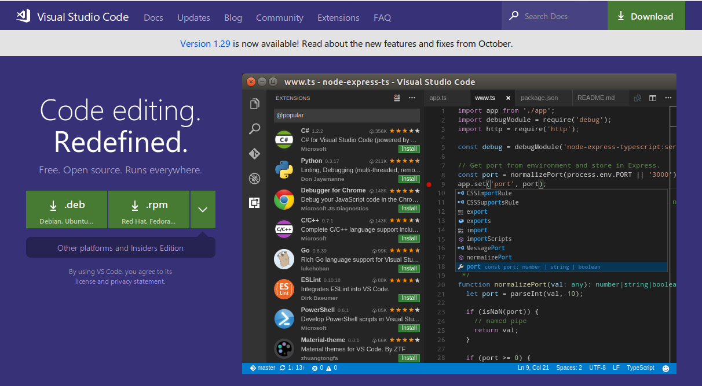
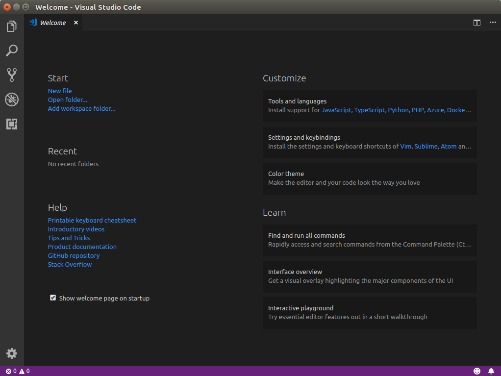
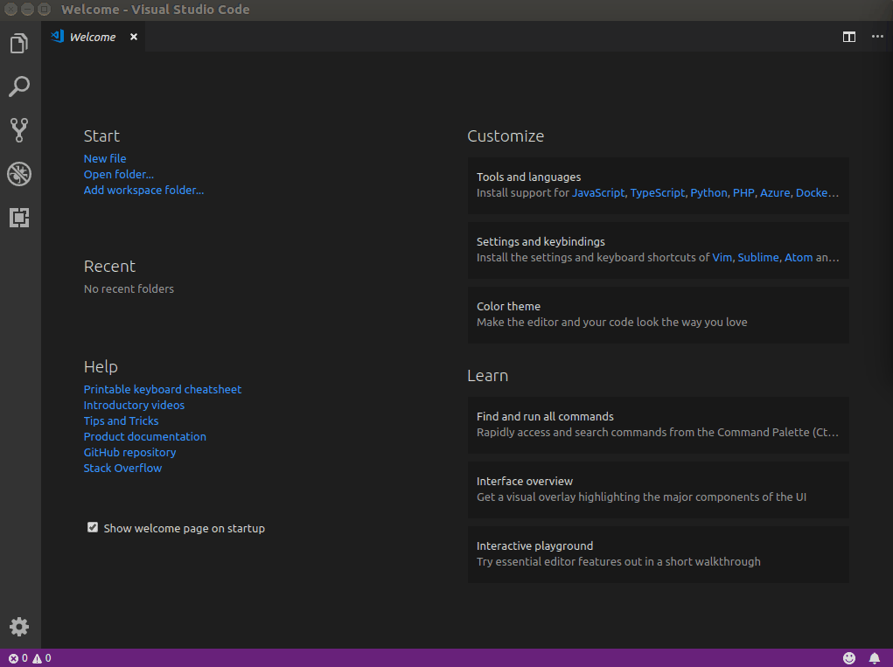
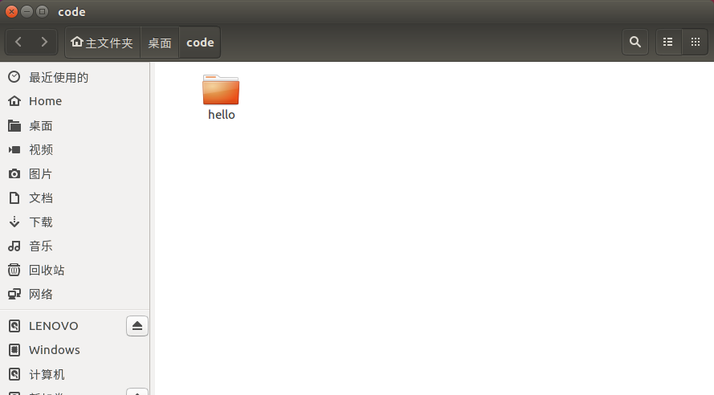
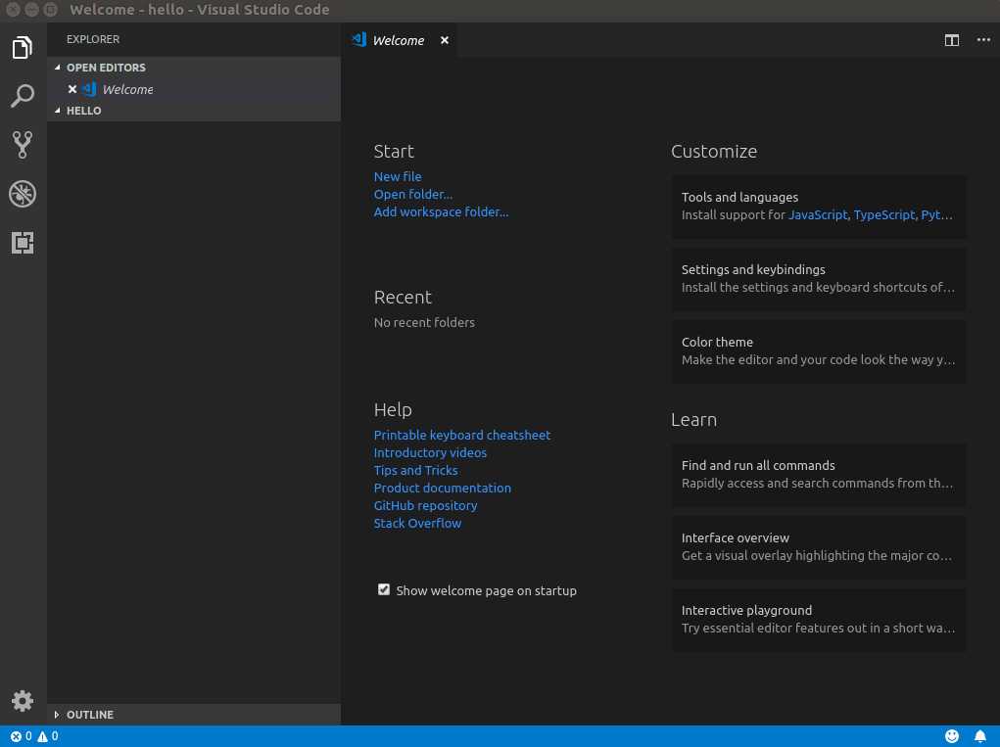
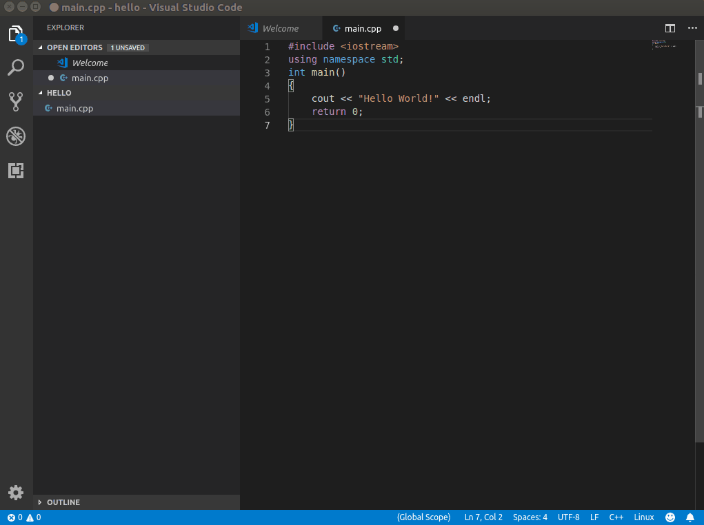

[toc]


# bash 终端使用


## tar  

### tar查看目录结构


tar查看目录结构(不解开压缩文件)

只查看目录结构：

```
tar -tvf  mnist.tar.gz | grep ^d
```


查看文件列表（包含路径）：

```
tar -tf mnist.tar.gz
```


**如何只查看tar.gz压缩文件中顶层目录的列表** 

```
$ tar -tf udpSocket.tar 
udpSocket/
udpSocket/clientUdp
udpSocket/clientUdp.c
udpSocket/makefile
udpSocket/serverUdp.c
udpSocket/serverUdp.h
udpSocket/serverUdp.o
udpSocket/singLinklistUdp
udpSocket/singLinklistUdp.c
udpSocket/singLinklistUdp.o
```

使用什么命令，才能只显示顶层的目录列表。如下，我只需要如下的信息：

```
udpSocket/
```


解决方式

方法一：

```
tar -tf udpSocket.tar | awk -F "/" '{print $1}' | sort | uniq
```

方法二：

```
tar -tf udpSocket.tar | awk -F "/" '{print $1}' | tail -n 1
```

方法三：

​                        

```
tar -tf udpSocket.tar | awk -F "/" '{print $1}' | sed -n '1p'
```


如何只查看tar.gz压缩文件中顶层目录的列表 - SegmentFault 思否
https://segmentfault.com/q/1010000004094930


### tar 批量打包一个文件夹下的多个目录（tar批量打包与解压）

对一个目录下的所有文件夹进行打包，当文件加比较少的时候，可以使用 tar 一个个进行操作，当目录下的文件夹比较多的时候，一个个打包就显得特别慢，这时候需要用一个脚本进行批量化打包，生成一个个独立的打包文件。


**原始文件结构**

```bash
pv@pv:~/Desktop/tmp$  tree ../tmp/
../tmp/
├── 1
│   └── Untitled Document
├── 11
├── 12
├── 1_back
│   └── Untitled Document
├── 2
│   ├── Untitled Document
│   └── Untitled Document (copy)
├── 3
│   └── Untitled Document
├── a
├── b
└── tar.sh

6 directories, 8 files

```


**批量打包**


- 指令
```bash
pv@pv:~/Desktop/tmp$ ls | awk '{ print "tar zcvf "$0".tar.gz " $0|"/bin/bash" }'
```


- 打包之后文件结构

```bash
pv@pv:~/Desktop/tmp$ tree ../tmp/
../tmp/
├── 1
│   └── Untitled Document
├── 11
├── 11.tar.gz
├── 12
├── 12.tar.gz
├── 1_back
│   └── Untitled Document
├── 1_back.tar.gz
├── 1.tar.gz
├── 2
│   ├── Untitled Document
│   └── Untitled Document (copy)
├── 2.tar.gz
├── 3
│   └── Untitled Document
├── 3.tar.gz
├── a
├── a.tar.gz
├── b
├── b.tar.gz
├── tar.sh
└── tar.sh.tar.gz

6 directories, 17 files

```


**批量解压**

在`打包之后文件结构`上面的基础上进行演示
创建解压文件目录 tarTmp，将所有打包的文件移动到 tarTmp

```bash
pv@pv:~/Desktop/tmp$ mkdir tarTmp  && mv *.gz tarTmp && cd tarTmp
pv@pv:~/Desktop/tmp/tarTmp$ ls
11.tar.gz  12.tar.gz  1_back.tar.gz  1.tar.gz  2.tar.gz  3.tar.gz  a.tar.gz  b.tar.gz  tar.sh.tar.gz
pv@pv:~/Desktop/tmp/tarTmp$ 

```

- 批量解压

```bash
pv@pv:~/Desktop/tmp/tarTmp$ for i in $(ls *.tar.gz);do tar xzvf $i;done
```

解压结果

```bash
pv@pv:~/Desktop/tmp/tarTmp$ tree ../tarTmp/
../tarTmp/
├── 1
│   └── Untitled Document
├── 11
├── 11.tar.gz
├── 12
├── 12.tar.gz
├── 1_back
│   └── Untitled Document
├── 1_back.tar.gz
├── 1.tar.gz
├── 2
│   ├── Untitled Document
│   └── Untitled Document (copy)
├── 2.tar.gz
├── 3
│   └── Untitled Document
├── 3.tar.gz
├── a
├── a.tar.gz
├── b
├── b.tar.gz
├── tar.sh
└── tar.sh.tar.gz

6 directories, 17 files
```


[批量打包一个文件夹下的多个目录](https://www.cnblogs.com/wangchenxicool/articles/2426288.html)


tar命令批量解压方法_kwame211的博客-CSDN博客
https://blog.csdn.net/kwame211/article/details/88417993


# python 相关

## python 用法


### 字典


#### Python中OrderedDict的使用 

```
import collections
print "Regular dictionary"
d={}
d['a']='A'
d['b']='B'
d['c']='C'
for k,v in d.items():
    print k,v
print "\nOrder dictionary"
d1 = collections.OrderedDict()
d1['a'] = 'A'
d1['b'] = 'B'
d1['c'] = 'C'
d1['1'] = '1'
d1['2'] = '2'
for k,v in d1.items():
    print k,v

输出：
Regular dictionary
a A
c C
b B

Order dictionary
a A
b B
c C
1 1
2 2
```


Python中OrderedDict的使用 - NotZY - 博客园
https://www.cnblogs.com/notzy/p/9312049.html


## python 环境


## pipreqs


```
(pytorch-yolov3-noteComputer) roth@localhost:~/myProject/pytorch-yolov3-noteComputer$ pipreqs ./PyTorch-YOLOv3
Traceback (most recent call last):
  File "/home/SSD/roth/myProjectEnv/pytorch-yolov3-noteComputer/lib/python3.6/site-packages/urllib3/connection.py", line 160, in _new_conn
    (self._dns_host, self.port), self.timeout, **extra_kw
  File "/home/SSD/roth/myProjectEnv/pytorch-yolov3-noteComputer/lib/python3.6/site-packages/urllib3/util/connection.py", line 84, in create_connection
    raise err
  File "/home/SSD/roth/myProjectEnv/pytorch-yolov3-noteComputer/lib/python3.6/site-packages/urllib3/util/connection.py", line 74, in create_connection
    sock.connect(sa)
OSError: [Errno 101] Network is unreachable

During handling of the above exception, another exception occurred:

Traceback (most recent call last):
  File "/home/SSD/roth/myProjectEnv/pytorch-yolov3-noteComputer/lib/python3.6/site-packages/urllib3/connectionpool.py", line 677, in urlopen
    chunked=chunked,
  File "/home/SSD/roth/myProjectEnv/pytorch-yolov3-noteComputer/lib/python3.6/site-packages/urllib3/connectionpool.py", line 381, in _make_request
    self._validate_conn(conn)
  File "/home/SSD/roth/myProjectEnv/pytorch-yolov3-noteComputer/lib/python3.6/site-packages/urllib3/connectionpool.py", line 976, in _validate_conn
    conn.connect()
  File "/home/SSD/roth/myProjectEnv/pytorch-yolov3-noteComputer/lib/python3.6/site-packages/urllib3/connection.py", line 308, in connect
    conn = self._new_conn()
  File "/home/SSD/roth/myProjectEnv/pytorch-yolov3-noteComputer/lib/python3.6/site-packages/urllib3/connection.py", line 172, in _new_conn
    self, "Failed to establish a new connection: %s" % e
urllib3.exceptions.NewConnectionError: <urllib3.connection.HTTPSConnection object at 0x7f445afc6e80>: Failed to establish a new connection: [Errno 101] Network is unreachable

During handling of the above exception, another exception occurred:

Traceback (most recent call last):
  File "/home/SSD/roth/myProjectEnv/pytorch-yolov3-noteComputer/lib/python3.6/site-packages/requests/adapters.py", line 449, in send
    timeout=timeout
  File "/home/SSD/roth/myProjectEnv/pytorch-yolov3-noteComputer/lib/python3.6/site-packages/urllib3/connectionpool.py", line 725, in urlopen
    method, url, error=e, _pool=self, _stacktrace=sys.exc_info()[2]
  File "/home/SSD/roth/myProjectEnv/pytorch-yolov3-noteComputer/lib/python3.6/site-packages/urllib3/util/retry.py", line 439, in increment
    raise MaxRetryError(_pool, url, error or ResponseError(cause))
urllib3.exceptions.MaxRetryError: HTTPSConnectionPool(host='pypi.python.org', port=443): Max retries exceeded with url: /pypi/Pillow/json (Caused by NewConnectionError('<urllib3.connection.HTTPSConnection
 object at 0x7f445afc6e80>: Failed to establish a new connection: [Errno 101] Network is unreachable',))

During handling of the above exception, another exception occurred:

Traceback (most recent call last):
  File "/home/SSD/roth/myProjectEnv/pytorch-yolov3-noteComputer/bin/pipreqs", line 8, in <module>
    sys.exit(main())
  File "/home/SSD/roth/myProjectEnv/pytorch-yolov3-noteComputer/lib/python3.6/site-packages/pipreqs/pipreqs.py", line 470, in main
    init(args)
  File "/home/SSD/roth/myProjectEnv/pytorch-yolov3-noteComputer/lib/python3.6/site-packages/pipreqs/pipreqs.py", line 432, in init
    pypi_server=pypi_server)
  File "/home/SSD/roth/myProjectEnv/pytorch-yolov3-noteComputer/lib/python3.6/site-packages/pipreqs/pipreqs.py", line 188, in get_imports_info
    "{0}{1}/json".format(pypi_server, item), proxies=proxy)
  File "/home/SSD/roth/myProjectEnv/pytorch-yolov3-noteComputer/lib/python3.6/site-packages/requests/api.py", line 76, in get
    return request('get', url, params=params, **kwargs)
  File "/home/SSD/roth/myProjectEnv/pytorch-yolov3-noteComputer/lib/python3.6/site-packages/requests/api.py", line 61, in request
    return session.request(method=method, url=url, **kwargs)
  File "/home/SSD/roth/myProjectEnv/pytorch-yolov3-noteComputer/lib/python3.6/site-packages/requests/sessions.py", line 530, in request
    resp = self.send(prep, **send_kwargs)
  File "/home/SSD/roth/myProjectEnv/pytorch-yolov3-noteComputer/lib/python3.6/site-packages/requests/sessions.py", line 643, in send
    r = adapter.send(request, **kwargs)
  File "/home/SSD/roth/myProjectEnv/pytorch-yolov3-noteComputer/lib/python3.6/site-packages/requests/adapters.py", line 516, in send
    raise ConnectionError(e, request=request)
requests.exceptions.ConnectionError: HTTPSConnectionPool(host='pypi.python.org', port=443): Max retries exceeded with url: /pypi/Pillow/json (Caused by NewConnectionError('<urllib3.connection.HTTPSConnect
ion object at 0x7f445afc6e80>: Failed to establish a new connection: [Errno 101] Network is unreachable',))
(pytorch-yolov3-noteComputer) roth@localhost:~/myProject/pytorch-yolov3-noteComputer$ 

```


**解决**


```
 pip install cryptography


pip install pyOpenSSL


pip install certifi
```


> (1条消息)python使用requests时报错requests.exceptions.SSLError: HTTPSConnectionPool_qq_31077649的博客-CSDN博客_requests.exceptions.sslerror: httpsconnectionpool(
> https://blog.csdn.net/qq_31077649/article/details/79013199


## Python测量时间，用time.time还是time.clock

Python测量时间，用time.time还是time.clock - MJay_Lee - 博客园
https://www.cnblogs.com/limengjie0104/p/8997466.html


## Python 编码错误的解决办法SyntaxError: Non-ASCII character '\xe5' in file                                                                                                                                    

​                                                        

【现象】

在编写Python时，当使用中文输出或注释时运行脚本，会提示错误信息：

SyntaxError: Non-ASCII character '\xe5' in file *******


【原因】

[Python](http://lib.csdn.net/base/python)的默认编码文件是用的ASCII码，而你的[python](http://lib.csdn.net/base/python)文件中使用了中文等非英语字符。


【解决办法】

在Python源文件的最开始一行，加入一句：

\# coding=UTF-8（等号换为”:“也可以）

或者

\# -*- coding:UTF-8 -*-


# opencv

## 保存视频


### 问题：为何视频能读出来，而写入代码也没报错，但文件大小为0k？


**问题**：为何视频能读出来，而写入代码也没报错，但文件大小为0k，视频好似没有写入成功！

**原因**：cv2.VideoWriter()第二个参数控制视频编码的格式，多数教程上是这样写的

```
videoWriter = cv2.VideoWriter('out.mp4', cv2.cv.CV_FOURCC('M', 'J', 'P', 'G'), fps, size)
```

或

```
videoWriter = cv2.VideoWriter('out.avi', cv2.cv.CV_FOURCC('I','4','2','0'), fps, size)
```


实际运行时生成的视频大小为0k，究其原因是运行环境没有相对应的视频编码器，故无法生成的视频，或者说第二个参数设置的不合适，系统里没有合适的。

**解决办法**

cv2.VideoWriter()第二个参数设置为-1，程序运行时则会交互地弹出一个对话框让你从系统已有的编码中选择一个。


```
import cv2
videoCapture = cv2.VideoCapture('clocka.avi')
fps = videoCapture.get(cv2.cv.CV_CAP_PROP_FPS)
size = (int(videoCapture.get(cv2.cv.CV_CAP_PROP_FRAME_WIDTH)), int(videoCapture.get(cv2.cv.CV_CAP_PROP_FRAME_HEIGHT)))
v = cv2.VideoWriter('bb.avi', -1, fps, size)

print fps, size,'v->',v

success, frame = videoCapture.read()

while success:
        cv2.imshow('MyWindow', frame)
        cv2.waitKey(1000/int(fps))
        v.write(frame)
        success, frame = videoCapture.read()
```


# ==C++==


## 开发编译器

### VScode环境搭建

- [1. Vscode安装](https://blog.csdn.net/weixin_43374723/article/details/84064644#1_Vscode_1)

- [2. Vscode环境配置](https://blog.csdn.net/weixin_43374723/article/details/84064644#2_Vscode_17)

- - [（1）安装c/c++插件](https://blog.csdn.net/weixin_43374723/article/details/84064644#1cc_18)
  - [（2）建立工程](https://blog.csdn.net/weixin_43374723/article/details/84064644#2_21)
  - [（3）更改配置文件（launch.json）](https://blog.csdn.net/weixin_43374723/article/details/84064644#3launchjson_28)
  - [（4）添加构建（编译、链接等）任务（tasks.json）](https://blog.csdn.net/weixin_43374723/article/details/84064644#4tasksjson_73)
  - [（5）简单断点调试](https://blog.csdn.net/weixin_43374723/article/details/84064644#5_129)

- [3.总结及注意事项](https://blog.csdn.net/weixin_43374723/article/details/84064644#3_139)

- [4. 附录](https://blog.csdn.net/weixin_43374723/article/details/84064644#4__147)

- - [（1）launch.json](https://blog.csdn.net/weixin_43374723/article/details/84064644#1launchjson_149)
  - [（2）tasks.json](https://blog.csdn.net/weixin_43374723/article/details/84064644#2tasksjson_180)


# 1. Vscode安装

Visual studio code是微软发布的一个运行于 Mac OS X、Windows和 Linux 之上的，针对于编写现代 Web 和云应用的跨平台源代码编辑器。
 第一种方式是从[VScode官网](https://code.visualstudio.com/)下载.deb文件，然后双击该文件会打开软件中心进行安装。
 
 另一种方式是通过Terminal进行安装，首先输入下面三条语句安装`umake`：

> sudo add-apt-repository ppa:ubuntu-desktop/ubuntu-make
>  sudo apt-get update
>  sudo apt-get install ubuntu-make

然后通过umake来安装VScode：

> umake web visual-studio-code

安装完毕后即可打开VScode，主界面如下：
 

# 2. Vscode环境配置

## （1）安装c/c++插件

首先通过左边栏的Extension栏目安装C++插件，操作如下图：
 

## （2）建立工程

由于VScode是以文件夹的形式管理工程的，因此我们首先新建一个文件夹，我这里取名叫`hello`。
 
 然后通过VScode打开此文件夹：
 
 新建main.cpp文件并输入程序：
 

## （3）更改配置文件（launch.json）

点击左侧的Debug按钮，选择添加配置（Add configuration）,然后选择C++（GDB/LLDB)，将自动生成launch.json文件，具体操作如下：
 
 生成的默认json文件如下：

```json
    // Use IntelliSense to learn about possible attributes.
    // Hover to view descriptions of existing attributes.
    // For more information, visit: https://go.microsoft.com/fwlink/?linkid=830387
    "version": "0.2.0",
    "configurations": [
        {
            "name": "(gdb) Launch",
            "type": "cppdbg",
            "request": "launch",
            "program": "enter program name, for example ${workspaceFolder}/a.out",
            "args": [],
            "stopAtEntry": false,
            "cwd": "${workspaceFolder}",
            "environment": [],
            "externalConsole": true,
            "MIMode": "gdb",
            "setupCommands": [
                {
                    "description": "Enable pretty-printing for gdb",
                    "text": "-enable-pretty-printing",
                    "ignoreFailures": true
                }
            ]
        }
    ]
}
1234567891011121314151617181920212223242526
```

注意:这里需要将`program`项的内容改为调试时运行的程序，将其改为`main.out`即可。具体更改如下：

```json
            "program": "enter program name, for example ${workspaceFolder}/a.out",
1
```

改为

```json
            "program": "${workspaceFolder}/main.out",
1
```

该语句指的是当前工作文件夹下的`main.out`文件，更改完毕的`launch.json`文件见附录。

## （4）添加构建（编译、链接等）任务（tasks.json）

为了方便在VScode里编译C++代码，我们可以将类似`g++ -g main.cpp`等g++命令写入VScode的任务系统。
 首先，利用快捷键ctrl+shift+p打开命令行，输入`Tasks: Run task`，会出现如下提示：

> ```
> No task to run found. configure tasks...
> ```

回车，然后依次选择如下：

> ```
> Create tasks.json file from template
> ```

> `Others` Example to run an arbitrary external command.

生成默认的`tasks.json`文件如下：

```json
{
    // See https://go.microsoft.com/fwlink/?LinkId=733558
    // for the documentation about the tasks.json format
    "version": "2.0.0",
    "tasks": [
        {
            "label": "echo",
            "type": "shell",
            "command": "echo Hello"
        }
    ]
}
123456789101112
```

这里的`label`为任务名，我们将`”label"= "echo"`改为`”label"= "build"`。
 由于我们的指令是`g++`，这里将`”command“=”echo Hello“`改为`”command“=”g++“`。
 然后添加`g++`的参数`args`。如果我们的g++指令为：`g++ -g main.cpp`，这里可以把参数设置为如下：

```json
{
    "tasks": [
        {
            "label": "build",
            "type": "shell",
            "command": "g++",
            "args": ["-g", "${file}"]
        }
      ]
}
12345678910
```

如果我们想配置g++指令为：`g++ -g main.cpp -std=c++11 -o main.out`，则参数可设置为：

```json
{
    "tasks": [
        {
            "label": "build",
            "type": "shell",
            "command": "g++",
            "args": ["-g", "${file}", "-std=c++11", "-o", "${fileBasenameNoExtension}.out"]
        }
     ]
}
12345678910
```

我们可以通过举一反三来配置不同的g++指令。完整的tasks.json文件可参考附录。

## （5）简单断点调试

经过上述配置之后就可以对我们写的程序进行简单的配置。在进行下面的操作前，我们应当保证`launch.json`和`tasks.json`的正确性并且已经成功保存。

使用快捷键ctrl+shift+p调出命令行，选择执行我们的`build`任务，build成功后，点击开始调试。具体操作如下：
 

值得注意的是，这里如果每次更改了程序需要重新build，然后再进行调试；如果直接进行调试则运行的是上次build的结果。通过在launc.json作如下更改可以使得每次**调试之前会自动进行build**：
 
 这里在launch.json文件中添加了`”preLaunchTask“=”build"`，也就是添加一个launch之间的任务，任务名为`build`，这个`build`就是我们在tasks.json中设置的任务名。

# 3.总结及注意事项

本文对Ubuntu16.04系统下配置基于VScode的C/C++开发环境进行了简单的介绍，主要步骤为：
 1.安装VScode，可以通过在官网下载和命令行的方式进行安装。（顺便提一下，在命令行安装的过程中可能会让你输入a）
 2.新建C/C++工程，VScode以文件夹为管理工程的方式，因此需要建立一个文件夹来保存工程。
 3.配置launch.json文件，它是一个启动配置文件。需要进行修改地方的是指定运行的文件，其次我们还可以在里面添加build任务。
 4.配置tasks.json文件，这个文件用来方便用户自定义任务，我们可以通过这个文件来添加g++/gcc或者是make命令，方便我们编译程序。
 5.上述四个流程完了之后我们就可以进行基础的C/C++开发与调试了。

# 4. 附录

这里给出一个较完整的配置文件和任务文件，笔者的系统的Ubuntu16.04 LTS，测试时间是2018/11/14。由于版本不同可能会有所变化，因此该配置仅供参考！

## （1）launch.json

```json
{
    // Use IntelliSense to learn about possible attributes.
    // Hover to view descriptions of existing attributes.
    // For more information, visit: https://go.microsoft.com/fwlink/?linkid=830387
    "version": "0.2.0",
    "configurations": [
        {
            "name": "(gdb) Launch",
            "type": "cppdbg",
            "request": "launch",
            "program": "${workspaceFolder}/${fileBasenameNoExtension}.out",
            "args": [],
            "stopAtEntry": false,
            "cwd": "${workspaceFolder}",
            "environment": [],
            "externalConsole": true,
            "MIMode": "gdb",
            "preLaunchTask": "build",
            "setupCommands": [
                {
                    "description": "Enable pretty-printing for gdb",
                    "text": "-enable-pretty-printing",
                    "ignoreFailures": true
                }
            ]
        }
    ]
}
12345678910111213141516171819202122232425262728
```

## （2）tasks.json

```json
{
    // See https://go.microsoft.com/fwlink/?LinkId=733558
    // for the documentation about the tasks.json format
    "version": "2.0.0",
    "tasks": [
        {
            "label": "build",
            "type": "shell",
            "command": "g++",
            "args": ["-g", "${file}", "-std=c++11", "-o", "${fileBasenameNoExtension}.out"]
        }
     ]
}
```