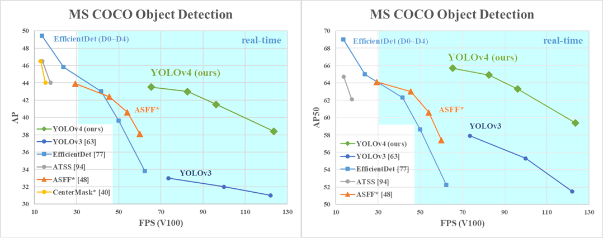
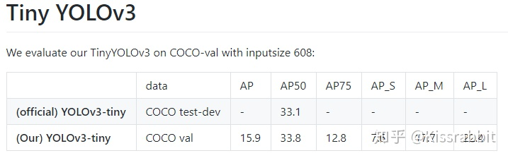
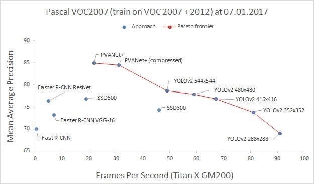
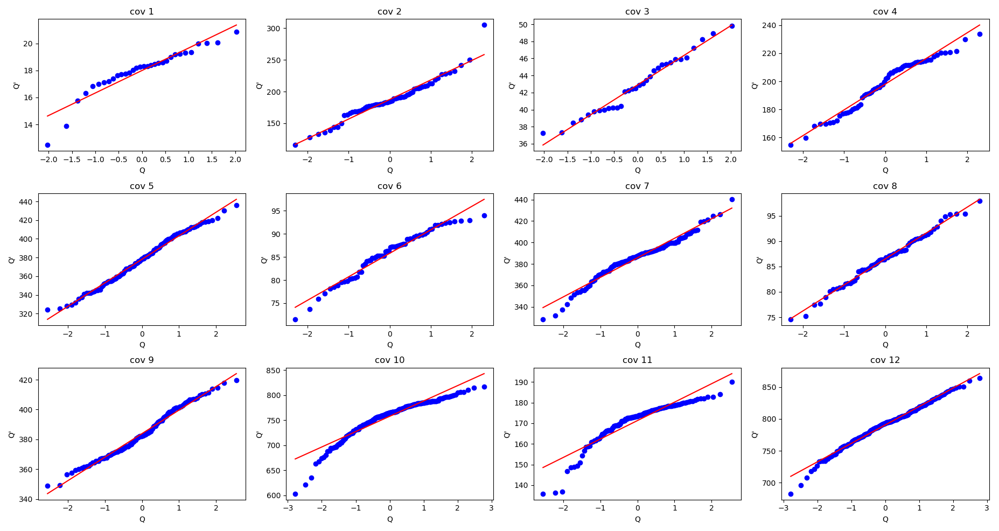

rethinking 


# 1、模型压缩与风格迁移实验

imagenet 路径

```
/home/HDD/roth/dataset/ImageNet_2012_DataSets/
```


对其中某几个卷积层进行重新初始化，验证数据的可靠性，在进行预训练与剪枝操作。


Neural Transfer Using PyTorch — PyTorch Tutorials 1.6.0 documentation
https://pytorch.org/tutorials/advanced/neural_style_tutorial.html?highlight=vgg


# 2、对某几个模型就行训练，千分类上的定点训练。


## pytorch 官方预训练权重

torchvision.models — PyTorch 1.6.0 documentation
https://pytorch.org/docs/stable/torchvision/models.html?highlight=model


## 对其中某几个卷积层进行重新初始化

冻住部分主干，对最后几层进行训练


### Pytorch 功能实现

#### Pytorch冻结部分层的参数


例如冻住 resnet-18 的某一部分

```python

import torch
import torch.nn as nn
import torchvision.models as models


def freezeBackbone(self):
    print("test  freezeBackbone".center(60,'*'))
    model = models.resnet18()
    
    # 冻住某些层
    for index, (k, v) in enumerate( model.named_parameters()):
        if index>=54:
            v.requires_grad = False
	# 查看冻住的结果
    for index, (k, v) in enumerate( model.named_parameters()):
        # print(index)
        print('index:\t{},\tk:{},\tv: {}'.format(index,k, v.requires_grad))
        # print('{}: {}'.format(k, v.requires_grad))
        # print("\n")

freezeBackbone()
```


- 打印结果


false：冻结，不进行梯度更新

True：没有冻住，可进行梯度更新

```
*********************test  freezeBackbone*********************
freezeBackbone
index:	0,	k:conv1.weight,	v: True
index:	1,	k:bn1.weight,	v: True
index:	2,	k:bn1.bias,	v: True
index:	3,	k:layer1.0.conv1.weight,	v: True
index:	4,	k:layer1.0.bn1.weight,	v: True
index:	5,	k:layer1.0.bn1.bias,	v: True
index:	6,	k:layer1.0.conv2.weight,	v: True
index:	7,	k:layer1.0.bn2.weight,	v: True
index:	8,	k:layer1.0.bn2.bias,	v: True
index:	9,	k:layer1.1.conv1.weight,	v: True
index:	10,	k:layer1.1.bn1.weight,	v: True
index:	11,	k:layer1.1.bn1.bias,	v: True
index:	12,	k:layer1.1.conv2.weight,	v: True
index:	13,	k:layer1.1.bn2.weight,	v: True
index:	14,	k:layer1.1.bn2.bias,	v: True
index:	15,	k:layer2.0.conv1.weight,	v: True
index:	16,	k:layer2.0.bn1.weight,	v: True
index:	17,	k:layer2.0.bn1.bias,	v: True
index:	18,	k:layer2.0.conv2.weight,	v: True
index:	19,	k:layer2.0.bn2.weight,	v: True
index:	20,	k:layer2.0.bn2.bias,	v: True
index:	21,	k:layer2.0.downsample.0.weight,	v: True
index:	22,	k:layer2.0.downsample.1.weight,	v: True
index:	23,	k:layer2.0.downsample.1.bias,	v: True
index:	24,	k:layer2.1.conv1.weight,	v: True
index:	25,	k:layer2.1.bn1.weight,	v: True
index:	26,	k:layer2.1.bn1.bias,	v: True
index:	27,	k:layer2.1.conv2.weight,	v: True
index:	28,	k:layer2.1.bn2.weight,	v: True
index:	29,	k:layer2.1.bn2.bias,	v: True
index:	30,	k:layer3.0.conv1.weight,	v: True
index:	31,	k:layer3.0.bn1.weight,	v: True
index:	32,	k:layer3.0.bn1.bias,	v: True
index:	33,	k:layer3.0.conv2.weight,	v: True
index:	34,	k:layer3.0.bn2.weight,	v: True
index:	35,	k:layer3.0.bn2.bias,	v: True
index:	36,	k:layer3.0.downsample.0.weight,	v: True
index:	37,	k:layer3.0.downsample.1.weight,	v: True
index:	38,	k:layer3.0.downsample.1.bias,	v: True
index:	39,	k:layer3.1.conv1.weight,	v: True
index:	40,	k:layer3.1.bn1.weight,	v: True
index:	41,	k:layer3.1.bn1.bias,	v: True
index:	42,	k:layer3.1.conv2.weight,	v: True
index:	43,	k:layer3.1.bn2.weight,	v: True
index:	44,	k:layer3.1.bn2.bias,	v: True
index:	45,	k:layer4.0.conv1.weight,	v: True
index:	46,	k:layer4.0.bn1.weight,	v: True
index:	47,	k:layer4.0.bn1.bias,	v: True
index:	48,	k:layer4.0.conv2.weight,	v: True
index:	49,	k:layer4.0.bn2.weight,	v: True
index:	50,	k:layer4.0.bn2.bias,	v: True
index:	51,	k:layer4.0.downsample.0.weight,	v: True
index:	52,	k:layer4.0.downsample.1.weight,	v: True
index:	53,	k:layer4.0.downsample.1.bias,	v: True
index:	54,	k:layer4.1.conv1.weight,	v: False
index:	55,	k:layer4.1.bn1.weight,	v: False
index:	56,	k:layer4.1.bn1.bias,	v: False
index:	57,	k:layer4.1.conv2.weight,	v: False
index:	58,	k:layer4.1.bn2.weight,	v: False
index:	59,	k:layer4.1.bn2.bias,	v: False
index:	60,	k:fc.weight,	v: False
index:	61,	k:fc.bias,	v: False

Process finished with exit code 0

```


cifar-10测试

1、对 cifar-56 上的模型最后两个卷积层进行重新初始化

2、将初始化的层冻住，不训练，看看是否能够收敛


文件

```
/home/SSD/roth/myProject/rethinking-network-pruning/cifar/network-slimming/exp/exp_on_cifar10/resnet56_sparsity0.0001PointConv_cifar10/pointConvPrune0.2/pruned.pth.tar
```


```bash
/home/SSD/roth/myProject/rethinking-network-pruning/cifar/network-slimming/runBash/resnet56_sparsity0.0001PointConv_cifar10_finetuningPointConv/resnet56_sparsity0.0001PointConv_cifar10_finetuningPointConv.sh
```


测试结果

```
/home/SSD/roth/myProject/rethinking-network-pruning/cifar/network-slimming/exp/exp_on_cifar10/resnet56_sparsity0.0001PointConv_cifar10_finetuningPointConv/pointConvLast2
```


- 参考文献

(3 封私信 / 12 条消息) Pytorch 如何精确的冻结我想冻结的预训练模型的某一层，有什么命令吗？ - 知乎
https://www.zhihu.com/question/311095447/answer/589307812


pytorch 两种冻结层的方式 - 知乎
https://zhuanlan.zhihu.com/p/79106053

pytorch如何冻结某层参数的实现 - python大师 - 博客园
https://www.cnblogs.com/daniumiqi/p/12175468.html


# 高斯拟合与收敛特性

- 解决主要问题

高斯拟合

高斯收敛


- 实验所用的数据集与模型

**cifar-10**

vgg-16

vgg-19

resnet。。。


**cifar-100**

vgg-16

vgg-19

resnet。。。


**imageNet**

采用官方训练好的权重内容

mobilenet。。。

。。。


==**coco**==

yolov3

yolov4

yolov3-tiny

yolov4-tiny


==**voc**==

yolov3

yolov4

bubbliiiing/yolov4-tiny-pytorch: 这是一个YoloV4-tiny-pytorch的源码，可以用于训练自己的模型。
https://github.com/bubbliiiing/yolov4-tiny-pytorch


yolov3-tiny

yolov4-tiny

YOLOv4-Tiny来了！371 FPS！ - 知乎
https://zhuanlan.zhihu.com/p/151389749


## 高斯拟合

数据集（使用训练收敛的模型）

**cifar-10**

vgg-16

vgg-19

resnet。。。


**cifar-100**

vgg-16

vgg-19

resnet。。。


**imageNet**

采用官方训练好的权重内容

mobilenet。。。

。。。


==**coco**==

- [ ] yolov3

- [ ] yolov4

- [ ] yolov3-tiny

- [ ] yolov4-tiny


==**voc**==

- [x] yolov3

- [ ] yolov4

- [x] yolov3-tiny

- [ ] yolov4-tiny


## 高斯收敛

训练过程中的 L1-norm 收敛

**cifar-10**

vgg-16

vgg-19

resnet。。。


**cifar-100**

vgg-16

vgg-19

resnet。。。


==**coco**==




- [ ] yolov3

ultralytics/yolov3: YOLOv3 in PyTorch > ONNX > CoreML > iOS
https://github.com/ultralytics/yolov3


## mAP

<i></i>                      |Size |COCO mAP<br>@0.5...0.95 |COCO mAP<br>@0.5 
---                          | ---         | ---         | ---
YOLOv3-tiny<br>YOLOv3<br>YOLOv3-SPP<br>**[YOLOv3-SPP-ultralytics](https://drive.google.com/open?id=1UcR-zVoMs7DH5dj3N1bswkiQTA4dmKF4)** |==416== |16.0<br>31.2<br>33.9<br>**41.2** |33.0<br>55.4<br>56.9<br>**60.6**

- mAP@0.5 run at `--iou-thr 0.5`, mAP@0.5...0.95 run at `--iou-thr 0.7`
- Darknet results: https://arxiv.org/abs/1804.02767


- [ ] yolov4
- [ ] yolov3-tiny



目标检测——TinyYOLOv3 - 知乎
https://zhuanlan.zhihu.com/p/137971709


- [ ] yolov4-tiny

| Network                                                      | VOC mAP(0.5) | COCO mAP(0.5) | Resolution | Inference time (NCNN/Kirin 990) | Inference time (MNN arm82/Kirin 990) | FLOPS     | Weight size |
| ------------------------------------------------------------ | ------------ | ------------- | ---------- | ------------------------------- | ------------------------------------ | --------- | ----------- |
| [YOLOv3-Tiny-Prn](https://github.com/AlexeyAB/darknet#pre-trained-models) | &            | 33.1          | 416        | 36.6 ms                         | & ms                                 | 3.5BFlops | 18.8MB      |
| [YOLOv4-Tiny](https://github.com/AlexeyAB/darknet#pre-trained-models) | &            | 40.2          | 416        | 44.6 ms                         | & ms                                 | 6.9BFlops | 23.1MB      |

dog-qiuqiu/MobileNet-Yolo: MobileNetV2-YoloV3-Nano: 0.5BFlops 3MB HUAWEI P40: 6ms/img, YoloFace-500k:0.1Bflops 420KB
https://github.com/dog-qiuqiu/MobileNet-Yolo


==**voc**==

- [x] yolov3

  ```
  0.789
  ```




通过这张图，可以看到，yolov3-voc 的map，在416x416情况下，应该在**75% 以上**


yolov4


yolov2-tiny

```
average precision (mAP@0.50) = 0.557859, or 55.79 %
```

官方训练出来的信息


- [x] yolov3-tiny


map@0.5 > 56%

mAP：65.1%

目标检测——TinyYOLOv3 - 知乎
https://zhuanlan.zhihu.com/p/137971709


预训练权重加载出错，因此从 0 开始训练


yolov4-tiny


## 讨论与分析，以下几个问题

### 1、与初始化相关嘛？ 相同数据集下，不同的初始化下，满足条件

**cifar-10**

- [ ] vgg-16

- [ ] resnet34

初始化方式1,2,3,4


**cifar-100**

- [ ] vgg-16

- [ ] resnet34

初始化方式1,2,3,4


### 2、与数据相关嘛？相同模型，在不同数据下的测试

**cifar-10**

vgg-16


**cifar-100**

vgg-16


**coco**

- [ ] vgg-16


**voc**

- [ ] vgg-16


### 3、 拟合程度是否与模型的冗余性有关？（待商榷）





例如cov10 ，两端不符合，进行模型压缩后，是不是拟合效果更好一些


## 用途


模型压缩

分析模型冗余性

nas 搜索

模型能够收敛，因此权重的某些特性也存在收敛特性


## 其他

只有验证部分

imageNet

4


下面所有，涵盖训练过程


**cifar -10**

4

vgg16

vgg19

resnet..


**cifar-100**

4


darknet to pytorch 


**coco**

4

yolo-v3


yolo-v4

argusswift/YOLOv4-pytorch: This is a pytorch repository of YOLOv4, attentive YOLOv4 and mobilenet YOLOv4 with PASCAL VOC and COCO
https://github.com/argusswift/YOLOv4-pytorch


Tianxiaomo/pytorch-YOLOv4: PyTorch ,ONNX and TensorRT implementation of YOLOv4
https://github.com/Tianxiaomo/pytorch-YOLOv4


yolo-v5

ultralytics/yolov5: YOLOv5 in PyTorch > ONNX > CoreML > iOS
https://github.com/ultralytics/yolov5


yolo-tiny4

bubbliiiing/yolov4-tiny-pytorch: 这是一个YoloV4-tiny-pytorch的源码，可以用于训练自己的模型。
https://github.com/bubbliiiing/yolov4-tiny-pytorch


EfficientDet


toandaominh1997/EfficientDet.Pytorch: Implementation EfficientDet: Scalable and Efficient Object Detection in PyTorch
https://github.com/toandaominh1997/EfficientDet.Pytorch


**voc**

4

yolo-tiny4


