[toc]


# 其他基础与背景知识


## 感受野


公式：

$$l_{k}=l_{k-1}+\left(\left(f_{k}-1\right) * \prod_{i=1}^{k-1} s_{i}\right)$$

*其中*

 $l_{k}$ :		是第  ${k}$ 层的感受野大小

 $l_{k-1}$ :	是第  ${k-1}$ 层的感受野大小

$f_{k}$:	 	*是当前层的卷积核大小* 

$s_{i}$:	 是第 $i$ 层的步长。


从这个公式可以看到，相比前一层，当前层的感受野大小在两层之间增加了 $\left(\left(f_{k}-1\right) * \prod_{i=1}^{k-1} s_{i}\right)$ ，这是一个指数级增加，如果 stride 大于1的话。这个公式也可以这样理解，对于第 $k$ 层，其卷积核为 ![[公式]](https://www.zhihu.com/equation?tex=f_k) ，那么相比前一层需要计算 ![[公式]](https://www.zhihu.com/equation?tex=f_k) 个位置（或者神经元，意思是 ![[公式]](https://www.zhihu.com/equation?tex=k) 层的一个位置在 ![[公式]](https://www.zhihu.com/equation?tex=k-1) 层的视野大小是 ![[公式]](https://www.zhihu.com/equation?tex=f_k) ），但是这些位置要一直向前扩展到输入层。对于第一个位置，扩展后的感受野为 ![[公式]](https://www.zhihu.com/equation?tex=l_%7Bk-1%7D) ，正好是前一层的感受野大小，但是对于剩余的 $f_{k}-1$  个位置就要看stride 大小，你需要扩展到前面所有层的 stride（注意不包括当前层的 stride，当前层的 stride 只会影响后面层的感受野），所以需要乘以 $\prod_{i=1}^{k-1} s_{i}$ ，这样剩余 ![[公式]](https://www.zhihu.com/equation?tex=f_k-1) 个位置的感受野大小就是  $\left(\left(f_{k}-1\right) * \prod_{i=1}^{k-1} s_{i}\right)$，和第一个位置的感受野加到一起就是上面的公式了。


- 计算示例


输入大小：224 * 224 


| Layer # | Kernel Size(K) | Stride | Dilation | Padding | Input Size | Output Size | Receptive Field(RF) |
| ------- | -------------- | ------ | -------- | ------- | ---------- | ----------- | ------------------- |
| 1       | 3              | 4      | 1        | 0       | 224        | 56          | 3                   |
| 2       | 3              | 2      | 1        | 1       | 56         | 28          | 11                  |
| 3       | 5              | 2      | 1        | 2       | 28         | 14          | 43                  |
| 4       | 3              | 2      | 1        | 1       | 14         | 7           | 75                  |
| 5       | 3              | 1      | 1        | 0       | 7          | 5           | 139                 |


计算过程：

第 Layer3 层： $43 = RF_{2} + ((K_{3} -1 ) * \prod_{i=1}^{3-1} s_{i}) = 11 + ( 4-1 ) * (Stride_{2}*Stride_{1}) = 11 + 4 * (2 * 4)$


感受野在线计算工具

Fomoro AI
https://fomoro.com/research/article/receptive-field-calculator#3,8,1,SAME;3,2,1,SAME;3,2,1,SAME;3,2,1,SAME


你知道如何计算CNN感受野吗？这里有一份详细指南 - 知乎
https://zhuanlan.zhihu.com/p/35708466


如何计算感受野(Receptive Field)——原理 - 知乎
https://zhuanlan.zhihu.com/p/31004121


总结一下共三种方法：

- 增加pooling层，但是会降低准确性（pooling过程中造成了信息损失）
- 增大卷积核的kernel size，但是会增加参数（卷积层的参数计算参考[[2\]](https://blog.csdn.net/dcxhun3/article/details/46878999)）
- 增加卷积层的个数，但是会面临梯度消失的问题（梯度消失参考[[3\]](https://blog.csdn.net/cppjava_/article/details/68941436)）
- 

【深度学习】感受野(receptive fields)概念计算及如何增加感受野总结_a529975125的博客-CSDN博客
https://blog.csdn.net/a529975125/article/details/80888463


**代码**

卷积神经网络物体检测之感受野大小计算 - machineLearning - 博客园
https://www.cnblogs.com/objectDetect/p/5947169.html


## Imagenet 论文里的 single crop evaluation（test）

**引用到该指标的文章**

(1条消息) DenseNet算法详解_AI之路-CSDN博客
https://blog.csdn.net/u014380165/article/details/75142664


http://www.caffecn.cn/?/question/428


[星空下的巫师](http://www.caffecn.cn/?/people/shicai) - https://github.com/shicai/Caffe_Manual

 赞同来自: [佛仙魔](http://www.caffecn.cn/?/people/foxianmo)

   好吧，第一次解释这种类型的问题。  
    
 既然知道single crop evaluation这个名词，那就从它开始吧。  
 训练的时候，当然随机裁剪，但测试的时候就需要有点技巧了。  
    
 Evaluation呢，就是指模型训练好了，测试评估它的性能。  
 Singl Crop Evaluation通常是指在测试过程中，将图像Resize到某个尺度（比如256xN），选择其中的Center Crop（即图像正中间区域，比如224x224），作为CNN的输入，去评估该模型。  
    
 Crops Evaluated不是个专业名词，仅仅表示用多少个Crops作为输入，去评估（Evaluate）模型。  
 10个Crops呢，一般是取（左上，左下，右上，右下，正中）各5个Crop，以及它们的水平镜像，共10个Crops，输入到CNN模型中，得到10个概率输出，然后平均一下，作为最后的结果。  
  144个Crops，略复杂点，以ImageNet为例，它首先将图像Resize到了4个尺度（比如256xN，320xN，384xN，480xN），每个尺度上去取（最左，正中，最右）3个位置的正方形区域，然后对这些正方形区域取上述的10个224x224的Crops，然后加上将这正方形区域直接Resize到224x224以及这Resize后的镜像，也就是每个正方形区域得到12个Crops，最后得到4x3x12=144个Crops，输入CNN，得到输出取平


Imagenet 论文里的 single crop evaluation（test）_woshiduojiu的博客-CSDN博客
https://blog.csdn.net/woshiduojiu/article/details/78854941


## resnet 


这个结构，在 shortcut 拼接的时候，是怎样子的？


参考模型resnet  50  


pytorch 

```
import torchvision.models as models
model = models.resnet50()
print(model)
```


打印结果

```
ResNet(
  (conv1): Conv2d(3, 64, kernel_size=(7, 7), stride=(2, 2), padding=(3, 3), bias=False)
  (bn1): BatchNorm2d(64, eps=1e-05, momentum=0.1, affine=True, track_running_stats=True)
  (relu): ReLU(inplace=True)
  (maxpool): MaxPool2d(kernel_size=3, stride=2, padding=1, dilation=1, ceil_mode=False)
  (layer1): Sequential(
    (0): Bottleneck(
      (conv1): Conv2d(64, 64, kernel_size=(1, 1), stride=(1, 1), bias=False)
      (bn1): BatchNorm2d(64, eps=1e-05, momentum=0.1, affine=True, track_running_stats=True)
      (conv2): Conv2d(64, 64, kernel_size=(3, 3), stride=(1, 1), padding=(1, 1), bias=False)
      (bn2): BatchNorm2d(64, eps=1e-05, momentum=0.1, affine=True, track_running_stats=True)
      (conv3): Conv2d(64, 256, kernel_size=(1, 1), stride=(1, 1), bias=False)
      (bn3): BatchNorm2d(256, eps=1e-05, momentum=0.1, affine=True, track_running_stats=True)
      (relu): ReLU(inplace=True)
      (downsample): Sequential(
        (0): Conv2d(64, 256, kernel_size=(1, 1), stride=(1, 1), bias=False)
        (1): BatchNorm2d(256, eps=1e-05, momentum=0.1, affine=True, track_running_stats=True)
      )
    )
    (1): Bottleneck(
      (conv1): Conv2d(256, 64, kernel_size=(1, 1), stride=(1, 1), bias=False)
      (bn1): BatchNorm2d(64, eps=1e-05, momentum=0.1, affine=True, track_running_stats=True)
      (conv2): Conv2d(64, 64, kernel_size=(3, 3), stride=(1, 1), padding=(1, 1), bias=False)
      (bn2): BatchNorm2d(64, eps=1e-05, momentum=0.1, affine=True, track_running_stats=True)
      (conv3): Conv2d(64, 256, kernel_size=(1, 1), stride=(1, 1), bias=False)
      (bn3): BatchNorm2d(256, eps=1e-05, momentum=0.1, affine=True, track_running_stats=True)
      (relu): ReLU(inplace=True)
    )
    (2): Bottleneck(
      (conv1): Conv2d(256, 64, kernel_size=(1, 1), stride=(1, 1), bias=False)
      (bn1): BatchNorm2d(64, eps=1e-05, momentum=0.1, affine=True, track_running_stats=True)
      (conv2): Conv2d(64, 64, kernel_size=(3, 3), stride=(1, 1), padding=(1, 1), bias=False)
      (bn2): BatchNorm2d(64, eps=1e-05, momentum=0.1, affine=True, track_running_stats=True)
      (conv3): Conv2d(64, 256, kernel_size=(1, 1), stride=(1, 1), bias=False)
      (bn3): BatchNorm2d(256, eps=1e-05, momentum=0.1, affine=True, track_running_stats=True)
      (relu): ReLU(inplace=True)
    )
  )
  (layer2): Sequential(
    (0): Bottleneck(
      (conv1): Conv2d(256, 128, kernel_size=(1, 1), stride=(1, 1), bias=False)
      (bn1): BatchNorm2d(128, eps=1e-05, momentum=0.1, affine=True, track_running_stats=True)
      (conv2): Conv2d(128, 128, kernel_size=(3, 3), stride=(2, 2), padding=(1, 1), bias=False)
      (bn2): BatchNorm2d(128, eps=1e-05, momentum=0.1, affine=True, track_running_stats=True)
      (conv3): Conv2d(128, 512, kernel_size=(1, 1), stride=(1, 1), bias=False)
      (bn3): BatchNorm2d(512, eps=1e-05, momentum=0.1, affine=True, track_running_stats=True)
      (relu): ReLU(inplace=True)
      (downsample): Sequential(
        (0): Conv2d(256, 512, kernel_size=(1, 1), stride=(2, 2), bias=False)
        (1): BatchNorm2d(512, eps=1e-05, momentum=0.1, affine=True, track_running_stats=True)
      )
    )
    (1): Bottleneck(
      (conv1): Conv2d(512, 128, kernel_size=(1, 1), stride=(1, 1), bias=False)
      (bn1): BatchNorm2d(128, eps=1e-05, momentum=0.1, affine=True, track_running_stats=True)
      (conv2): Conv2d(128, 128, kernel_size=(3, 3), stride=(1, 1), padding=(1, 1), bias=False)
      (bn2): BatchNorm2d(128, eps=1e-05, momentum=0.1, affine=True, track_running_stats=True)
      (conv3): Conv2d(128, 512, kernel_size=(1, 1), stride=(1, 1), bias=False)
      (bn3): BatchNorm2d(512, eps=1e-05, momentum=0.1, affine=True, track_running_stats=True)
      (relu): ReLU(inplace=True)
    )
    (2): Bottleneck(
      (conv1): Conv2d(512, 128, kernel_size=(1, 1), stride=(1, 1), bias=False)
      (bn1): BatchNorm2d(128, eps=1e-05, momentum=0.1, affine=True, track_running_stats=True)
      (conv2): Conv2d(128, 128, kernel_size=(3, 3), stride=(1, 1), padding=(1, 1), bias=False)
      (bn2): BatchNorm2d(128, eps=1e-05, momentum=0.1, affine=True, track_running_stats=True)
      (conv3): Conv2d(128, 512, kernel_size=(1, 1), stride=(1, 1), bias=False)
      (bn3): BatchNorm2d(512, eps=1e-05, momentum=0.1, affine=True, track_running_stats=True)
      (relu): ReLU(inplace=True)
    )
    (3): Bottleneck(
      (conv1): Conv2d(512, 128, kernel_size=(1, 1), stride=(1, 1), bias=False)
      (bn1): BatchNorm2d(128, eps=1e-05, momentum=0.1, affine=True, track_running_stats=True)
      (conv2): Conv2d(128, 128, kernel_size=(3, 3), stride=(1, 1), padding=(1, 1), bias=False)
      (bn2): BatchNorm2d(128, eps=1e-05, momentum=0.1, affine=True, track_running_stats=True)
      (conv3): Conv2d(128, 512, kernel_size=(1, 1), stride=(1, 1), bias=False)
      (bn3): BatchNorm2d(512, eps=1e-05, momentum=0.1, affine=True, track_running_stats=True)
      (relu): ReLU(inplace=True)
    )
  )
  (layer3): Sequential(
    (0): Bottleneck(
      (conv1): Conv2d(512, 256, kernel_size=(1, 1), stride=(1, 1), bias=False)
      (bn1): BatchNorm2d(256, eps=1e-05, momentum=0.1, affine=True, track_running_stats=True)
      (conv2): Conv2d(256, 256, kernel_size=(3, 3), stride=(2, 2), padding=(1, 1), bias=False)
      (bn2): BatchNorm2d(256, eps=1e-05, momentum=0.1, affine=True, track_running_stats=True)
      (conv3): Conv2d(256, 1024, kernel_size=(1, 1), stride=(1, 1), bias=False)
      (bn3): BatchNorm2d(1024, eps=1e-05, momentum=0.1, affine=True, track_running_stats=True)
      (relu): ReLU(inplace=True)
      (downsample): Sequential(
        (0): Conv2d(512, 1024, kernel_size=(1, 1), stride=(2, 2), bias=False)
        (1): BatchNorm2d(1024, eps=1e-05, momentum=0.1, affine=True, track_running_stats=True)
      )
    )
    (1): Bottleneck(
      (conv1): Conv2d(1024, 256, kernel_size=(1, 1), stride=(1, 1), bias=False)
      (bn1): BatchNorm2d(256, eps=1e-05, momentum=0.1, affine=True, track_running_stats=True)
      (conv2): Conv2d(256, 256, kernel_size=(3, 3), stride=(1, 1), padding=(1, 1), bias=False)
      (bn2): BatchNorm2d(256, eps=1e-05, momentum=0.1, affine=True, track_running_stats=True)
      (conv3): Conv2d(256, 1024, kernel_size=(1, 1), stride=(1, 1), bias=False)
      (bn3): BatchNorm2d(1024, eps=1e-05, momentum=0.1, affine=True, track_running_stats=True)
      (relu): ReLU(inplace=True)
    )
    (2): Bottleneck(
      (conv1): Conv2d(1024, 256, kernel_size=(1, 1), stride=(1, 1), bias=False)
      (bn1): BatchNorm2d(256, eps=1e-05, momentum=0.1, affine=True, track_running_stats=True)
      (conv2): Conv2d(256, 256, kernel_size=(3, 3), stride=(1, 1), padding=(1, 1), bias=False)
      (bn2): BatchNorm2d(256, eps=1e-05, momentum=0.1, affine=True, track_running_stats=True)
      (conv3): Conv2d(256, 1024, kernel_size=(1, 1), stride=(1, 1), bias=False)
      (bn3): BatchNorm2d(1024, eps=1e-05, momentum=0.1, affine=True, track_running_stats=True)
      (relu): ReLU(inplace=True)
    )
    (3): Bottleneck(
      (conv1): Conv2d(1024, 256, kernel_size=(1, 1), stride=(1, 1), bias=False)
      (bn1): BatchNorm2d(256, eps=1e-05, momentum=0.1, affine=True, track_running_stats=True)
      (conv2): Conv2d(256, 256, kernel_size=(3, 3), stride=(1, 1), padding=(1, 1), bias=False)
      (bn2): BatchNorm2d(256, eps=1e-05, momentum=0.1, affine=True, track_running_stats=True)
      (conv3): Conv2d(256, 1024, kernel_size=(1, 1), stride=(1, 1), bias=False)
      (bn3): BatchNorm2d(1024, eps=1e-05, momentum=0.1, affine=True, track_running_stats=True)
      (relu): ReLU(inplace=True)
    )
    (4): Bottleneck(
      (conv1): Conv2d(1024, 256, kernel_size=(1, 1), stride=(1, 1), bias=False)
      (bn1): BatchNorm2d(256, eps=1e-05, momentum=0.1, affine=True, track_running_stats=True)
      (conv2): Conv2d(256, 256, kernel_size=(3, 3), stride=(1, 1), padding=(1, 1), bias=False)
      (bn2): BatchNorm2d(256, eps=1e-05, momentum=0.1, affine=True, track_running_stats=True)
      (conv3): Conv2d(256, 1024, kernel_size=(1, 1), stride=(1, 1), bias=False)
      (bn3): BatchNorm2d(1024, eps=1e-05, momentum=0.1, affine=True, track_running_stats=True)
      (relu): ReLU(inplace=True)
    )
    (5): Bottleneck(
      (conv1): Conv2d(1024, 256, kernel_size=(1, 1), stride=(1, 1), bias=False)
      (bn1): BatchNorm2d(256, eps=1e-05, momentum=0.1, affine=True, track_running_stats=True)
      (conv2): Conv2d(256, 256, kernel_size=(3, 3), stride=(1, 1), padding=(1, 1), bias=False)
      (bn2): BatchNorm2d(256, eps=1e-05, momentum=0.1, affine=True, track_running_stats=True)
      (conv3): Conv2d(256, 1024, kernel_size=(1, 1), stride=(1, 1), bias=False)
      (bn3): BatchNorm2d(1024, eps=1e-05, momentum=0.1, affine=True, track_running_stats=True)
      (relu): ReLU(inplace=True)
    )
  )
  (layer4): Sequential(
    (0): Bottleneck(
      (conv1): Conv2d(1024, 512, kernel_size=(1, 1), stride=(1, 1), bias=False)
      (bn1): BatchNorm2d(512, eps=1e-05, momentum=0.1, affine=True, track_running_stats=True)
      (conv2): Conv2d(512, 512, kernel_size=(3, 3), stride=(2, 2), padding=(1, 1), bias=False)
      (bn2): BatchNorm2d(512, eps=1e-05, momentum=0.1, affine=True, track_running_stats=True)
      (conv3): Conv2d(512, 2048, kernel_size=(1, 1), stride=(1, 1), bias=False)
      (bn3): BatchNorm2d(2048, eps=1e-05, momentum=0.1, affine=True, track_running_stats=True)
      (relu): ReLU(inplace=True)
      (downsample): Sequential(
        (0): Conv2d(1024, 2048, kernel_size=(1, 1), stride=(2, 2), bias=False)
        (1): BatchNorm2d(2048, eps=1e-05, momentum=0.1, affine=True, track_running_stats=True)
      )
    )
    (1): Bottleneck(
      (conv1): Conv2d(2048, 512, kernel_size=(1, 1), stride=(1, 1), bias=False)
      (bn1): BatchNorm2d(512, eps=1e-05, momentum=0.1, affine=True, track_running_stats=True)
      (conv2): Conv2d(512, 512, kernel_size=(3, 3), stride=(1, 1), padding=(1, 1), bias=False)
      (bn2): BatchNorm2d(512, eps=1e-05, momentum=0.1, affine=True, track_running_stats=True)
      (conv3): Conv2d(512, 2048, kernel_size=(1, 1), stride=(1, 1), bias=False)
      (bn3): BatchNorm2d(2048, eps=1e-05, momentum=0.1, affine=True, track_running_stats=True)
      (relu): ReLU(inplace=True)
    )
    (2): Bottleneck(
      (conv1): Conv2d(2048, 512, kernel_size=(1, 1), stride=(1, 1), bias=False)
      (bn1): BatchNorm2d(512, eps=1e-05, momentum=0.1, affine=True, track_running_stats=True)
      (conv2): Conv2d(512, 512, kernel_size=(3, 3), stride=(1, 1), padding=(1, 1), bias=False)
      (bn2): BatchNorm2d(512, eps=1e-05, momentum=0.1, affine=True, track_running_stats=True)
      (conv3): Conv2d(512, 2048, kernel_size=(1, 1), stride=(1, 1), bias=False)
      (bn3): BatchNorm2d(2048, eps=1e-05, momentum=0.1, affine=True, track_running_stats=True)
      (relu): ReLU(inplace=True)
    )
  )
  (avgpool): AdaptiveAvgPool2d(output_size=(1, 1))
  (fc): Linear(in_features=2048, out_features=1000, bias=True)
)

```

**通道维度不匹配**


对应的 log 网络结构

```
  (layer1): Sequential(
    (0): Bottleneck(
      (conv1): Conv2d(64, 64, kernel_size=(1, 1), stride=(1, 1), bias=False)
      (bn1): BatchNorm2d(64, eps=1e-05, momentum=0.1, affine=True, track_running_stats=True)
      (conv2): Conv2d(64, 64, kernel_size=(3, 3), stride=(1, 1), padding=(1, 1), bias=False)
      (bn2): BatchNorm2d(64, eps=1e-05, momentum=0.1, affine=True, track_running_stats=True)
      (conv3): Conv2d(64, 256, kernel_size=(1, 1), stride=(1, 1), bias=False)
      (bn3): BatchNorm2d(256, eps=1e-05, momentum=0.1, affine=True, track_running_stats=True)
      (relu): ReLU(inplace=True)
      (downsample): Sequential(
        (0): Conv2d(64, 256, kernel_size=(1, 1), stride=(1, 1), bias=False)
        (1): BatchNorm2d(256, eps=1e-05, momentum=0.1, affine=True, track_running_stats=True)
      )
    )
```

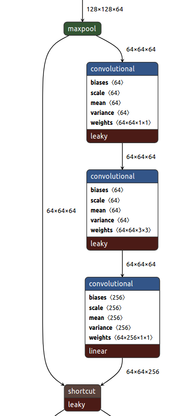


实际上，使用 darknet 的cfg 文件，用 netron 可视化的时候，是有一定 bug 的，上图中的正确可视化应该如下（省略的部分，对应上面的 layer1 下的downsample 部分 ）：

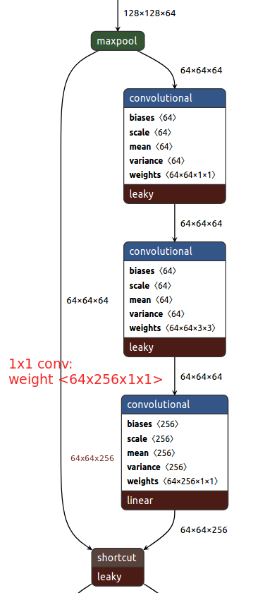


**resnet 拼接，特征图大小不匹配**


采用 1x1 的卷积，步长为2，进行维度升降和特征图下采样


对应的 log 信息的（downsample部分）如下


```
  (layer4): Sequential(
    (0): Bottleneck(
      (conv1): Conv2d(1024, 512, kernel_size=(1, 1), stride=(1, 1), bias=False)
      (bn1): BatchNorm2d(512, eps=1e-05, momentum=0.1, affine=True, track_running_stats=True)
      (conv2): Conv2d(512, 512, kernel_size=(3, 3), stride=(2, 2), padding=(1, 1), bias=False)
      (bn2): BatchNorm2d(512, eps=1e-05, momentum=0.1, affine=True, track_running_stats=True)
      (conv3): Conv2d(512, 2048, kernel_size=(1, 1), stride=(1, 1), bias=False)
      (bn3): BatchNorm2d(2048, eps=1e-05, momentum=0.1, affine=True, track_running_stats=True)
      (relu): ReLU(inplace=True)
      (downsample): Sequential(
        (0): Conv2d(1024, 2048, kernel_size=(1, 1), stride=(2, 2), bias=False)
        (1): BatchNorm2d(2048, eps=1e-05, momentum=0.1, affine=True, track_running_stats=True)
      )
    )
    (1): Bottleneck(
      (conv1): Conv2d(2048, 512, kernel_size=(1, 1), stride=(1, 1), bias=False)
      (bn1): BatchNorm2d(512, eps=1e-05, momentum=0.1, affine=True, track_running_stats=True)
      (conv2): Conv2d(512, 512, kernel_size=(3, 3), stride=(1, 1), padding=(1, 1), bias=False)
      (bn2): BatchNorm2d(512, eps=1e-05, momentum=0.1, affine=True, track_running_stats=True)
      (conv3): Conv2d(512, 2048, kernel_size=(1, 1), stride=(1, 1), bias=False)
      (bn3): BatchNorm2d(2048, eps=1e-05, momentum=0.1, affine=True, track_running_stats=True)
      (relu): ReLU(inplace=True)
    )
    (2): Bottleneck(
      (conv1): Conv2d(2048, 512, kernel_size=(1, 1), stride=(1, 1), bias=False)
      (bn1): BatchNorm2d(512, eps=1e-05, momentum=0.1, affine=True, track_running_stats=True)
      (conv2): Conv2d(512, 512, kernel_size=(3, 3), stride=(1, 1), padding=(1, 1), bias=False)
      (bn2): BatchNorm2d(512, eps=1e-05, momentum=0.1, affine=True, track_running_stats=True)
      (conv3): Conv2d(512, 2048, kernel_size=(1, 1), stride=(1, 1), bias=False)
      (bn3): BatchNorm2d(2048, eps=1e-05, momentum=0.1, affine=True, track_running_stats=True)
      (relu): ReLU(inplace=True)
    )
  )
```


例如下图， netron 可视化的 resnet50 是不合理的


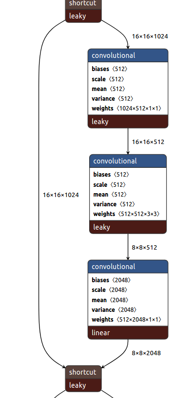


实际上，使用 darknet 的cfg 文件，用 netron 可视化的时候，是有一定 bug 的，上图中的正确可视化应该如下（省略的部分，对应上面的 layer4 下的downsample 部分 ）：


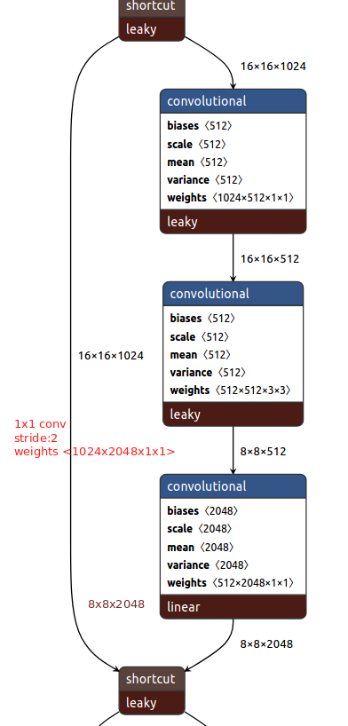


(1条消息) 深度残差网络RESNET_leaon的博客-CSDN博客
https://blog.csdn.net/qq_31050167/article/details/79161077


## densenet 网络

### 解决问题

- 网络退化


### 解决方案

特征复用，创建Dense block 块


### 网络四个优点 

- 减轻梯度消失
- 提高了特征的传播效率 
- 提高了特征的利用效率
- 减小了网络的参数量


DenseNet网络结构 - 知乎
https://zhuanlan.zhihu.com/p/67311529


### 缺点

- 内存占用高

可以明显看到DenseNet极大地降低了冗余层的使用，明显的减少了冗余的参数。但是为感觉这feature map的存量也忒大了。会爆内存的吧。

DenseNet解读 - 知乎
https://zhuanlan.zhihu.com/p/78250794


### DenseNet 与 resnet 关系


万法归宗，啥都是dense connect。shortcut  ，fpn，aspp，unet++ 都是，只是dense的程度不一样而已。


(2 封私信 / 80 条消息) 为什么目前感觉大多数论文还是以resnet为主干网络而不是densenet？ - 知乎
https://www.zhihu.com/question/342326641


# 目标检测网络


## 综述相关

目标检测技术二十年综述_算法
https://www.sohu.com/a/317079084_100007727


CVPR2019目标检测方法进展综述 - 知乎
https://zhuanlan.zhihu.com/p/59376548


## 背景知识


### 性能指标


#### 混淆矩阵

T: True

P:Positives，正样本

F:False

N:Negatives，负样本


| **实际标签\预测结果** | 预测为真（P） | 预测为假（N） |
| --------------------- | ------------- | ------------- |
| **真实为真（P）**     | TP（真正例）  | FN（假反例）  |
| **真实为假（N）**     | FP（假正例）  | TN（真反例）  |


**True Positive (TP)**：		 $\mathrm{IoU}>I O U_{t h r e s h o l d}$ ($\mathrm{IoU}>I O U_{t h r e s h o l d}$一般取 0.5 ) 的检测框数量（同一 Ground Truth 只计算一次）

**False Positive (FP)**：		$\mathrm{IoU}<=I O U_{t h r e s h o l d}$ 的检测框数量，或者是检测到同一个 GT 的多余检测框的数量

 **False Negative (FN)**：	 没有检测到的 GT 的数量

 **True Negative (TN)**：	 **在 mAP 评价指标中不会使用到**


#### 准确率（Accuracy）

$$
\text {Accuracy}=\frac{T P+T N}{\text { AllSamples }  } 
=\frac{T P+T N}{\text {TP + FP + FN + TN   }  }
$$


#### 精确率（查准率，Precision）

又叫positive predictive value（PPV）,查准率（Precision）.
 对正类的精确率公式:

$$
Precision(PPV)=\frac{T P}{T P+F P}
$$


PPV=TP+FPTP
 即预测为真的样本中有多少实际为真。


#### 召回率（查全率，Recall）

又叫true positive rate（TPR），查全率（Recall）
 对正类的召回率公式:

$$
recall(TPR)=\frac{T P}{T P+F N}
$$


 即真实为真的样本中有多少被预测为真。


#### P-R 曲线


根据以下两个指标绘制

查准率（Precision）: TP/(TP + FP)

查全率（Recall）: TP/(TP + FN)


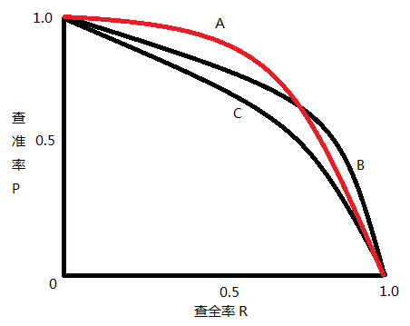

#### **交并比 - Intersection Over Union (IOU)**


交并比（IOU）是度量两个检测框（对于目标检测来说）的交叠程度，公式如下：


$$
\mathrm{IOU}=\frac{\operatorname{area}\left(B_{p} \cap B_{g t}\right)}{\operatorname{area}\left(B_{p} \cup B_{g t}\right)}  
$$


B_gt 代表的是目标实际的边框（Ground Truth，GT），B_p 代表的是预测的边框，通过计算这两者的 IOU，可以判断预测的检测框是否符合条件，IOU 用图片展示如下：


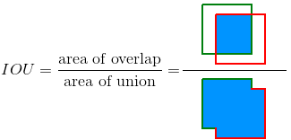


#### **评价指标 mAP**

**mAP**：mean Average Precision，即各类别 AP 的平均值

**AP**：计算**某一类** P-R 曲线下的面积，mAP 则是计算所有类别 P-R 曲线下面积的平均值。


两个公式，一个是 Precision，一个是 Recall，这两个公式同上面的一样，我们把它们扩展开来，用另外一种形式进行展示，其中 `all detctions` 代表所有预测框的数量， `all ground truths` 代表所有 GT 的数量。


$$
Precision =\frac{T P}{T P+F P}=\frac{T P}{\text { all detections }}\\ Recall =\frac{T P}{T P+F N}=\frac{T P}{\text { all ground truths }}
$$

**下面举例计算一个类别中AP过程**

假设我们有 7 张图片（Images1-Image7），这些图片有 15 个目标（绿色的框，GT 的数量，上文提及的 `all ground truths`）以及 24 个预测边框（红色的框，A-Y 编号表示，并且有一个置信度值）

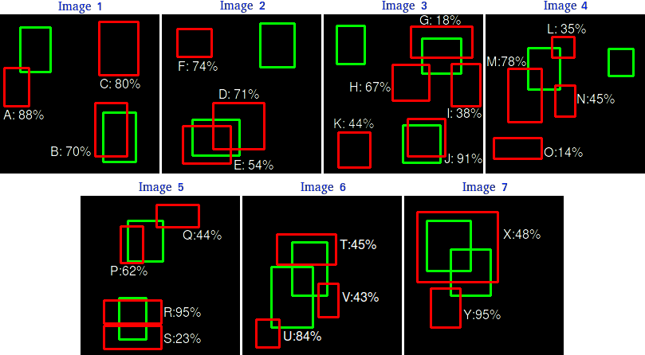根据上图以及说明，我们可以列出以


下表格，其中 Images 代表图片的编号，Detections 代表预测边框的编号，Confidences 代表预测边框的置信度，TP or FP 代表预测的边框是标记为 TP 还是 FP（认为预测边框与 GT 的 IOU 值大于等于 0.3 就标记为 TP；若一个 GT 有多个预测边框，则认为 IOU 最大且大于等于 0.3 的预测框标记为 TP，其他的标记为 FP，即一个 GT 只能有一个预测框标记为 TP），**这里的 0.3 是随机取的一个值**。


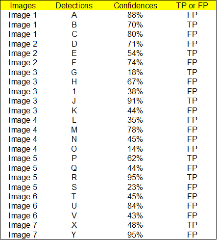


通过上表，我们可以绘制出 P-R 曲线（因为 AP 就是 P-R 曲线下面的面积），但是在此之前我们需要计算出 P-R 曲线上各个点的坐标，根据置信度从大到小排序所有的预测框，然后就可以计算 Precision 和 Recall 的值，见下表。（需要记住一个叫**累加的概念，就是下图的 ACC TP 和 ACC FP**）


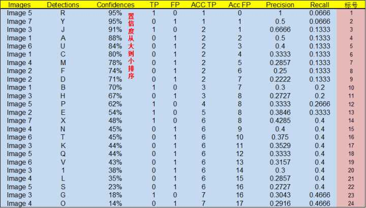


下面计算的 TP 与FP 为  TP = { ACC TP}  ，FP = { ACC FP }

TP+FN = 15，因为该类别在 7 张图中，一共就只有 15 个目标（真实数据标签的P）

- 标号为 1 的 Precision 和 Recall 的计算方式

​		Precision=TP/(TP+FP)=1/(1+0)=1，Recall=TP/(TP+FN)=TP/(`all ground truths`)=1/15=0.0666 （`all ground truths 上面有定义过了`）

- 标号 2

  Precision=TP/(TP+FP)=1/(1+1)=0.5，Recall=TP/(TP+FN)=TP/(`all ground truths`)=1/15=0.0666

-  标号 3

  Precision=TP/(TP+FP)=2/(2+1)=0.6666，Recall=TP/(TP+FN)=TP/(`all ground truths`)=2/15=0.1333

  其他的依次类推

然后就可以绘制出 P-R 曲线 


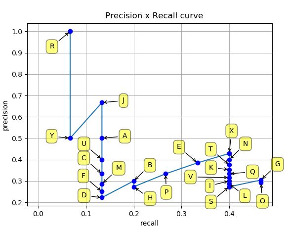


得到 P-R 曲线就可以计算 AP（P-R 曲线下的面积），要计算 P-R 下方的面积，一般使用的是插值的方法，取 11 个点 **[0, 0.1, 0.2, 0.3, 0.4, 0.5, 0.6, 0.7, 0.8, 0.9, 1]** 的插值所得


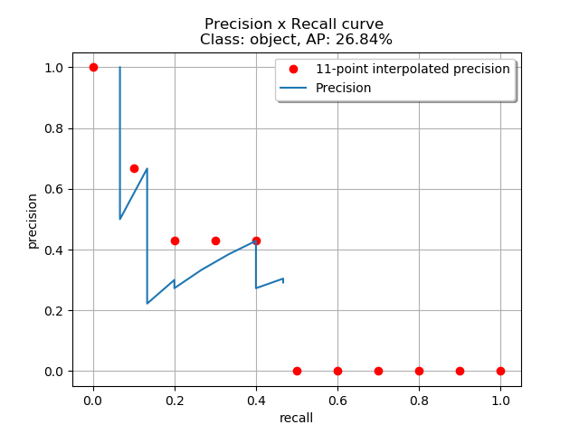


 得到一个类别的 AP 结果如下：


![[公式]](https://www.zhihu.com/equation?tex=%5Cbegin%7Baligned%7D+%26A+P%3D%5Cfrac%7B1%7D%7B11%7D+%5Csum_%7Br+%5Cin%5C%7B0%2C0%2C1%2C+%5Cldots%2C+1%5C%7D%7D+%5Crho_%7B%5Ctext+%7Binterp+%7D%28r%29%7D%5C%5C+%26A+P%3D%5Cfrac%7B1%7D%7B11%7D%281%2B0.6666%2B0.4285%2B0.4285%2B0.4285%2B0%2B0%2B0%2B0%2B0%2B0%29%5C%5C+%26A+P%3D26.84+%5C%25+%5Cend%7Baligned%7D%5C%5C)


要计算 mAP，就把所有类别的 AP 计算出来，然后求取平均即可。

参考：**[https://github.com/rafaelpadilla/Object-Detection-Metrics](https://link.zhihu.com/?target=https%3A//github.com/rafaelpadilla/Object-Detection-Metrics)**


深度学习各类性能指标含义解释_记忆碎片的博客-CSDN博客_目标检测16.0 map
https://blog.csdn.net/zgcr654321/article/details/89856788?utm_medium=distribute.pc_relevant.none-task-blog-BlogCommendFromMachineLearnPai2-1.channel_param&depth_1-utm_source=distribute.pc_relevant.none-task-blog-BlogCommendFromMachineLearnPai2-1.channel_param#t15


深度学习_目标检测_mAP@.5:.95的含义_Rocky6688的博客-CSDN博客_map@.5
https://blog.csdn.net/Rocky6688/article/details/107662970


目标检测中的AP，mAP - 知乎
https://zhuanlan.zhihu.com/p/88896868


AP，Precision，Recall, mAP 之间的关系 - 简书
https://www.jianshu.com/p/fbb96bb49782


目标检测中的mAP是什么含义？ - AICV的回答 - 知乎（推荐）

 https://www.zhihu.com/question/53405779/answer/993913699


(1条消息)理解目标检测当中的mAP_hsqyc的博客-CSDN博客_目标检测map
https://blog.csdn.net/hsqyc/article/details/81702437


(推荐)

睿智的目标检测20——利用mAP计算目标检测精确度_Bubbliiiing的学习小课堂-CSDN博客
https://blog.csdn.net/weixin_44791964/article/details/104695264#AP_86


深度学习各类性能指标含义解释_记忆碎片的博客-CSDN博客_目标检测16.0 map
https://blog.csdn.net/zgcr654321/article/details/89856788?utm_medium=distribute.pc_relevant.none-task-blog-BlogCommendFromMachineLearnPai2-1.channel_param&depth_1-utm_source=distribute.pc_relevant.none-task-blog-BlogCommendFromMachineLearnPai2-1.channel_param#t11


（三十七）通俗易懂理解——模型评价指标（混淆矩阵、目标检测AP与mAP、PR曲线） - 知乎
https://zhuanlan.zhihu.com/p/73251860


(1条消息)目标检测基础知识_章鱼、不嚎-CSDN博客
https://blog.csdn.net/qq_34063988/article/details/102871497#t9


目标检测中的mAP - 墨麟非攻 - 博客园
https://www.cnblogs.com/gezhuangzhuang/p/10547504.html


#### 什么是AP，AP50，AP75等

我们发现除了AP，还有 ![[公式]](目标检测网络.assets/equation) , ![[公式]](目标检测网络.assets/equation) 等值，这些事代表什么意思呢？

$A P_{50}$：IoU阈值为 $0.5$ 时的AP测量值

$A P_{75}$：IoU阈值为 $ 0.75$ 时的测量值

$A P_{s}$ : 像素面积小于 的 $32^2$ 目标框的AP测量值

$A P_{M}$ : 像素面积在 $32^2 - 96^2$ 之间目标框的测量值

$A P_{L}$ :  像素面积大于  $ 96^2$ 的目标框的AP测量值

注：通常来说AP是在单个类别下的，mAP是AP值在所有类别下的均值。在这里，在coco的语境下AP便是mAP，这里的AP已经计算了所有类别下的平均值，这里的AP便是mAP。


作者：希葛格的韩少君
链接：https://zhuanlan.zhihu.com/p/88896868


看懂COCO数据集目标识别性能评价标准AP，AP50，AP75，APsmal等_一江明澈的水的专栏-CSDN博客
https://blog.csdn.net/meccaendless/article/details/87176932


目标检测评价指标AP50，AP60_Luissen的博客-CSDN博客
https://blog.csdn.net/m0_37615398/article/details/85256543


## 算法的数学实现


## 目前主流的目标检测算法概括

什么是One-Stage目标检测，什么是Two-Stage目标检测


目前主流的目标检测算法主要是基于深度学习模型，大概可以分成两大类别：

（1）One-Stage目标检测算法，这类检测算法不需要Region  Proposal阶段，可以通过一个Stage直接产生物体的类别概率和位置坐标值，比较典型的算法有YOLO、SSD和CornerNet；

（2）Two-Stage目标检测算法，这类检测算法将检测问题划分为两个阶段，第一个阶段首先产生候选区域（Region Proposals），包含目标大概的位置信息，然后第二个阶段对候选区域进行分类和位置精修，这类算法的典型代表有R-CNN，Fast  R-CNN，Faster  R-CNN等。目标检测模型的主要性能指标是检测准确度和速度，其中准确度主要考虑物体的定位以及分类准确度。

一般情况下，Two-Stage算法在准确度上有优势，而One-Stage算法在速度上有优势。不过，随着研究的发展，两类算法都在两个方面做改进，均能在准确度以及速度上取得较好的结果。


目标检测最新进展总结与展望 - 知乎
https://zhuanlan.zhihu.com/p/46595846


## 一阶网络 SSD


[[目标检测\]SSD原理](https://www.cnblogs.com/fariver/p/7347197.html)


[目标检测]SSD原理 - fariver - 博客园
https://www.cnblogs.com/fariver/p/7347197.html


## 目标检测 HRNet

HRNet详解_gdtop的个人笔记-CSDN博客_hrnet
https://blog.csdn.net/weixin_37993251/article/details/88043650


## 目标检测 EfficientDet


EfficientDet 算法解读 - 知乎
https://zhuanlan.zhihu.com/p/93241232


# YOLO 相关思考


## YOLO模型是如何识别物体类别和计算方框的？

**挑战**

> 按照之前设定好的尺寸比例切分的图片，很难准确的框住物体（蓝色方框是小图片）；
> 当识别出小图片中存在物体后，接下来需要在原图中找出能精准框住物体的bounding box（红色方框）；


**方案**

> **用grid来切分原图**，3x3（分析简化）, 19x19（实际使用，避免2个物体出现在同一个grid cell的麻烦）；
> 将原图直接喂给CNN模型，能高效计算，一次性完成9个grid小图片的分类和方框预测（之前视频有细节讲解）；
> 分类概率值，告诉我们每个grid cell 图片当中存在某个物体的概率高低；


> 4个regression 方框值，告诉我们，以每个grid cell的位置为参照，框住物体的红色方框的中心点所在和红色方框的长与宽；
> 根据每个grid cell在原图的位置，进一步还原红色方框中心点在原图的位置，以及还原方框的具体位置和大小；
> 方框的长与宽，可以大于grid cell的长与宽，因为ground truth 中的红色方框的长与宽是可以超越 grid cell 的长与宽的；


[探索一句话版的机器学习与深度学习_哔哩哔哩 (゜-゜)つロ 干杯~-bilibili](https://link.zhihu.com/?target=https%3A//www.bilibili.com/video/av22581633/) p35


- 参考文献

5分钟YOLO模型是如何识别物体类别和计算方框的？ - 知乎
https://zhuanlan.zhihu.com/p/36538031


## one-stage和two-stage 性能差异主要原因

作者认为one-stage和two-stage的表现差异主要原因是大量前景背景类别不平衡导致。作者设计了一个简单密集型网络RetinaNet来训练在保证速度的同时达到了精度最优。在双阶段算法中，在候选框阶段，通过得分和nms筛选过滤掉了大量的负样本，然后在分类回归阶段又固定了正负样本比例，或者通过OHEM在线困难挖掘使得前景和背景相对平衡。而one-stage阶段需要产生约100k的候选位置，虽然有类似的采样，但是训练仍然被大量负样本所主导。


- 参考文献

Focal Loss理解 - 三年一梦 - 博客园
https://www.cnblogs.com/king-lps/p/9497836.html


# 目标检测一些问题

## 正负样本比例严重失衡的问题

### 综述

- Focal loss
- 


### Focal loss


1.  总述

Focal loss主要是为了解决one-stage目标检测中正负样本比例严重失衡的问题。该损失函数降低了大量简单负样本在训练中所占的权重，也可理解为一种困难样本挖掘。

 

2. 损失函数形式

Focal loss是在交叉熵损失函数基础上进行的修改，首先回顾二分类交叉上损失：

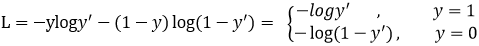

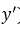是经过激活函数的输出，所以在0-1之间。可见普通的交叉熵对于正样本而言，输出概率越大损失越小。对于负样本而言，输出概率越小则损失越小。此时的损失函数在大量简单样本的迭代过程中比较缓慢且可能无法优化至最优。那么Focal loss是怎么改进的呢？

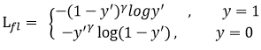

 

 

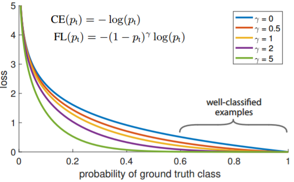

 

首先在原有的基础上加了一个因子，其中gamma>0使得减少易分类样本的损失。使得更关注于困难的、错分的样本。

例如gamma为2，对于正类样本而言，预测结果为0.95肯定是简单样本，所以（1-0.95）的gamma次方就会很小，这时损失函数值就变得更小。而预测概率为0.3的样本其损失相对很大。对于负类样本而言同样，预测0.1的结果应当远比预测0.7的样本损失值要小得多。对于预测概率为0.5时，损失只减少了0.25倍，所以更加关注于这种难以区分的样本。这样减少了简单样本的影响，大量预测概率很小的样本叠加起来后的效应才可能比较有效。

此外，加入平衡因子alpha，用来平衡正负样本本身的比例不均：文中alpha取0.25，即正样本要比负样本占比小，这是因为负例易分。

 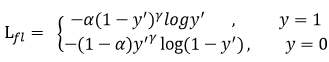

只添加alpha虽然可以平衡正负样本的重要性，但是无法解决简单与困难样本的问题。

gamma调节简单样本权重降低的速率，当gamma为0时即为交叉熵损失函数，当gamma增加时，调整因子的影响也在增加。实验发现gamma为2是最优。

 

3. 总结

作者认为one-stage和two-stage的表现差异主要原因是大量前景背景类别不平衡导致。作者设计了一个简单密集型网络RetinaNet来训练在保证速度的同时达到了精度最优。在双阶段算法中，在候选框阶段，通过得分和nms筛选过滤掉了大量的负样本，然后在分类回归阶段又固定了正负样本比例，或者通过OHEM在线困难挖掘使得前景和背景相对平衡。而one-stage阶段需要产生约100k的候选位置，虽然有类似的采样，但是训练仍然被大量负样本所主导。


- 参考文献

Focal Loss理解 - 三年一梦 - 博客园
https://www.cnblogs.com/king-lps/p/9497836.html


# SSD和YOLO对小目标检测的思考

SSD和YOLO对小目标检测的思考_Yancy的博客-CSDN博客_yolo小目标检测
https://blog.csdn.net/lyxleft/article/details/101054616


# 目标检测 loss

## 综述

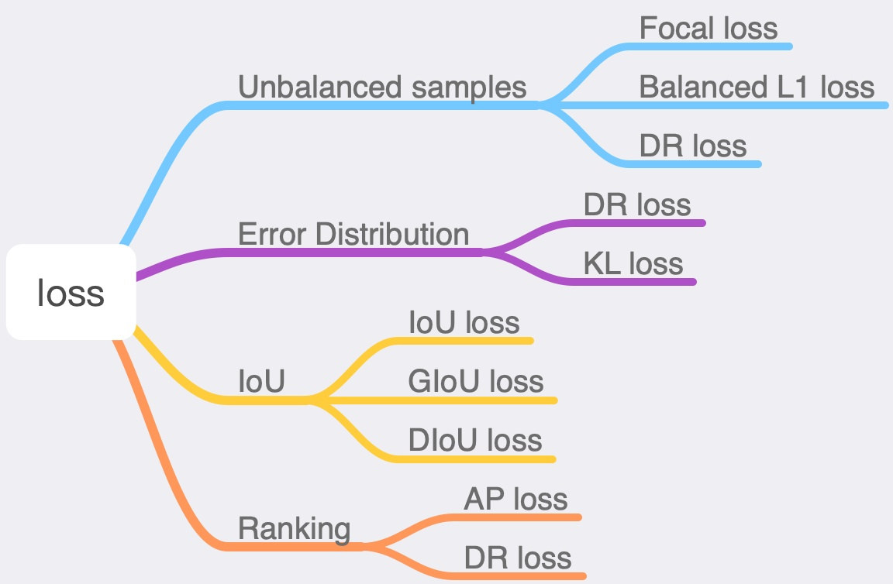

loss上的改进，大部分的思路，是找出那些原本的loss（包括regression和classification）可能会不合理的情况，修正这些不合理。总的来说，有用ranking来解决正负样本不平衡的问题（如DR loss、AP-loss，一个从**分布**角度，一个从**AP**角度）；有考虑当前的Smooth L1 Loss中偏移分布假设可能不太合理，重新考虑设计偏移分布的KL loss；也有考虑multi-scale的样本loss不平衡，而用**IoU**作为loss的IoU loss，以及后续的改进GIoU、DIoU；

首先，在Faster R-CNN中，使用的是smooth L1 loss。而smooth L1  loss，可以理解为，当|x|<1时，为L2损失（即假设样本服从标准高斯分布），当|x|>1时，为L1损失（即假设样本服从拉普拉斯分布），这样的好处在于训练时|x|>1时快速下降，|x|<1时精细调整。对于各种损失函数的介绍具体参看[机器学习常用损失函数小结 - 王桂波的文章 - 知乎](https://zhuanlan.zhihu.com/p/77686118)

另外的一个细节是，预测的偏移值为(tx,ty,tw,th)，具体如下所示


通过除以边长，消除不同边长大小间量级差异，而tx,ty中用直接减，而tw,th用log之后减，是考虑tw,th的量级比tx,ty要大？

## KL loss

cvpr2019：[https://arxiv.org/pdf/1809.08545.pdf](https://link.zhihu.com/?target=https%3A//arxiv.org/pdf/1809.08545.pdf)

这篇文章是为了解决边界不确定的box的regression问题（不被模糊样例造成大的loss干扰）。KL  loss是regression的loss。文章预测坐标（x1,y1,x2,y2）的偏移值，对于每个偏移值，假设预测值服从高斯分布，标准值为狄拉克函数（即偏移一直为0），计算这两个分布的距离（这里用KL散度表示距离）作为损失函数。参考smooth L1 loss，也分为|xg-xe|<=1和>1的两段，>1部分用L1  loss接上（为保证=1部分两个阶段相等，故很容易得到>1部分的公式。

![[公式]](目标检测网络.assets/equation)  ，当|xg-xe|<=1

![[公式]](目标检测网络.assets/equation) ，当|xg-xe|>1

另， ![[公式]](目标检测网络.assets/equation) 的梯度公式为![[公式]](目标检测网络.assets/equation) 

这里 ![[公式]](目标检测网络.assets/equation) ，这里的![[公式]](目标检测网络.assets/equation) 就是假设中**预测值的高斯分布的 ![[公式]](https://www.zhihu.com/equation?tex=%5Csigma)** 。即可以认为，文章提出的KL loss与smooth L1 loss最大的不同点在于，新增了一个变量。而这个 ![[公式]](https://www.zhihu.com/equation?tex=%5Csigma) 信息可能对regression有帮助（smooth L1 loss是假设样本服从标准高斯分布的，故若样本服从的高斯分布可以学习，那么学习效果应该会更好。假设模型服从高斯分布，一开始应该是 ![[公式]](https://www.zhihu.com/equation?tex=%5Csigma) 会比较大，随着训练过程 ![[公式]](https://www.zhihu.com/equation?tex=%5Csigma) 会越来越小，如果说到最后， ![[公式]](目标检测网络.assets/equation) 说明这个偏移基本在0左右）。有几个疑问， ![[公式]](https://www.zhihu.com/equation?tex=%5Csigma) 初始化为什么选择0.0001，以及这种没有ground true的参数作为预测输出的意义，无ground true的 ![[公式]](https://www.zhihu.com/equation?tex=%5Csigma) 会比固定的标准高斯分布要好？另，没有看明白，KL loss与不确定的box的regression问题之间的关系。

## Focal loss

focal loss相对很有名气，主要是针对one-stage方法中样本不平衡的问题提出的，是classification loss，如下所示

![[公式]](目标检测网络.assets/equation) 

实验表明![[公式]](目标检测网络.assets/equation)取2,![[公式]](目标检测网络.assets/equation)取0.25的时候效果最佳。

思路很清晰，大量的样本其实贡献的loss很有限（大部分都是易学习的负样本），导致少量的正样本的loss难以贡献。故增加这部分少量样本的loss的权重（即y=1），减少大量负样本的loss的权重。

## DR loss

DR loss的研究背景和focal loss一样，one-stage方法中样本不平衡。顾名思义，Distributional **Ranking**，做分布的转换以及用ranking作为loss。

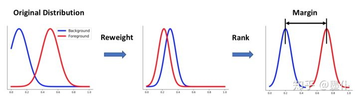

看不懂，具体参看

[张凯：2019 DR loss（样本不平衡问题）目标检测论文阅读](https://zhuanlan.zhihu.com/p/75896297)[zhuanlan.zhihu.com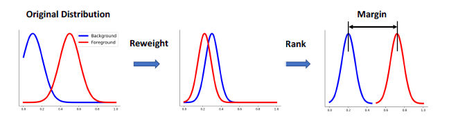](https://zhuanlan.zhihu.com/p/75896297)

## AP loss

arxiv2019:[Towards Accurate One-Stage Object Detection with AP-Loss](https://link.zhihu.com/?target=http%3A//arxiv.org/abs/1904.06373)

AP loss也是解决one-stage方法中样本不平衡问题。顾名思义，利用AP（与一般概念的AP不同）来作为loss，下图给出了AP比Acc（即1/0分类）要更适合作为loss的一个例子。

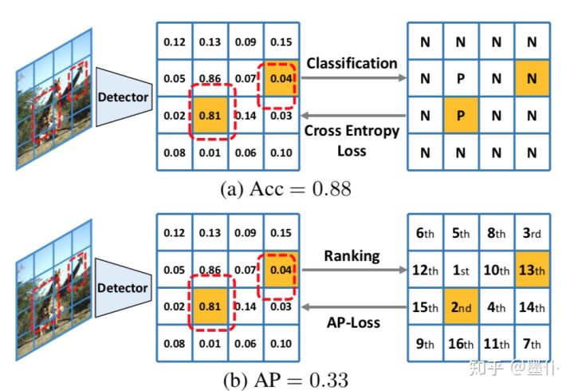

与 DR loss类似的，这里也使用了**Ranking**。将AP用x和y表示出来，并给出这个loss计算公式在训练过程中是否可以比较好收敛的推导分析。

## Balanced L1 loss

这是一作在知乎的回答介绍。

[如何看待 CVPR2019 论文 Libra R-CNN（一个全面平衡的目标检测器）？](https://www.zhihu.com/question/319458937/answer/647082241)[www.zhihu.com](https://www.zhihu.com/question/319458937/answer/647082241)

Libra R-CNN中提出了Balanced L1 Loss。作者观察发现， ![[公式]](目标检测网络.assets/equation) 中那些easy samples只能贡献30%的梯度（具体说明？），这样的梯度贡献分配是不合理的（作者发现数据集中有不少的noise  label，故希望能降低这些noise label对loss的负面影响，而这些noise label大部分分布在x比较大的部分）。

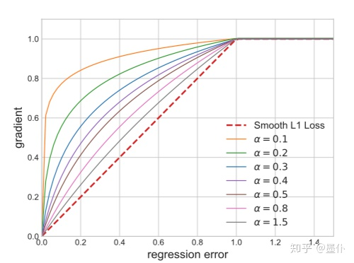

上图虚线是Smooth L1 Loss的梯度函数，作者认为在[0,1]区间内 ![[公式]](目标检测网络.assets/equation) 的梯度应更大一些（特别是接近0的地方，即loss比较小的easy samples），因此增加这部分的梯度值，把原先的Smooth L1 Loss的梯度改写为

![[公式]](目标检测网络.assets/equation) 

于是得到 ![[公式]](目标检测网络.assets/equation) 的公式为

![[公式]](目标检测网络.assets/equation) 

这里作者取 ![[公式]](目标检测网络.assets/equation) 为默认值，具体的loss函数值如下图

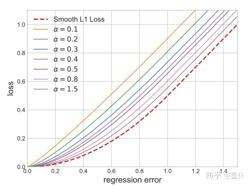

不过没有找到Balanced L1 Loss的easy samples贡献的梯度的百分比。可以看到，Balanced L1  Loss确实在x较小的时候提升了loss的值，变相减小了x比较大的时候的loss，达到了降低那些noise label的loss的效果。

## IoU系列——IoU loss、GIoU loss、DIoU loss

这篇里介绍了这些以IoU为基础的各种loss，IoU loss是16年的，而后的几个都是19年，有点奇怪的是，19年这几篇的最终衡量指标都是用AP提升的相对百分比而不是绝对百分比。

[BBuf：目标检测算法之AAAI 2020 DIoU Loss 已开源(YOLOV3涨近3个点)](https://zhuanlan.zhihu.com/p/97555019)

## IoU loss

arxiv2016:[UnitBox: An Advanced Object Detection Network](https://link.zhihu.com/?target=http%3A//arxiv.org/abs/1608.01471)

UnitBox这篇文章中，提出了IoU loss，但好像仅仅用在人脸识别的场景下。文中认为不同尺度的box对l2  loss有影响（但个人认为除以w，除以h之后这个问题就基本没有了～）。故文中提出了新的loss，如下图所示，计算-ln(IoU)作为loss，其实也就是交叉熵损失。把IoU看成是伯努利分布（即GT为IoU=1或0，然后训练中通过调整坐标来接近这个值）

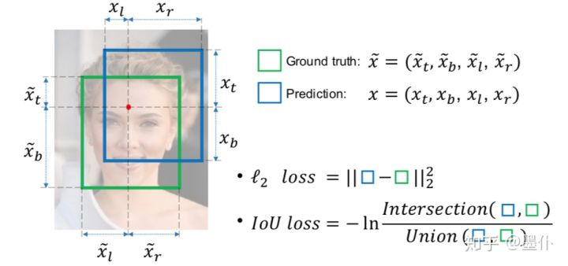

有个疑问，文中说 ![[公式]](目标检测网络.assets/equation) ，那预测框必包含红点，是否会有影响？ 


## GIoU loss

arxiv2019:[Generalized Intersection over Union: A Metric and A Loss for Bounding Box Regression](https://link.zhihu.com/?target=https%3A//arxiv.org/abs/1902.09630)

在IoU loss中，有个很明显的缺点：如果两个框没有相交，根据定义，IoU=0，不能反映两者的距离大小（重合度），loss为1。

而GIOU的原理和想法很简单，就是在IoU的基础上添加了一项（如下所示），其中![[公式]](目标检测网络.assets/equation)表示包含两个框的最小矩形，这样就可以优化两个框不相交的情况。

![[公式]](目标检测网络.assets/equation) 


从结果来看，GIoU在YOLO上提升（对比IoU loss）比较明显，而在Faster R-CNN等两阶段的算法上提升（对比IoU loss）很不明显。

## DIoU loss

在DIoU中，作者比较深入的讨论了IoU作为loss时应该如何考虑其设计。首先，作者提出了GIoU存在的一个明显的问题，即一个框在另一个内的情况应该予以考虑。

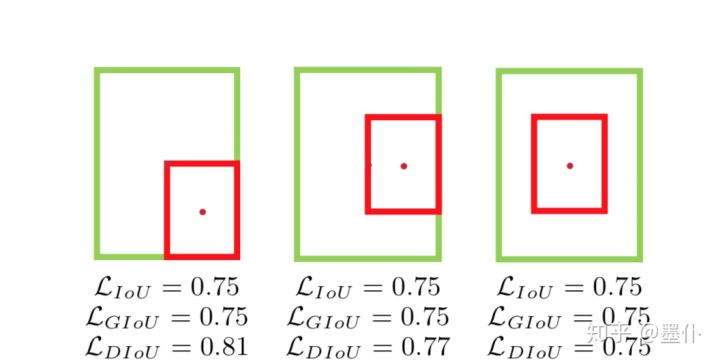一个框在另一个框内时的不同情况间，各loss的差异

于是作者针对这种情况，设计了新的一种loss，公式如下

![[公式]](目标检测网络.assets/equation) 

直观的理解就是在IoU之外，增加了一项，即下图的(d/c)^2，这样即使一个框在另一个内，两个框的中心点还是会继续靠拢。同样的，在NMS时，也可以用DIoU替代IoU。

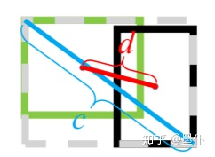DIou loss的直观理解

另，文中还设计了**CIoU**，加入了Anchor的长宽比和目标框之间的**长宽比**的**一致性**这个考虑，公式如下

![[公式]](目标检测网络.assets/equation) 

这里的 ![[公式]](目标检测网络.assets/equation) 是一个系数，v表示了预测和实际框的长宽比之差，公式如下

![[公式]](目标检测网络.assets/equation) 

## 小结

从以上的一些loss中从几个不同的维度，可以归纳出几个设计loss的步骤：

1. **衡量目标**是否合理，从regression来说是**坐标点的偏移**，还是**IoU**，classification中直接分类还是可以用**rank中的AP**？
2. 从**场景**（目前的loss）存在的问题出发，找出设计loss时需要**重点考虑的因素**，如**正负样本不平衡**，存在一些标错的**noise label**，或是存在边界模拟两可的**uncertainty label**；
3. 一些针对设计和问题转化，比如将**分类**问题转化为**ranking**问题，Smooth L1 Loss的设计细节（如L1及L2部分的设计分布假设）的一些不足的讨论及优化变形；
4. 新的loss函数的推导，包括loss函数的推理设计过程，以及收敛性等对loss函数的一般要求的给出；
5. 新的loss函数对其他部分的影响及联动修改。


# 抠图 Deep Image Matting

Pytorch 抠图算法 Deep Image Matting 模型实现 - 简书
https://www.jianshu.com/p/91fc778cf4ed


# 面试题

### 面试题-牛客


## 问答题 *168* /392 SPP，YOLO了解吗？ 

  SPP，YOLO了解吗？ 

  参考回答: 


  **SPP-Net简介：** 

  SPP-Net主要改进有下面两个： 

  1）.共享卷积计算、2）.空间金字塔池化 

  在SPP-Net中同样由这几个部分组成： 

  ss算法、CNN网络、SVM分类器、bounding box 

   ss算法的区域建议框同样在原图上生成，但是却在Conv5上提取，当然由于尺寸的变化，在Conv5层上提取时要经过尺度变换，这是它R-CNN最大的不同，也是SPP-Net能够大幅缩短时长的原因。因为它充分利用了卷积计算，也就是每张图片只卷积一次，但是这种改进带来了一个新的问题，由于ss算法生成的推荐框尺度是不一致的，所以在cov5上提取到的特征尺度也是不一致的，这样是没有办法做全尺寸卷积的（Alexnet）。 

  所以SPP-Net需要一种算法，这种算法能够把不一致的输入产生统一的输出，这就SPP，即空间金字塔池化，由它替换R-CNN中的pooling层，除此之外，它和R-CNN就一样了。 


  **YOLO详解：** 

  YOLO的名字You only look once正是自身特点的高度概括。YOLO的核心思想在于将目标检测作为回归问题解决  ，YOLO首先将图片划分成SxS个区域，注意这个区域的概念不同于上文提及将图片划分成N个区域扔进detector这里的区域不同。上文提及的区域是真的将图片进行剪裁，或者说把图片的某个局部的像素扔进detector，而这里的划分区域，只的是逻辑上的划分。 


## 面试中提到的内容

### 目标检测中，不同物体之间的距离非常接近如何解决？   

物体之间空间上非常接近，或者说两个同类别的物体之间重叠部分较大，这时候使用非极大值抑制的话，很容易就把另外一个物体的检测框去掉了，这种问题一般如何解决？


（1）Repulsion loss，参见CVPR 2018论文 repulsion loss，用作拥挤人群检测；

（2）Soft NMS，降低confidence而不是直接去掉；

（3）NMS的改进，今年旷视的ECCV：

[[1807.11590\] Acquisition of Localization Confidence for Accurate Object Detection](https://link.zhihu.com/?target=https%3A//arxiv.org/abs/1807.11590)


作者：董洪义
链接：https://www.zhihu.com/question/270143544/answer/441217760
来源：知乎
著作权归作者所有。商业转载请联系作者获得授权，非商业转载请注明出处。


### 目标检测如何解决小目标检测


#### 1. 概述

无论是在检测还是分割算法中小目标的检测或分割都是比中等与大目标难的，一般来讲在COCO检测数据集上小目标的检测性能是大目标的一半不到。

那么什么样的目标才能算是小目标呢？下图是[COCO网站](http://cocodataset.org/#detection-leaderboard)上对于不同大小目标的定义（面积小于32∗32

32∗32的目标）：
 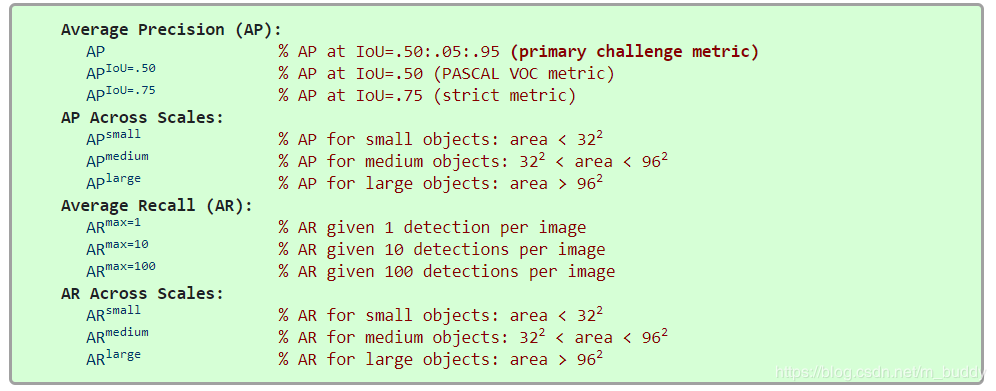
 小目标检测困难的原因分析：

- 1）网络的stride特性：检测网络中一般使用CNN网络作为特征提取工具，在CNN网络中为了增大感受野使得CNN网络中的特征图不断缩小，面积较小的区域的信息自然就很难传递到后面的目标检测检测器中了；
- 2）训练集的分布（参考[SNIP](https://blog.csdn.net/m_buddy/article/details/90454642)）：在COCO数据集中大目标和小目标的大小比值是比较大的，这就为网络适应目标带来了一定的困难；
- 3）网络损失函数：现有的检测网络中OHEM之类的训练样本选择机制，在正负样本选择的时候对小目标并不是很友好；

在此基础上结合论文[Augmentation for small object detection](https://arxiv.org/abs/1902.07296)与网络上搜罗的一些资料对小目标检测的优化做了总结。

#### 2. 方法总结

**2.1 从图像或特征尺度的角度**

2.2 从anchor角度

2.3 对于使用ROI Pooling的网络

2.4 GAN方法

2.5 增加小目标数量

2.6 在对小目标的IoU阈值上

2.7 回归损失函数上

2.8 小目标的GT


##### **2.1 从图像或特征尺度的角度**

既然使用最后一个stage的特征去做预测很难，那么可以考虑如下的方式进行优化：

- 1）使用FPN在多个尺度上预测不同尺度的目标；
- 2）参考SNIP区分大小目标，针对性优化；
- 3）输入图像放大（用超分辨率之类的方法有质量的方法）或是切图多次检测；

##### 2.2 从anchor角度

- 1）**anchor的密度**：由检测所用feature map的stride决定，这个值与前景阈值密切相关，在密集的情况下可以使anchor加倍以增加对密集目标的检测能力（TextBoxes++，Pixel-Anchor）；
- 2）**anchor的范围**：RetinaNet中是anchor范围是32~512，这里应根据任务检测目标的范围确定，按需调整anchor范围，或目标变化范围太大如MS COCO，这时候应采用多尺度测试；
- 3）**anchor的形状数量**：RetinaNet每个位置预测三尺度三比例共9个形状的anchor，这样可以增加anchor的密度，但stride决定这些形状都是同样的滑窗步进，需考虑步进会不会太大，如RetinaNet框架前景阈值是0.5时，一般anchor大小是stride的4倍左右；

##### 2.3 对于使用ROI Pooling的网络

SINet：A Scale-Insensitive Convolutional Neural Network for Fast  Vehicle Detection  认为小目标在Pooling之后会导致物体结构失真（也可以换作RoIAlign），于是提出了新的Context-Aware RoI  Pooling方法，有助于保留有用信息，下图是该方法与简单Pooling操作的对比：
 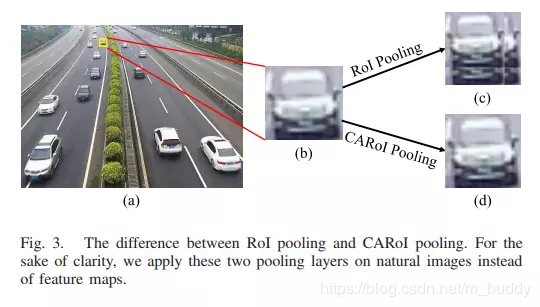

##### 2.4 GAN方法

用生成对抗网络(GAN)来做小目标检测：Perceptual Generative Adversarial Networks for Small Object Detection（好像没有公开代码，效果难说）。
 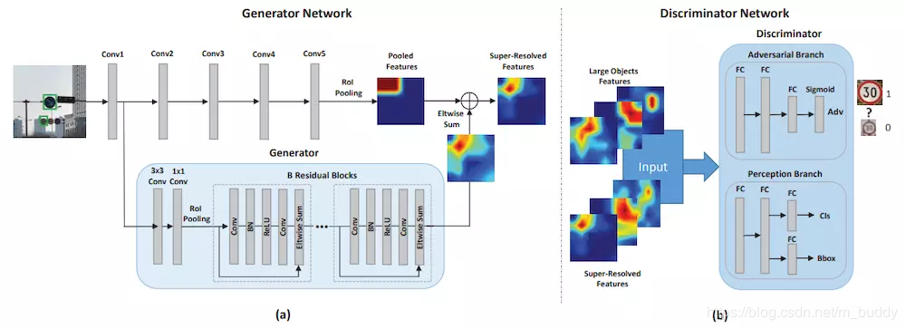

##### 2.5 增加小目标数量

- 1）在Augmentation for small object detection文章中提到增加图像中小目标的数量（不影响其它目标检测的情况下，复制小目标多个），提升小目标被学习到的机会；
   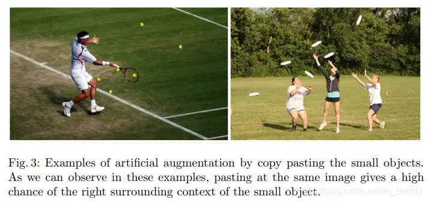
- 2）增加小目标图像在训练数据集中的数量，保证小目标能够被有效地学习；

##### 2.6 在对小目标的IoU阈值上

对小目标可以不使用严苛的阈值（0.5），可以考虑针对小目标使用Cascade RCNN的思想，级联优化小目标的检测。

##### 2.7 回归损失函数上

在YOLO中按照不同的目标大小给了不同的损失函数加权系数：(2−*w*∗*h*)∗1.5

(2−w∗h)∗1.5。使用这样的策略其性能提升了1个点。

##### 2.8 小目标的GT

增大小目标的GT，从而变相加大目标，增加检测的能力。


小目标检测相关技巧总结 - 简书
https://www.jianshu.com/p/1973079386f4


### 损失函数


以当误差大的时候，权重更新快；当误差小的时候，权重更新
https://zhuanlan.zhihu.com/p/58883095


机器学习之常见的损失函数(loss function)_perfect1t的博客-CSDN博客
https://blog.csdn.net/perfect1t/article/details/88199179#t3


## 线性分类器


- [线性判别分析](https://baike.baidu.com/item/线性判别分析)（LDA） --- 假设为[高斯](https://baike.baidu.com/item/高斯)条件密度模型。
- [朴素贝叶斯分类器](https://baike.baidu.com/item/朴素贝叶斯分类器)--- 假设为条件独立性假设模型。

第二种方式则称为[判别模型](https://baike.baidu.com/item/判别模型)（discriminative models），这种方法是试图去最大化一个[训练集](https://baike.baidu.com/item/训练集)（training set）的输出值。在训练的成本函数中有一个额外的项加入，可以容易地表示[正则化](https://baike.baidu.com/item/正则化)。例子包含：

- [Logit模型](https://baike.baidu.com/item/Logit模型)---的[最大似然估计](https://baike.baidu.com/item/最大似然估计)，其假设观察到的训练集是由一个依赖于分类器的输出的二元模型所产生。
- [感知元](https://baike.baidu.com/item/感知元)（Perceptron） --- 一个试图去修正在训练集中遇到错误的算法。
- [支持向量机](https://baike.baidu.com/item/支持向量机)--- 一个试图去最大化决策超平面和训练集中的样本间的[边界](https://baike.baidu.com/item/边界)（margin）的算法。


- **注意**

决策树不是线性分类器


线性分类器_百度百科
https://baike.baidu.com/item/%E7%BA%BF%E6%80%A7%E5%88%86%E7%B1%BB%E5%99%A8/10251055?fr=aladdin#2